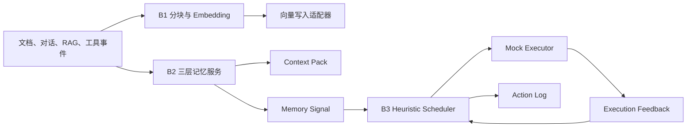

# P3 MVP 实施状态与迭代路线

> 更新日期：2026-07-13
>
> 当前定位：本地可运行、可测试的 P3 B1 → B2 → B3 MVP 闭环
>
> 硬件边界：B1 以 Mock 为默认路径，提供 CPU 真实 Embedding 联调路径；B3 以 Heuristic + Mock Executor 为当前执行边界。

## 1. 本轮目标

本轮优先完善不依赖专用硬件的 B2、B3，并为 B1 接入一条可在普通开发机运行的真实 Embedding 链路。目标不是提前宣称达到生产验收指标，而是冻结核心接口、打通闭环、保留真实组件替换点，并建立可重复的质量门。



## 2. 已完成内容

### 2.1 B1：Embedding 流水线

- 提供文本分块、重叠窗口、稳定 chunk_id 和来源元数据绑定。
- 提供统一的 `EmbeddingRequest`、`EmbeddingRecord`、`EmbeddingResult` 和状态模型。
- 提供可替换的向量写入接口及本地 `InMemoryVectorSink`。
- 默认使用确定性的 Mock Embedding，保证无模型、无 GPU 时仍可开发和测试。
- 增加可选 FastEmbed CPU/ONNX 适配器，默认模型为 `BAAI/bge-small-zh-v1.5`。
- 文档向量与查询向量分别使用 passage/query 接口。
- 记录模型名、维度、处理耗时、request_id、trace_id、source_id、object_id 等追踪字段。
- Embedding 或写入失败时返回结构化失败结果，不让异常静默丢失。

### 2.2 B2：Agent 记忆服务

- 支持 Working、Episodic、Semantic 三层记忆管理。
- 支持 `after_turn`、`task_update`、`rag_result`、`tool_result`、`user_memory` 事件写入。
- 用户显式记忆进入 Semantic；普通会话、任务和工具事件进入 Working。
- 支持 Working 会话归档为 Episodic，并保留来源和归档关系。
- 在写入、访问、归档时输出 Memory Signal。
- 强制 tenant_id、user_id、agent_id、session_id 范围过滤，降低跨租户和跨用户串记忆风险。
- Context Pack 支持：
  - Working/Episodic/Semantic 联合召回；
  - 相关度排序和 token budget；
  - 内容去重；
  - `summary`、`memory_refs`、`evidence_refs`、`budget_info`、`status`、`trace_id`；
  - 访问次数和最近访问时间回写。
- 新增低资源 SQLite 存储，三个 manager 可共享同一数据库，并支持跨进程恢复。
- 保留 `MemoryStore` 协议，后续可替换为 Redis、Milvus/P2 或服务端存储实现。

### 2.3 B3：Heuristic 调度闭环

- 建立调度对象、访问统计、语义信号、Tier 状态、资源状态、动作、反馈和日志模型。
- 实现 V1 评分：
  - 访问频率权重 0.4；
  - 语义价值权重 0.3；
  - 时间近期性权重 0.2；
  - 成本可承受度权重 0.1。
- 支持 Promote、Demote、Keep、Pin、Unpin、Prefetch、Evict 枚举和执行反馈。
- Promote/Demote 会检查相邻 Tier、网络状态、目标层容量和迁移开关。
- 默认 Evict 关闭，避免 MVP 阶段误删真实数据。
- 支持默认 30 秒周期扫描，也可配置间隔和运行次数。
- Mock Executor 可复现成功与失败，并返回延迟、new_tier、error_code、failure_reason、trace_id。
- 执行失败时自动生成 Keep 回退动作，并记录原动作与回退反馈。
- 相同 request_id、object_id 和动作组合产生稳定 action_id，重复请求不会重复执行底层动作。
- Action Log 记录总分、频次分、语义分、衰减分、成本分、reason、策略版本和执行状态。

### 2.4 示例、配置与测试

- 新增非交互闭环：`examples/p3_closed_loop.py`。
- 原 Textual TUI 已接入真实 B1 Pipeline 和 B3 Scheduler/Executor，不再只是静态说明文本。
- 增加 B1 模型与分块配置、B3 周期与阈值配置。
- 增加 B1、B2、B3、SQLite 及完整闭环测试。
- 当前质量门：106 项测试通过，ruff 通过，mypy 通过。

## 3. 如何直接运行

### 3.1 Mock 完整闭环

```powershell
.\.venv\Scripts\python.exe examples\p3_closed_loop.py
```

预期结果包括：32 维 Mock 向量、B2 Context Pack、会话归档、B3 Promote/Demote/Keep 类动作和执行反馈。

### 3.2 CPU 真实 Embedding 闭环

```powershell
.\.venv\Scripts\python.exe -m pip install -e ".[b1-real]"
.\.venv\Scripts\python.exe examples\p3_closed_loop.py --real-embedding
```

首次运行会下载模型。当前本地验证的输出维度为 512；短文本耗时只用于冒烟验证，不能作为 4K QPS 或生产吞吐结论。

### 3.3 交互式 TUI

```powershell
.\.venv\Scripts\python.exe examples\minimal_loop\main.py --step-delay 0
```

### 3.4 质量检查

```powershell
.\.venv\Scripts\python.exe -m pytest -q
.\.venv\Scripts\ruff.exe format --check .
.\.venv\Scripts\ruff.exe check .
.\.venv\Scripts\mypy.exe src
```

## 4. 当前仍缺少什么

| 模块 | 当前缺口 | 影响 |
|---|---|---|
| B1 | 尚未实现正式 gRPC/Sidecar、动态批处理、并发队列、SIMD/IPEX/INT8、真实 E1 写入 | 不能证明 4K QPS 或生产级吞吐 |
| B1 | 尚未建立标准文档集、批量基准和 P50/P95/P99 报告 | 无法冻结合同性能口径 |
| B2 | 当前持久化是本地 SQLite，未接 Redis、Milvus/P2、Celery/Broker | 适合开发/MVP，不适合分布式生产部署 |
| B2 | 尚未实现用户纠错、删除传播、版本冲突和跨会话压缩流水线 | 长期记忆治理仍不完整 |
| B2 | 尚未用标注集验证召回准确率、5× 压缩率和 Working Memory P99 | 不能宣称满足最终 B2 验收指标 |
| B3 | 当前 Executor 是 Mock，未接 P1/P2 真实迁移和路由更新 | 只能证明策略与反馈闭环，不能证明物理迁移收益 |
| B3 | 尚未实现 LRU、LFU、Keep-only 回放基线和大规模 Trace 回放器 | 无法量化 Heuristic 相对收益 |
| B3 | 尚未实现超时、冷却窗口、震荡抑制和 orphan feedback 处理 | 异常稳定性仍需加强 |
| 全链路 | 当前日志和 trace 为本地模型字段，未接 OpenTelemetry、Prometheus/Grafana | 生产可观测性和审计尚未完成 |
| 全链路 | 未完成鉴权、密钥管理、数据脱敏、删除审计和多租户安全测试 | 不能进入正式生产数据环境 |

## 5. 推荐迭代路线

### Sprint 1：把 MVP 变成可联调服务

目标：冻结接口并允许 B1/B2/B3 通过 HTTP/gRPC 或消息边界独立运行。

- 为 B1 Pipeline、B2 MemoryService、B3 Scheduler 增加服务入口和健康检查。
- 为 Memory Signal、ScheduleAction、ExecutionFeedback 增加 schema_version 和兼容性测试。
- B3 增加执行超时、重试上限、冷却窗口、orphan feedback 和持久化 Action Log。
- 接入结构化日志及最小 OpenTelemetry trace。
- 验收：服务可独立启动，闭环可跨进程运行，失败可追踪且不重复执行。

### Sprint 2：B2 准真实化

目标：从本地 SQLite 过渡到接近正式架构的 B2。

- 实现 Redis Working Memory Store。
- 实现 Milvus/P2 长期记忆检索适配器。
- 引入 Celery/Broker 异步归档、摘要和压缩任务。
- 增加删除、纠错、supersede、TTL 同步和审计事件。
- 构造跨租户、跨用户、跨会话正负样本。
- 验收：无串数据；重启可恢复；删除与纠错可传播；输出召回准确率和延迟报告。

### Sprint 3：B3 回放评估与 P1/P2 联调

目标：证明 Heuristic 决策合理性，并逐步替换 Mock Executor。

- 实现 LRU、LFU、Keep-only 三类基线。
- 实现 JSONL/Parquet/数据库 Trace 回放器和指标汇总。
- 指标至少包含命中率、估计延迟、迁移次数、无效迁移率、成本、占用率、失败率、回退次数和震荡次数。
- 提供 P1/P2 Executor Adapter，先影子模式，再建议模式，最后按白名单开启真实 Promote/Demote。
- Evict 保持人工审批或禁用，直到删除与恢复策略完成评审。
- 验收：同一数据集可重复回放，输出基线对比报告；真实反馈能以 action_id 幂等回写。

### Sprint 4：B1 性能工程

目标：硬件到位后开展正式吞吐优化和验收。

- 增加动态 batching、并发 worker、队列背压和批量向量写入。
- 对比 FastEmbed、ONNX Runtime、IPEX/INT8 及项目指定模型。
- 区分纯 Embedding docs/s 与包含 chunk、网络、E1 写入的端到端 QPS。
- 固定测试数据、硬件、线程数、batch size、预热方式和统计窗口。
- 验收：输出可复现的 P50/P95/P99、吞吐、错误率、资源使用率和降级报告。

## 6. 每次迭代的更新方式

1. 从最新目标分支创建 `codex/<feature>` 或团队约定的功能分支。
2. 先更新接口模型和本文档中的范围，再实现功能，避免代码与验收口径分离。
3. 每个新接口至少覆盖：正常路径、身份隔离、重复请求、依赖失败和超时回退。
4. 合并前必须执行 pytest、ruff、mypy 和对应闭环冒烟测试。
5. 涉及 schema 的修改必须增加 `schema_version` 或迁移说明，不能静默破坏已有数据。
6. 涉及调度阈值或权重的修改必须提升 `policy_version`，并保留旧策略回放结果。
7. 涉及真实数据删除、Evict 或物理迁移的功能默认关闭，通过配置和白名单逐步放量。
8. 每个 Sprint 完成后更新本文档的“已完成、缺口、验证结果”，并记录对应 commit/PR。

## 7. 下一步优先建议

下一轮优先执行 Sprint 1，而不是立即扩大模型或数据规模。先补齐服务边界、持久化 Action Log、超时/冷却、schema_version 和真实可观测性，可以让现有 B2/B3 MVP 更快进入 P1/P2/P4 联调，也能减少后续替换 Mock 组件时的返工。
