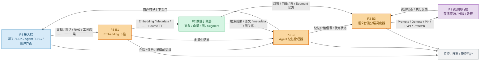
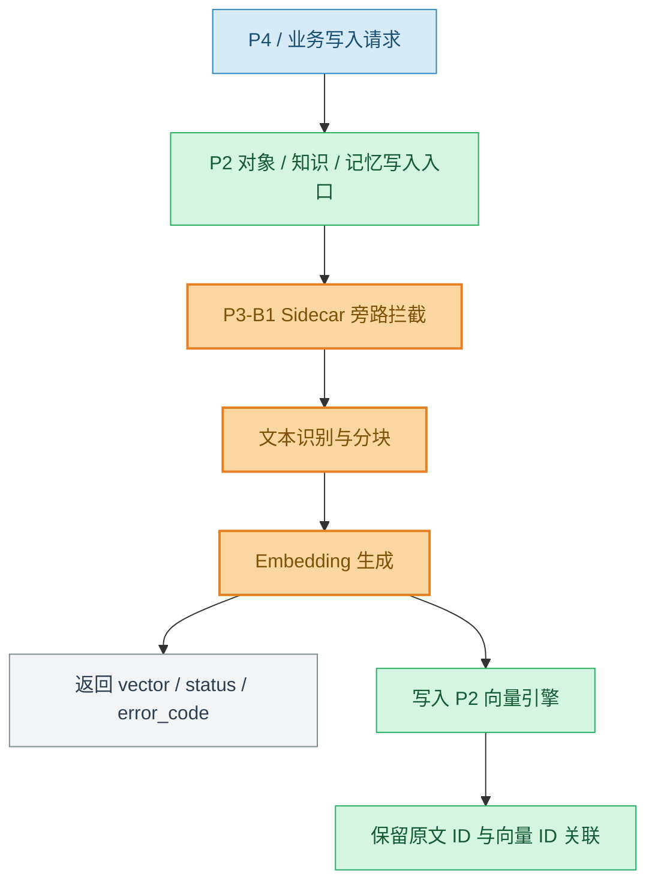
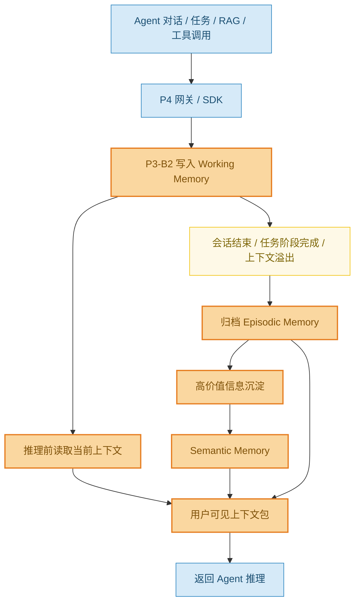
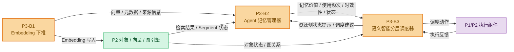
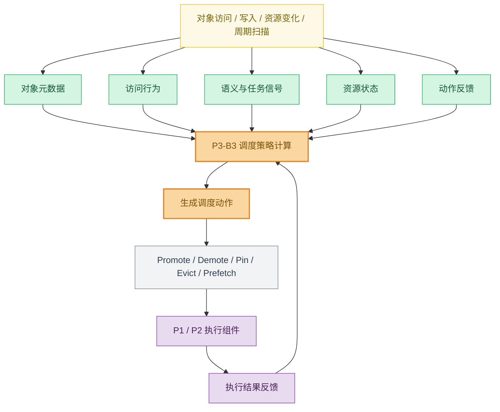
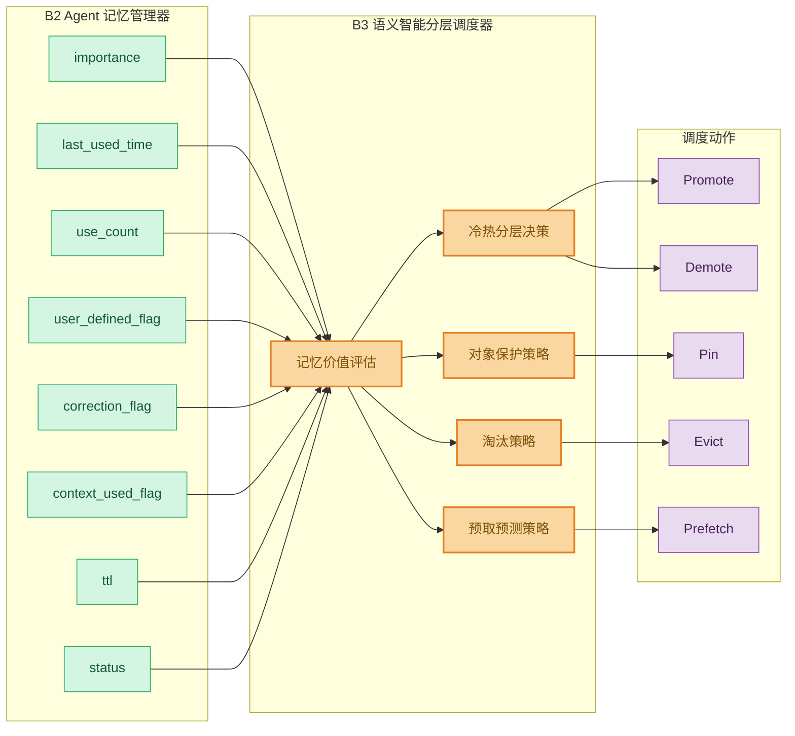

## 1. 文档说明

### 1.1. 编写目的

本文档用于明确 P3 语义层与智能调度模块在捷云盛多智能体项目中的定位、接入方式、输入输出、核心功能、外部依赖、阶段交付内容和评审确认事项。

本文档重点回答以下问题：

1. P3 在整体项目中以什么形式接入；
2. P3 与 P1 存储底座、P2 数据引擎、P4 接入网关及 Agent/RAG 业务流程之间的关系；
3. P3 从哪些模块获取数据；
4. P3 对外输出什么能力和结果；
5. P3 当前阶段需要实现哪些功能需求；
6. 哪些内容需要项目经理、甲方或其他模块负责人确认。

本文档不是详细设计文档，不展开具体算法参数、模型结构、代码实现方式和底层存储实现细节。文档中的接口字段为需求评审阶段的最小字段集合，用于对齐模块边界和接口 owner，不代表最终接口协议。

### 1.2. 文档适用范围

本文档适用于 P3 语义层与智能调度相关需求分析，包括：

- B1：Embedding 下推；
- B2：Agent 记忆管理器；
- B3：语义智能分层调度器；
- P3 与 P1/P2/P4/Agent/RAG/工具调用流程之间的接口关系；
- P3 当前阶段需求边界和验收关注点。

## 2. 背景与建设价值

当前 Agent 和 RAG 系统在企业级落地过程中，普遍面临以下问题：

1. **长上下文持续膨胀，推理成本高，有效信息难筛选。**  
   多轮对话、文档片段、工具调用结果和 RAG 证据不断累积，如果缺少统一的上下文管理机制，容易导致 Prompt 变长、成本上升、关键信息被稀释。

2. **历史对话、任务过程、工具结果和知识证据缺少统一记忆管理。**  
   Agent 在跨会话、长任务和多步骤执行过程中，需要恢复历史状态、复用任务经验和追溯证据来源。若只依赖当前上下文窗口，难以支撑长期任务连续执行。

3. **底层存储调度缺少语义感知能力。**  
   传统 LRU/LFU 等策略主要依据访问时间和访问频率，难以判断某段记忆、某个向量 Segment 或某类知识片段对当前任务是否重要，也难以体现业务优先级和语义价值。

因此，P3 的建设价值在于：在 Agent/RAG 业务流程与底层对象、向量、图和存储资源能力之间，引入语义化、记忆化和智能调度能力，形成“用户可见态 ↔ 向量库态”的上下文闭环

## 3. 术语、模块定位与系统口径

### 3.1. 术语与缩略语

| 术语 | 说明 |
|---|---|
| P1 | 底层存储资源与执行层，负责存储资源、冷热层级、迁移执行等能力 |
| P2 | 数据引擎层，提供对象、向量、图、Segment 状态等能力 |
| P3 | 语义层与智能调度模块，负责语义化、记忆管理和分层调度决策 |
| P4 | 网关、SDK、Agent/RAG 入口、用户界面和业务接入层 |
| B1 | Embedding 下推模块，负责写入链路中的语义化与向量化处理 |
| B2 | Agent 记忆管理器，负责三层记忆管理和用户可见上下文构建 |
| B3 | 语义智能分层调度器，负责语义资源调度决策 |
| Working Memory | 当前会话和当前任务的短期记忆 |
| Episodic Memory | 历史事件型记忆，如历史对话、任务轨迹、工具调用记录等 |
| Semantic Memory | 长期语义记忆，如用户偏好、长期规则、领域知识、任务经验等 |
| 用户可见态 | Agent 推理前可直接使用的上下文包，包含摘要、记忆、证据和任务状态 |
| 向量库态 | 已完成切分、向量化、索引和元数据绑定后的语义资源状态 |
| Segment | 向量或对象引擎中的分段、分片或可调度管理单元 |
| Tier | 存储资源层级，例如热层、温层、冷层等 |
| Promote | 将对象、记忆或 Segment 升温到更高性能层级 |
| Demote | 将对象、记忆或 Segment 降温到更低成本层级 |
| Pin | 对高价值对象进行固定或保护，避免被淘汰 |
| Evict | 淘汰或释放低价值对象 |
| Prefetch | 根据预测提前加载可能被访问的对象或记忆 |

---

### 3.2. P3 模块定位

P3 是整个项目中的语义层与智能调度层，位于上层 Agent/RAG 业务流程与底层对象、向量、图、存储资源能力之间。

P3 不直接承担底层对象存储、向量索引、图存储、物理迁移和网关接入能力，而是围绕 AI Agent 和 RAG 场景中的上下文、记忆、语义资源和冷热调度提供语义处理能力。

P3 的核心目标是：

> 对进入系统的文本、记忆、知识片段和任务上下文进行语义化处理，形成可管理、可召回、可追溯、可调度的记忆与语义资源，并基于访问行为、语义价值、任务上下文和资源状态生成分层调度决策。

P3 的三个核心子模块为：

| 子模块 | 模块名称 | 核心职责 |
|---|---|---|
| B1 | Embedding 下推 | 在存储侧或写入链路旁路完成文本、记忆、知识片段的向量化处理 |
| B2 | Agent 记忆管理器 | 管理当前会话记忆、历史事件记忆、长期语义记忆，并构建 Agent 推理前可用上下文 |
| B3 | 语义智能分层调度器 | 基于对象价值、访问行为、语义任务和资源状态生成放置、迁移、淘汰、预取等调度动作 |

---

---

## 4. 总体架构、接入形态与模块关系

### 4.1. P3 总体接入架构

P3 不作为独立孤岛运行，而是通过 P4 获取业务入口和 Agent/RAG 上下文，通过 P2 获取对象、向量、图和 Segment 状态，通过 P1/P2 执行组件完成实际资源调度动作。

图中颜色说明：蓝色表示 P4/业务入口，橙色表示 P3 语义层与智能调度模块，绿色表示 P2 数据引擎层，紫色表示 P1 资源执行层，灰色表示监控、日志和管控后台。

---

### 4.2. P3 在整体项目中的接入形态

P3 不是单一功能点，而是以三种形态接入整个项目：写入旁路接入、Agent 运行流程接入和调度决策服务接入。

#### 4.2.1. 写入旁路接入

对应模块：B1 Embedding 下推。

P3 在文档、记忆、知识片段或其他文本类对象写入系统时，通过 Sidecar、Node Agent、SDK Hook、旁路代理或消息链路接入写入流程，对需要语义化的数据进行识别、拦截、向量化和结果回传。

该接入形态的目标是让文本类数据在进入存储系统时即可形成向量表示，为后续语义检索、Agent 记忆管理和分层调度提供基础。

#### 4.2.2. Agent 运行流程接入

对应模块：B2 Agent 记忆管理器。

P3 接入 Agent 多轮对话、推理前上下文构建、会话结束归档、任务执行、RAG 调用和工具调用流程，负责记录、归档、召回和整理 Agent 运行过程中产生的上下文信息。

##### 4.2.2.1. 记忆写入、归档与上下文构建流程

##### 4.2.2.2. B2 与 B1/B3 的衔接关系

该接入形态的目标是支撑 Agent 当前会话连续性、跨会话信息恢复、长期知识沉淀和用户可控记忆管理。

#### 4.2.3. 调度决策服务接入

对应模块：B3 语义智能分层调度器。

P3 作为独立调度服务或平台组件接入上层业务、Agent 记忆管理器与底层对象、向量、图及资源执行组件之间。调度器负责汇聚对象状态、访问行为、语义任务、资源状态和动作反馈，生成标准化调度动作。

该接入形态的目标是让系统不再只依赖 LRU、LFU 等传统策略，而是能够根据语义价值、业务优先级、任务阶段和资源成本进行智能分层调度。

---

### 4.3. P3 与外部模块关系

#### 4.3.1. P3 与 P4 的关系

P4 是网关、SDK、业务入口、用户界面和 Agent/RAG 调用入口。P3 通过 P4 获取用户请求、会话上下文、Agent 任务信息、RAG 调用记录、工具调用结果和用户记忆操作请求。

| P4 向 P3 提供 | P3 向 P4 返回 |
|---|---|
| 用户请求 | 向量化处理状态 |
| tenant_id | 记忆写入结果 |
| user_id | 记忆召回结果 |
| session_id | Agent 推理前用户可见上下文 |
| agent_id | 记忆查看、修改、删除结果 |
| task_id | 调度状态 |
| 文档写入请求 | 错误码和日志标识 |
| 记忆写入请求 |  |
| RAG 调用记录 |  |
| 工具调用结果 |  |
| 用户查看、修改、删除记忆请求 |  |
| trace_id |  |

#### 4.3.2. P3 与 P2 的关系

P2 提供对象引擎、向量引擎和图引擎能力。P3 不负责实现这些底层引擎，而是依赖 P2 完成原始数据保存、向量写入、向量检索、图关系查询和 Segment 状态获取。

| P3 从 P2 获取 | P3 向 P2 输出 |
|---|---|
| 对象元数据 | embedding 结果 |
| 原始文档或知识片段 | 记忆元数据 |
| chunk 信息 | 向量写入请求 |
| 向量写入接口 | 语义检索请求 |
| 向量检索接口 | 记忆检索请求 |
| Segment 状态 | Segment 调度建议 |
| 图节点和图关系 | 对象关联调度需求 |
| 对象访问记录 |  |
| 索引状态 |  |
| 当前数据所在层级 |  |

#### 4.3.3. P3 与 P1 的关系

P1 提供底层存储、资源层级、冷热介质、数据迁移和资源执行能力。P3 不直接执行物理迁移，不直接管理硬件资源，而是通过调度接口向 P1/P2 资源执行组件输出调度建议或动作。

| P3 从 P1/P2 获取 | P3 向 P1/P2 输出 |
|---|---|
| Tier 层级定义 | promote |
| 各层容量 | demote |
| 各层访问时延 | pin |
| 当前负载 | unpin |
| 迁移成本 | prefetch |
| 资源状态 | evict hint |
| 迁移执行结果 | migration hint |
| 异常与失败反馈 | 调度原因 |
|  | 优先级 |
|  | trace_id |

#### 4.3.4. P3 与监控/日志系统关系

P3 需要接入统一监控和日志系统，用于记录：

- Embedding 请求耗时；
- Sidecar 拦截成功率；
- 记忆写入延迟；
- 记忆召回命中率；
- 上下文构建耗时；
- 调度决策耗时；
- 调度动作分布；
- 迁移执行结果；
- 异常和降级情况。

这些日志和指标用于联调、验收、问题定位和后续策略优化。

---

### 4.4. P3 内部模块关系

P3 内部三个模块之间存在明确的数据流和控制流关系。

#### 4.4.1. B1 到 B2

B1 负责将文本、记忆、知识片段等对象转成向量化结果，并保留原文 ID、chunk ID、来源类型和元数据。B2 使用 B1 的输出结果建立和管理记忆体系，包括 Working Memory、Episodic Memory 和 Semantic Memory。

| B1 输出项 | B2 使用方式 |
|---|---|
| chunk_id | 作为记忆片段、文档片段的最小关联单位 |
| source_id | 追溯原始文档、会话、任务或工具调用来源 |
| source_type | 区分对话、文档、RAG 证据、工具结果等来源 |
| embedding | 支撑记忆召回、相似检索和语义相关性判断 |
| metadata | 支撑权限、时间、租户、任务和状态管理 |
| 处理状态 | 判断是否进入记忆归档和后续重试流程 |

#### 4.4.2. B2 到 B3

B2 是 B3 的主要语义信号来源之一。B2 记录记忆是否被使用、是否有帮助、是否被纠错、是否为用户显式设定、是否进入当前上下文，并将这些信息作为记忆价值信号提供给 B3。

B3 使用 B2 输出的记忆价值信息，结合访问行为、资源状态和对象元数据，判断对应记忆或底层数据是否需要升温、降温、压缩、淘汰或保护。

| B2 输出项 | B3 使用方式 |
|---|---|
| memory_id | 标识被调度或评估的记忆对象 |
| memory_type | 区分 Working、Episodic、Semantic 等记忆类型 |
| importance | 判断记忆价值和保护优先级 |
| last_used_time | 判断时效性和冷却程度 |
| use_count | 判断访问热度和复用价值 |
| user_defined_flag | 判断是否为用户显式记忆，避免误删误淘汰 |
| correction_flag | 判断该记忆是否被用户纠错、禁用或降权 |
| context_used_flag | 判断该记忆是否进入过当前推理上下文 |
| ttl | 判断生命周期和过期策略 |
| status | 判断记忆是否有效、归档、禁用或删除 |

#### 4.4.3. B3 对 B1/B2 的反馈边界

B3 不直接改变 B1 的向量化逻辑，也不直接控制 B2 的记忆内容、记忆压缩、记忆删除和用户可见状态。B3 的主输出对象是 P1/P2 执行组件，其核心职责是根据语义价值、访问行为、资源状态和执行反馈生成资源侧调度动作或建议。

B3 可以向 B2 返回资源侧状态提示和调度建议，例如：

- 某类记忆或对象对应资源已被 Promote、Demote、Pin 或 Keep；
- 某类记忆对应对象当前访问成本较高，建议 B2 在构建 Context Pack 时注意 token budget 或来源选择；
- 某类记忆对应对象已过期、禁用或执行失败，建议 B2 重新检查 status、ttl 和 source_reference；
- 某类高价值用户显式记忆对应对象需要保护，B3 可输出 Pin 建议，但是否进入长期语义记忆、是否对用户可见仍由 B2 决定。

因此，B2 负责记忆生命周期、语义压缩、状态隔离和用户可见上下文构建；B3 负责资源侧分层调度、动作输出和执行反馈闭环。二者通过 memory signal、对象引用、调度状态和 trace_id 保持协同，但不得互相替代职责。

---

---

## 5. 数据对象、数据来源与输出结果

### 5.1. P3 数据来源

P3 的数据来源包括业务输入数据、Agent 运行数据、语义处理数据、资源状态数据和反馈数据。

| 数据类型 | 主要来源 | 使用模块 | 用途 |
|---|---|---|---|
| 文档/知识片段 | P4/P2 对象写入链路 | B1、B2 | 向量化、知识记忆沉淀 |
| 多轮对话 | Agent 对话流程/P4 | B2、B3 | 当前会话记忆、历史归档、上下文构建 |
| 任务执行过程 | Agent 任务流程 | B2 | 任务恢复、跨会话续接 |
| 工具调用结果 | Agent 工具链 | B2 | 任务复盘、上下文恢复 |
| RAG 调用记录 | RAG 流程/P4/P2 | B2 | 问题—证据—回答追溯 |
| 用户显式设定 | 用户界面/P4 | B2、B3 | 高可信长期记忆和保护规则 |
| 外部语义结果 | B1/P2 向量检索 | B2、B3 | 记忆召回、语义相关性判断 |
| 对象元数据 | P2 对象引擎 | B3 | 调度对象建模 |
| Segment 状态 | P2 向量引擎 | B3 | Segment 级调度 |
| 图关系数据 | P2 图引擎 | B3 | 关联调度、预取 |
| 访问日志 | P4/P2/监控系统 | B3 | 访问热度、命中率评估 |
| 资源层级状态 | P1/P2 | B3 | 调度动作可行性判断 |
| 调度执行反馈 | P1/P2 执行组件 | B3 | 策略评估和闭环更新 |

---

### 5.2. P3 输出结果

P3 对外输出包括语义处理结果、记忆管理结果、上下文构建结果和调度结果。

| 输出结果 | 输出对象 | 作用 |
|---|---|---|
| embedding 结果 | P2 向量引擎 / B2 记忆管理器 | 支撑向量检索和记忆召回 |
| 向量化处理状态 | P4 / 写入链路 / 管控后台 | 表示向量化是否成功、失败或排队 |
| 记忆写入结果 | Agent / P4 / 系统后台 | 表示当前信息是否成功进入记忆体系 |
| 用户可见上下文包 | Agent 推理流程 | 推理前提供可用上下文 |
| 记忆查看/修改/删除结果 | 用户界面 / 后台 | 支撑用户可控记忆 |
| 记忆价值信号 | B3 调度器 | 支撑冷热分层和保护策略 |
| 调度动作 | P1/P2 执行组件 | 触发升温、降温、迁移、淘汰、预取 |
| 调度状态与反馈指标 | 监控/后台/验收系统 | 支撑效果评估和问题定位 |

---

---

## 6. B1/B2/B3 核心功能需求

### 6.1. B1 Embedding 下推功能需求

#### 6.1.1. 模块目标

B1 建设一套部署在存储侧或写入链路旁路的向量化能力，在数据写入或进入记忆、知识库流程时完成文本识别、拦截、Embedding 生成、结果返回或落地。

#### 6.1.2. 功能需求

| 编号 | 需求项 | 需求描述 | 优先级 |
|---|---|---|---|
| B1-FR-01 | 写入拦截 | 能在存储写入链路中识别需要向量化的文本、记忆和知识片段 | P0 |
| B1-FR-02 | 向量化处理 | 能在存储侧完成 Embedding 生成，并返回向量或写入约定位置 | P0 |
| B1-FR-03 | 节点绑定 | Sidecar 能与存储节点绑定运行，参与真实或准真实读写链路 | P0 |
| B1-FR-04 | 向量结果关联 | 向量结果应保留与原始文本、文档块、记忆对象之间的关联 ID | P0 |
| B1-FR-05 | SIMD 预研支撑 | 完成基础矩阵乘法 SIMD 指令集预研，支撑后续 CPU 向量化性能优化 | P0 |
| B1-FR-06 | 吞吐性能支撑 | 在压测环境下，旁路拦截与向量化整体吞吐稳定达到合同目标 | P0 |
| B1-FR-07 | 长文本适配 | 支持极端长文本、不同文本长度和不同输入类型的处理验证 | P1 |
| B1-FR-08 | 异常降级 | 支持异常断连、吞吐抖动、节点宕机、网络延迟等场景下的可用性验证 | P1 |

#### 6.1.3. 输入数据

- 文档文本；
- 记忆文本；
- 知识库片段；
- Agent 对话片段；
- RAG 证据片段；
- 工具调用返回文本；
- 原始对象 ID；
- chunk ID；
- metadata；
- request_id。

#### 6.1.4. 输出数据

- embedding vector；
- status；
- error_code；
- latency；
- source_id；
- chunk_id；
- request_id；
- metadata；
- trace_id。

#### 6.1.5. 外部依赖

B1 依赖甲方或其他模块提供：

- 存储写入入口；
- 请求协议和字段样例；
- 存储节点清单；
- CPU/指令集信息；
- 部署权限；
- 向量落地接口；
- 压测环境；
- 测试数据；
- 日志权限。

### 6.2. B2 Agent 记忆管理器功能需求

#### 6.2.1. 模块目标

B2 面向大模型智能体的多轮对话、知识库调用和长期任务执行过程，负责将当前会话上下文、历史交互记录和长期语义知识沉淀为可管理、可追溯、可压缩、可召回的记忆体系。

B2 支撑 Agent 在当前会话中保持上下文连续，在跨会话场景中恢复历史信息，并在长期运行中沉淀可复用的用户偏好、领域知识和任务经验。

#### 6.2.2. 记忆数据来源

B2 的数据来源包括：

- 多轮对话；
- 任务执行过程；
- 工具调用结果；
- RAG 调用记录；
- 用户显式设定；
- 外部语义结果；
- 运行反馈。

每类数据进入记忆体系后，应保留来源信息，便于后续追溯、纠错和删除。

#### 6.2.3. 接入流程需求

| 编号 | 接入流程 | 需求描述 | 优先级 |
|---|---|---|---|
| B2-FR-01 | Agent 对话流程 | 每轮对话自动写入当前上下文 | P0 |
| B2-FR-02 | Agent 推理前流程 | 推理前返回整理后的可用上下文 | P0 |
| B2-FR-03 | 会话结束流程 | 会话结束后自动归档有效信息 | P0 |
| B2-FR-04 | 任务执行流程 | 记录任务目标、步骤、结果和未完成事项 | P1 |
| B2-FR-05 | RAG 调用流程 | 记录问题—证据—回答的关联关系 | P0 |
| B2-FR-06 | 工具调用流程 | 记录工具调用结果、错误和关键返回值 | P1 |
| B2-FR-07 | 用户产品界面 | 支持用户查看、添加、修改、删除记忆 | P1 |
| B2-FR-08 | 调优师后台 | 支持配置 Agent 级长期知识和记忆策略 | P1 |
| B2-FR-09 | 系统管理后台 | 展示记忆延迟、归档状态、压缩效果和异常情况 | P1 |
| B2-FR-10 | 外部调度/存储环节 | 输出记忆重要性、时效性、使用频次等价值信号 | P0 |

#### 6.2.4. 记忆分层需求

B2 应支持以下四类核心能力：

| 功能部分 | 保存或处理内容 | 触发时机 | 主要能力 |
|---|---|---|---|
| Working Memory 当前会话记忆 | 当前多轮对话、任务状态、临时上下文、最近工具结果 | 每轮对话、任务执行中 | 快速读写、短期保存、自动过期、上下文恢复 |
| Episodic Memory 历史事件记忆 | 历史对话、任务轨迹、RAG 调用记录、工具调用结果 | 会话结束、任务阶段完成、上下文溢出 | 自动归档、跨会话检索、来源追溯、时间衰减 |
| Semantic Memory 长期语义记忆 | 用户偏好、长期规则、领域知识、任务经验、核心事实 | 高价值历史信息沉淀、用户显式设定、运营配置注入 | 长期保存、压缩去重、用户可改可删、长期知识复用 |
| 用户可见态构建 | 当前会话内容、相关历史记忆、长期语义知识、证据片段 | Agent 推理前、用户查看记忆时、任务恢复时 | 多层记忆组装、容量控制、来源追溯、摘要化输出、异常降级 |

#### 6.2.5. 用户可见上下文包需求

B2 在 Agent 推理前应返回用户可见上下文包。上下文包应包括：

- 当前会话摘要；
- 当前任务状态；
- 相关历史记忆；
- 长期语义知识；
- RAG 证据片段；
- 工具调用关键结果；
- 来源标识；
- 更新时间；
- 可信度或优先级；
- 长度或 token 控制信息。

当长期记忆检索、历史归档或语义召回异常时，B2 应保证当前会话记忆仍可用，避免影响前台对话。

### 6.3. B3 语义智能分层调度器功能需求

#### 6.3.1. 模块目标

B3 是 P3 中面向多层语义资源的决策与编排模块，主要完成调度对象统一抽象、调度信号聚合、调度策略计算和调度动作生成。

B3 重点解决传统 LRU、LFU 等策略只依赖最近访问时间或累计访问频率，难以体现语义价值、任务上下文和业务优先级的问题。

B3 不直接负责底层数据读写、物理迁移和资源释放。B3 负责判断何时调度、调度哪个对象、执行何种动作；具体执行由 P1/P2 或资源执行组件完成。

#### 6.3.2. 调度对象需求

B3 应支持对以下语义资源进行统一抽象：

- 短期上下文；
- 历史记忆；
- 长期知识；
- 文档片段；
- 向量条目；
- 向量 Segment；
- 图实体关系；
- 可复用语义资源。

每个调度对象应具备基本状态，包括：

- 对象标识；
- 对象类型；
- 当前层级；
- 大小；
- 生命周期；
- 访问特征；
- 语义热度；
- 业务优先级；
- 有效期限；
- 当前状态；
- 可调度状态。

#### 6.3.3. 调度信号需求

B3 需要聚合以下信号：

| 信号类别 | 主要内容 | 主要来源 |
|---|---|---|
| 对象属性信号 | 类型、大小、层级、生命周期、有效期限、可迁移状态 | P2/B2 |
| 访问行为信号 | 最近访问时间、访问频次、访问间隔、命中情况、热点变化 | P4/P2/监控 |
| 语义价值信号 | 语义类别、任务相关度、实体重要性、业务价值、语义热度 | B2/Agent/语义服务 |
| 任务上下文信号 | 请求类型、任务阶段、会话状态、业务优先级、时延要求 | P4/Agent/B2 |
| 资源状态信号 | 各层容量、负载、访问时延、网络状态、迁移成本 | P1/P2 |
| 关联与预测信号 | 对象语义关联、共同访问、任务依赖、未来访问概率 | P2 图引擎/历史日志 |
| 动作反馈信号 | 动作结果、迁移耗时、后续访问、资源变化、预取命中 | P1/P2/监控 |

#### 6.3.4. 调度动作需求

B3 应输出标准化调度动作或建议，包括：

- 分层放置；
- 提权；
- 降权；
- 跨层迁移；
- 对象淘汰；
- 预测预取；
- 保持当前状态；
- 反馈与策略更新。

每个调度动作应至少包含：

- action_type；
- object_id；
- target_tier；
- priority；
- reason；
- expire_time；
- trace_id；
- policy_version；
- expected_effect；
- callback_required。

#### 6.3.5. 分阶段策略需求

B3 策略建设分为三个阶段：

| 阶段 | 策略形态 | 需求重点 | 当前阶段交付判断 |
|---|---|---|---|
| V1 | Heuristic 冷启动 | 接通对象、访问和资源基础信号，完成规则评分、动作输出和基础监控 | 当前阶段重点交付 |
| V2 | Contextual Bandit | 接入动作反馈和在线指标，增加策略版本管理、探索比例和灰度开关 | 后续演进方向，当前阶段仅预留 |
| V3 | Deep RL + GNN | 接入对象关联图、拓扑状态和预测特征，支持模型推理与周期训练更新 | 后续演进方向，当前阶段不纳入验收 |

当前阶段重点交付 V1 Heuristic 冷启动策略所需的对象、信号、动作、接口和验收口径；V2/V3 仅作为后续策略演进方向和接口预留，不纳入当前阶段验收。

---

---

## 7. 外部接口需求

本章仅定义 P3 与外部模块交互所需的最小字段集合，用于需求评审和接口 owner 对齐，不代表最终接口协议。字段名称、字段类型、枚举值、必填规则、错误码和调用方式需在后续接口设计阶段由 P1/P2/P3/P4 相关负责人共同确认。

### 7.1. B1 写入旁路接口

该接口用于将需要向量化的文本、记忆或知识片段提交给 B1，并返回向量或处理状态。

| 类型 | 最小字段 |
|---|---|
| 输入 | request_id、source_type、text/chunk_text、doc_id/memory_id/chunk_id、metadata |
| 输出 | vector、status、error_code、latency、trace_id |

### 7.2. B2 记忆写入接口

该接口用于 Agent、RAG 或工具调用流程将上下文信息写入记忆系统。

| 类型 | 最小字段 |
|---|---|
| 输入 | request_id、user_id、tenant_id、agent_id、session_id、task_id、memory_source、content、source_reference、metadata |
| 输出 | memory_id、status、memory_type、error_code、trace_id |

### 7.3. B2 上下文召回接口

该接口用于 Agent 推理前获取整理后的用户可见上下文包。本节为模块级最小字段集合，端到端数据流接口在 7.17 `IF-B2-P4-01` 中进一步细化。

| 类型 | 最小字段 |
|---|---|
| 输入 | request_id、user_id、tenant_id、agent_id、session_id、task_id、current_query、context_budget、retrieval_scope |
| 输出 | context_package、memory_refs、evidence_refs、summary、status、trace_id |

### 7.4. B3 调度决策接口

该接口用于提交对象状态和上下文信息，获取调度动作或建议。

| 类型 | 最小字段 |
|---|---|
| 输入 | request_id、object_id、object_type、current_tier、metadata、access_stats、semantic_signals、task_context、resource_state、trace_id |
| 输出 | action_type、target_tier、priority、reason、expected_effect、policy_version、status、trace_id |

### 7.5. 调度反馈接口

该接口用于 P1/P2 执行组件向 B3 返回调度动作执行结果。

| 类型 | 最小字段 |
|---|---|
| 输入 | action_id、object_id、action_type、execute_status、execute_latency、resource_change、error_code、trace_id |
| 输出 | feedback_status、update_status、trace_id |

### 7.6. 阶段方案接口要求对齐说明

根据《P3 第一阶段阶段方案文档（公司提交版 V1.1）》中的 P2/P3 接口总表，P3 需求文档的接口部分需要从“模块级最小字段”进一步细化为“端到端数据流接口”。本节补充内容嵌入外部接口需求正文，用于指导 B1、B2、B3 三个负责人继续细化接口字段、调用方式、真实联调范围与模拟验证范围。

填写时需遵循以下原则：

1. **接口编号与阶段方案保持一致。** 例如 IF-P4-B1-01、IF-B2-B3-01、IF-P2-B3-01 等编号不得随意变更。
2. **接口字段先按最小闭环填写。** 当前阶段只要求支持 12 月 1 日 MVP 必须字段，不追求最终生产协议完整性。
3. **必须区分真实接口与模拟接口。** 若某接口当前只能 mock，应在“真实/模拟边界”中说明替代方式、可验证内容和不能验证的内容。
4. **接口必须携带可追踪字段。** request_id、trace_id、tenant_id、source_id、object_id、memory_id、action_id 等字段应按接口场景选择性保留。
5. **接口 owner 必须明确。** 每个接口需由调用方、被调用方和项目经理共同确认 owner、交付时间和联调方式。

### 7.7. P2/P3/P4/P1 统一接口补充总表

| 接口编号 | 接口方向 | 阶段方案数据内容 | 使用模块 | 需求文档补充位置 | 是否 MVP 必须 | 真实/模拟边界 | 负责人填写 | 当前状态 |
|---|---|---|---|---|---|---|---|---|
| IF-P4-P2-01 | P4 → P2-E2 | 原始对象、文档、文件、模型/checkpoint、metadata | P2/P4，P3 可引用 | 7.8 | 是 | 开发可使用测试对象库；联调需 P2-E2 准真实对象接口；验收需真实或准真实 object_id/source_id/metadata/status | P4 负责人 / P2-E2 负责人 / P3 协同 | 已按方案填写，评审确认中 |
| IF-P4-B1-01 | P4 → B1 | 需语义化文本、对象引用、RAG 证据、工具结果摘要、embedding_required | B1 | 7.9 | 是 | 开发可 mock；联调需 P4 脱敏样例；验收需真实或准真实字段与 trace | B1 负责人 / P4 协同 | 评审确认中 |
| IF-P4-B2-01 | P4/Agent → B2 | 对话、任务事件、RAG 调用记录、工具调用结果、用户显式设定 | B2 | 7.10 | 是 | 开发可 mock；联调需 P4/Agent/RAG/工具链脱敏样例；验收需准真实事件流与 trace | B2 负责人 / P4、Agent、RAG、工具链协同 | 评审确认中 |
| IF-B1-P2-01 | B1 → P2-E1 | embedding、chunk_id、source_id、object_id、metadata、embedding_model | B1/P2 | 7.11 | 是 | 开发可 MockE1；联调需测试 E1；验收不得用纯 mock 替代向量写入主链路 | B1 负责人 / P2-E1 协同 | 评审确认中 |
| IF-B1-P2-02 | B1 → P2-E2 | chunk、摘要、处理状态、metadata 更新 | B1/P2 | 7.12 | 建议 | 开发可测试对象库；若 P4/P2 已预切分，B1 只回写状态和引用 | B1 负责人 / P2-E2 协同 | 评审确认中 |
| IF-B1-B2-01 | B1 → B2 | embedding_ref/vector、chunk_id、source_id、source_type、metadata、process_status、trace_id | B1/B2 | 7.13 | 是 | 可直接调用或经 P2 中转；MVP 必须证明 B1 产物可被 B2 作为记忆依据使用 | B1 负责人 / B2 负责人 / P2 协同 | 评审确认中 |
| IF-B2-P2-01 | B2 → P2-E2/E1 | 记忆原文/摘要、memory metadata、memory embedding 请求或引用 | B2/P2 | 7.14 | 是 | 开发可测试库；联调需 P2-E2/E1 准真实接口；验收需 memory_id/object_id/embedding_ref 可追溯 | B2 负责人 / P2-E1/E2 协同 | 评审确认中 |
| IF-B2-P2-02 | B2 → P2-E3 | session-turn-task-rag-evidence-memory 关系写入 | B2/P2 | 7.15 | 建议 | E3 可后置；MVP 至少保留最小关系图 mock 和 relation_type/source_id 字段兼容 | B2 负责人 / P2-E3 协同 | 评审确认中 |
| IF-P2-B2-01 | P2-E1/E2/E3 → B2 | 向量检索结果、对象原文/metadata、图关系/子图 | B2 | 7.16 | 是 | E1/E2 主链路需真实或准真实；E3 可先 mock；必须支持身份与状态过滤 | B2 负责人 / P2-E1/E2/E3 协同 | 评审确认中 |
| IF-B2-P4-01 | B2 → P4/Agent | Context Pack、summary、memory_refs、evidence_refs、budget_info、status、trace_id | B2/P4/Agent | 7.17 | 是 | 开发可 mock Agent；联调/验收需 P4/Agent/RAG 脱敏样例和真实 trace | B2 负责人 / P4、Agent 协同 | 评审确认中 |
| IF-B2-B3-01 | B2 → B3 | memory signal、context_used_flag、importance、TTL、状态 | B3 | 7.18 | 是 | 开发可使用 mock signal；联调应使用 B2 准真实输出；字段结构需联调前冻结 | B2 负责人 / B3 负责人 | 评审确认中 |
| IF-P2-B3-01 | P2 → B3 | ObjectMeta、SegmentStat、访问统计、图关系、索引状态 | B3 | 7.19 | 是 | 开发可 mock SegmentStats/ObjectStats；联调需 P2 准真实状态接口或日志回放数据 | P2 负责人 / B3 负责人 | 评审确认中 |
| IF-B3-P1P2-01 | B3 → P1/P2 | Promote、Demote、Pin、Unpin、Prefetch、Evict、Keep 等动作或建议 | B3/P1/P2 | 7.20 | 是 | MVP 可接 mock executor；若 P1/P2 执行接口就绪，可切换准真实执行反馈；Evict/Prefetch 可先建议式输出 | B3 负责人 / P1/P2 负责人 | 评审确认中 |
| IF-P1P2-B3-01 | P1/P2 → B3 | 执行反馈、资源变化、迁移耗时、失败原因、trace_id | B3 | 7.21 | 是 | MVP 可由 mock executor 返回反馈；真实迁移接口就绪后接入 P1/P2 回调；反馈字段需与 action_id 幂等关联 | P1/P2 负责人 / B3 负责人 | 评审确认中 |
| IF-MON-ALL-01 | P4/P3/P2/P1 → 监控 | request_id、trace_id、latency、status、error_code、指标 | 全模块 | 7.22 | 是 | 开发可本地日志；联调/验收需接入统一日志、Trace 和监控平台；mock 业务接口不得 mock trace/latency/status/error_code | 监控/运维负责人 / P1/P2/P3/P4 各模块负责人 | 已按方案填写，评审确认中 |

### 7.8. IF-P4-P2-01：P4 原始资产写入 P2-E2 接口

该接口用于确认原始资产数据的统一落点。P3 不直接保存全部原始资产，但 B1/B2/B3 需要通过 object_id、source_id、raw_ref 等字段引用 P2-E2 中的原文、chunk、metadata 或对象状态。

| 填写项 | 需求说明 | 负责人填写 |
|---|---|---|
| 调用方 | P4 / 业务系统 / Agent / RAG / 训练或推理任务入口 | P4 为主调用方；Agent/RAG/业务写入链路经 P4 统一提交，P3 通过 object_id、source_id、raw_ref、content_ref 引用 P2-E2 数据。 |
| 被调用方 | P2-E2 对象引擎 | P2-E2 对象引擎或其测试/准真实接口；开发阶段可使用测试对象库，验收阶段应切换到真实或准真实 P2-E2。 |
| 输入字段 | request_id、trace_id、tenant_id、source_type、source_id、object_type、raw_ref、content_ref、metadata、status、created_at | MVP 必填 request_id、trace_id、tenant_id、source_type、source_id、object_type、raw_ref/content_ref、metadata、status、created_at；如存在 chunk，需同步 chunk_id/chunk_ref。 |
| 输出字段 | object_id、raw_ref、metadata_ref、status、error_code、trace_id | P2-E2 返回 object_id、raw_ref、metadata_ref、status、error_code、trace_id；B1/B2/B3 使用 object_id/source_id 追溯原文、记忆来源和调度对象。 |
| P3 使用方式 | B1 根据 object_id/raw_ref 拉取原文或 chunk；B2 根据 object_id 追溯记忆来源；B3 根据 ObjectMeta 建模调度对象 | B1 不保存原文，只消费 object_id/raw_ref/chunk_ref 并生成 embedding；B2 使用 object_id/source_id 维护记忆来源；B3 使用 ObjectMeta、status、ttl、business_priority 和 current_tier 构造调度对象视图。 |
| 是否同步调用 | 同步 / 异步 / 两者均需 | P4→P2-E2 可同步或异步；P3 侧要求写入完成后能够通过 object_id/raw_ref 获取可用文本、chunk 或 metadata。批量写入可异步，单条对象写入需返回可追踪状态。 |
| 是否 MVP 必须 | 是，至少需要测试或准真实对象落点 | 是。MVP 至少需要测试或准真实 P2-E2 对象落点，并保证 object_id、source_id、metadata、status 与正式接口兼容。 |
| 真实/模拟边界 | 若 P2-E2 未就绪，可使用测试对象库或本地样例，但 object_id、source_id、metadata、status 字段必须与正式接口兼容 | 开发阶段可使用测试对象库、本地样例或 MinIO/PostgreSQL 替代；联调阶段需接入 P2-E2 测试接口；验收阶段不得只使用无 object_id/source_id 体系的纯 mock。 |
| 评审确认事项 | object_id/source_id 生成规则、metadata 最小字段、状态枚举、原文是否必须先落 E2 | 方案建议：object_id 由 P2-E2 生成，source_id 由 P4/业务入口生成并透传；metadata 最小字段包括 tenant_id、source_type、created_at、status、namespace；状态枚举建议采用 active、disabled、deleted、expired、processing、failed；原文原则上先落 E2，P4 直接传 chunk_text 的场景也必须保留 object_id/source_id 可追溯关系。 |

### 7.9. IF-P4-B1-01：P4 向 B1 提交语义化请求接口

该接口用于将需要向量化的文本、对象引用、RAG 证据、工具结果摘要或记忆候选内容提交给 B1。

| 填写项 | 需求说明 | 负责人填写 |
|---|---|---|
| 调用方 | P4 / Agent / RAG / 业务写入链路 | P4、Agent/RAG 写入链路、B2 记忆向量化流程均可作为调用来源；P4 为接口 owner 协同方。 |
| 被调用方 | B1 Embedding 下推服务 / Sidecar | B1 Sidecar / EmbeddingWorker，对外暴露 HTTP/gRPC 或项目统一 RPC 接口。 |
| 输入字段 | request_id、trace_id、tenant_id、user_id、agent_id、session_id、task_id、source_type、source_id、object_id/raw_ref、text/chunk_text、metadata、embedding_required、embedding_config_id | 必需字段：request_id、trace_id、tenant_id、source_type、source_id、text/chunk_text 或 object_id/raw_ref、metadata、embedding_required；建议字段：user_id、agent_id、session_id、task_id、embedding_config_id。 |
| 输出字段 | semantic_object_id、chunk_ids、embedding_refs/vector、embedding_model、embedding_dim、status、error_code、latency、trace_id | 返回 chunk_ids、embedding_refs、embedding_model、embedding_dim、quantization_type、status、error_code、latency_ms、embedding_latency_ms、trace_id；默认返回向量引用，不建议在高并发场景直接回传大向量数组。 |
| 调用触发 | 文档写入、RAG 证据入库、工具结果归档、记忆向量化、query embedding | 文档/知识片段入库、RAG 证据沉淀、工具结果归档、B2 记忆向量化、query embedding 或 P4 标记 embedding_required=true 时触发。 |
| 是否同步调用 | 同步返回状态，批量场景支持异步或队列化 | 支持同步返回状态；批量文档和压测场景建议队列化/批处理；主写入链路异常时不得长期阻塞。 |
| 是否 MVP 必须 | 是 | 是，B1 MVP 必须至少支持 P4→B1 的文本/chunk 向量化请求。 |
| 真实/模拟边界 | 开发阶段可使用 mock 请求；联调/验收需使用 P4 提供的脱敏样例和准真实字段 | 开发阶段可 mock；联调需 P4 脱敏样例和准真实字段；验收阶段需真实或准真实 trace、metadata、source_type、文本长度分布。 |
| 评审确认事项 | embedding_required 由谁判断、chunk 由谁切分、最大文本长度、source_type 枚举 | 需确认 embedding_required 判断 owner、chunk 由 P4/P2 预切分还是 B1 基础切分、最大文本/token 长度、source_type 枚举、同步/异步超时策略。 |

### 7.10. IF-P4-B2-01：P4/Agent 向 B2 提交记忆事件接口

该接口用于将 Agent 对话、任务事件、RAG 调用记录、工具调用结果、用户显式设定和用户记忆操作提交给 B2。B2 以事件流方式接收上层运行过程数据，形成 Working Memory、Episodic Memory 和 Semantic Memory 的候选输入。

| 填写项 | 需求说明 | 负责人填写 |
|---|---|---|
| 调用方 | P4 / Agent Runtime / RAG / 工具链 / 用户界面 | P4 负责统一事件入口和字段标准化；Agent Runtime 产生对话轮次、推理前请求和任务事件；RAG 产生 question-evidence-answer 记录；工具链产生 tool_call/tool_result；用户界面产生用户显式记忆新增、修改、删除事件。 |
| 被调用方 | B2 Agent 记忆管理器 | B2 MemoryEventService / Memory API，负责事件接收、字段校验、幂等处理、Working Memory 写入、异步归档任务投递和状态返回。 |
| 输入字段 | request_id、trace_id、tenant_id、user_id、agent_id、session_id、task_id、event_type、memory_source、content、source_reference、metadata、timestamp | MVP 必需字段：request_id、trace_id、tenant_id、user_id、agent_id、session_id、event_type、memory_source、content/source_reference、timestamp。建议字段：task_id、turn_id、role、rag_evidence_refs、tool_name、tool_status、content_token_count、permission_scope、ttl、expected_version。 |
| 输出字段 | memory_id、memory_type、status、error_code、trace_id | 返回 event_id、memory_id、memory_type、write_status/status、error_code、trace_id；异步归档场景返回 archive_task_id、queue_status；删除/修改场景返回 affected_memory_ids 和 consistency_check_status。 |
| 事件类型 | after_turn、before_inference、session_end、task_event、rag_call、tool_result、user_memory_add、user_memory_update、user_memory_delete | MVP 至少支持 after_turn、before_inference、session_end、rag_call、tool_result；用户显式记忆新增/修改/删除建议纳入联调，若产品界面未就绪可通过后台或接口样例验证。 |
| 是否同步调用 | 同步 / 异步 / 混合 | after_turn、user_memory_add/update/delete 建议同步返回接收状态；session_end、task_event、rag_call、tool_result 可异步归档；before_inference 不建议写入大量内容，主要触发 7.17 Context Pack 召回。 |
| 是否 MVP 必须 | 是，至少需覆盖多轮对话、RAG 证据或工具结果中的两类 | 是。MVP 至少需完成多轮对话写入、推理前上下文请求、会话结束归档，并覆盖 RAG 证据或工具结果中的至少两类事件。 |
| 真实/模拟边界 | 自构造样例只能用于开发；联调和验收需使用公司脱敏 Agent/RAG/工具调用样例 | 开发阶段可用构造事件；联调阶段应使用 P4/Agent/RAG/工具链提供的脱敏样例；验收阶段需保留真实或准真实 tenant/user/agent/session/task/trace 字段，不能只用单用户 demo 证明。 |
| 评审确认事项 | P4 是否提供 before_inference/after_turn/session_end 标准事件、用户操作事件是否纳入 MVP | 需确认 P4 是否统一产生 after_turn、before_inference、session_end 标准事件；content 是直接传文本还是 content_ref；用户记忆操作是否纳入 MVP；事件幂等键、重试策略、超时策略和错误码由谁冻结。 |

### 7.11. IF-B1-P2-01：B1 向 P2-E1 写入向量接口

该接口用于将 B1 生成的 embedding、chunk_id、source_id、metadata 等写入 P2-E1 向量引擎。

| 填写项 | 需求说明 | 负责人填写 |
|---|---|---|
| 调用方 | B1 | B1 Sidecar / P2VectorAdapter。 |
| 被调用方 | P2-E1 向量引擎 | P2-E1 测试或准真实向量引擎，底层可为 Milvus 或项目统一向量接口。 |
| 输入字段 | request_id、trace_id、tenant_id、collection、embedding、embedding_dim、embedding_model、chunk_id、source_id、object_id、metadata、status | 必需字段：request_id、trace_id、tenant_id、collection、embedding 或 embedding_ref、embedding_dim、embedding_model、chunk_id、source_id、object_id、metadata、status；建议增加 normalized、quantization_type、sidecar_instance_id。 |
| 输出字段 | embedding_ref、vector_id、segment_id、write_status、error_code、latency、trace_id | 返回 embedding_ref/vector_id、segment_id、write_status、error_code、e1_write_latency_ms、trace_id。 |
| 过滤字段 | tenant_id、user_id、agent_id、namespace、source_type、status、created_at、updated_at | 最小过滤字段为 tenant_id、namespace、source_type、status、created_at；如涉及 Agent 记忆，需保留 user_id、agent_id、session_id、task_id。 |
| 是否同步调用 | 支持同步写入状态返回，批量写入采用异步/批处理 | MVP 支持同步写入状态返回；压测和批量导入建议支持批量写入，需明确单批上限、失败重试和幂等键。 |
| 是否 MVP 必须 | 是 | 是，B1 MVP 必须完成 E1 写入或与 E1 兼容的测试向量写入。 |
| 真实/模拟边界 | 开发可使用 MockE1 或测试 Milvus；验收不可仅使用纯 mock 替代向量写入主链路 | 开发可用 MockE1/测试 Milvus；联调需接入 P2-E1 测试接口；验收不可仅用纯 mock 替代 E1 写入主链路。 |
| 评审确认事项 | embedding_dim、collection schema、distance_type、normalize、批量写入上限、错误码 | 需冻结 embedding_dim、collection schema、distance_type、normalize 策略、批量写入上限、幂等键、错误码和 trace 字段。 |

### 7.12. IF-B1-P2-02：B1 向 P2-E2 更新 chunk/摘要/处理状态接口

该接口用于补充原文、chunk、摘要、处理状态和 metadata 的追溯关系。

| 填写项 | 需求说明 | 负责人填写 |
|---|---|---|
| 调用方 | B1 | B1 Sidecar / Chunk 状态回写适配器。 |
| 被调用方 | P2-E2 对象引擎 | P2-E2 对象引擎或其测试接口。 |
| 输入字段 | request_id、trace_id、object_id、source_id、chunk_ids、chunk_text_refs、summary_ref、metadata、process_status、error_code | 必需字段：request_id、trace_id、object_id、source_id、chunk_ids、chunk_text_refs 或 chunk_refs、metadata、process_status、error_code；如 B1 不生成摘要，summary_ref 可为空。 |
| 输出字段 | object_id、chunk_refs、update_status、error_code、trace_id | 返回 object_id、chunk_refs、update_status、error_code、trace_id。 |
| 是否 MVP 必须 | 建议；若 P4/P2 已完成 chunk 管理，则 B1 可只写处理状态和引用 | 建议支持；若 P4/P2 已完成 chunk 管理，B1 MVP 可只写 embedding 处理状态、error_code 和 embedding_ref 引用。 |
| 真实/模拟边界 | 可用测试对象库过渡，但 object_id/chunk_id/source_id 必须与正式接口兼容 | 开发可用测试对象库；联调/验收需保证 object_id、chunk_id、source_id、metadata、status 与 P2-E2 正式字段兼容。 |
| 评审确认事项 | chunk 是否由 B1 生成并写回 E2，还是由 E2/P4 预切分后提供 | 需确认 chunk 是 P4/P2 预切分还是 B1 基础切分；B1 是否需要写回 chunk_text_refs；摘要是否属于 B1 范围；失败状态如何回写。 |

### 7.13. IF-B1-B2-01：B1 向 B2 提供向量化结果与来源引用接口

该接口用于明确 B1 语义化结果如何进入 B2 记忆管理链路。若系统实现采用 B1 直接推送方式，则由 B1 将 embedding_ref/vector、chunk_id、source_id、metadata 等结果发送给 B2；若系统实现采用 P2 中转方式，则本接口表示逻辑数据流，B1 将结果写入 P2，B2 通过 `IF-P2-B2-01` 检索或读取该结果。无论采用哪种方式，字段结构、ID 规则和 trace_id 必须保持一致。

| 填写项 | 需求说明 | 负责人填写 |
|---|---|---|
| 调用方 | B1 Embedding 下推服务，或 B2 主动从 P2 拉取 B1 写入结果 | MVP 支持两种实现口径：B1 直接异步通知 B2；或 B1 写入 P2-E1/E2 后由 B2 按 object_id/source_id 拉取。优先保持逻辑字段一致，避免后续切换实现方式时破坏 B2 记忆链路。 |
| 被调用方 | B2 Agent 记忆管理器，或 P2-E1/E2 作为中转落点 | 直接模式下被调用方为 B2 MemoryCandidate 接口；中转模式下 P2-E1/E2 作为落点，B2 通过 7.16 读取 embedding_ref、chunk_ref、metadata 和原文引用。 |
| 输入字段 | request_id、trace_id、tenant_id、user_id、agent_id、session_id、task_id、source_type、source_id、object_id、chunk_id、chunk_text_ref、embedding_ref/vector、embedding_model、embedding_dim、metadata、process_status | 必需字段：request_id、trace_id、tenant_id、source_type、source_id、chunk_id、embedding_ref 或 vector、embedding_model、embedding_dim、process_status。Agent 记忆场景建议携带 user_id、agent_id、session_id、task_id、memory_id/object_id、chunk_text_ref 和 metadata。 |
| 输出字段 | receive_status、memory_candidate_id、error_code、trace_id | B2 返回 receive_status、memory_candidate_id、error_code、trace_id；若进入 pending_embedding 或 retry 队列，应返回 pending_status、retry_after 和 failure_reason。 |
| P3 使用方式 | B2 使用 chunk_id/source_id/embedding_ref/metadata 建立记忆候选、来源追溯和后续 Context Pack 召回依据 | B2 不直接依赖大向量数组作为长期状态，优先保存 embedding_ref/vector_id、source_id、chunk_id、object_id 和 metadata；Context Pack 召回时再经 P2-E1/E2 读取检索结果与原文/摘要。 |
| 是否同步调用 | B1 直接同步 / B1 异步推送 / B2 经 P2 拉取 / 混合 | 开发阶段可同步返回；联调和压测建议采用异步推送或 P2 中转方式。若 B1 向量化失败，B2 可记录 pending_embedding 状态并由异步任务重试。 |
| 是否 MVP 必须 | 是。MVP 至少必须证明 B1 产出的向量化结果可被 B2 作为记忆写入或召回依据使用 | 是。MVP 不强制 B1 直接调用 B2，但必须证明 B1 输出的 embedding_ref/chunk_id/source_id 可被 B2 用于记忆候选写入、来源追溯或 Context Pack 召回。 |
| 真实/模拟边界 | 若 B1 不直接调用 B2，应明确由 P2 中转，并保证 `IF-B1-P2-01`、`IF-B1-P2-02` 与 `IF-P2-B2-01` 字段兼容；开发阶段可 mock，但联调前需冻结字段 | 开发可使用 mock embedding_ref；联调需接入真实或准真实 B1/P2 字段；验收不可只证明 B2 内部伪向量可用，必须保留 B1 产物与 B2 记忆对象之间的 trace。 |
| 评审确认事项 | B1 是否直接通知 B2；B2 是否只从 P2 拉取；embedding_ref 与 memory_id/object_id 的映射规则；失败状态是否进入 pending_embedding | 需确认 B1→B2 是否存在物理接口，还是只保留逻辑数据流；memory_id、object_id、chunk_id、embedding_ref 的映射规则；向量化失败是否进入 pending_embedding；重复通知如何幂等。 |

### 7.14. IF-B2-P2-01：B2 向 P2-E2/E1 写入记忆与记忆向量接口

该接口用于持久化 Episodic Memory 与 Semantic Memory 的原文、摘要、metadata 和 embedding 引用。B2 负责记忆生命周期、状态、来源追溯和用户可见边界；P2-E2/P2-E1 负责原文/摘要与向量检索底座。记忆向量化可通过 B1 完成，但 B1 不作为 B2→P2 持久化接口的主被调用方。

| 填写项 | 需求说明 | 负责人填写 |
|---|---|---|
| 调用方 | B2 | B2 Agent 记忆管理器，在会话结束、任务阶段完成、上下文溢出、高价值信息沉淀、用户显式记忆写入、记忆更新/删除时触发。 |
| 被调用方 | P2-E2 / P2-E1 | P2-E2 保存记忆原文、摘要、metadata、状态和 source_reference；P2-E1 保存 embedding 或 embedding_ref。记忆向量化由 B2 调用 B1 或复用 B1/P2 中转结果完成。 |
| 输入字段 | memory_id、memory_type、tenant_id、user_id、agent_id、session_id、task_id、content/summary、source_reference、metadata、status、ttl、embedding_ref/vector | 必需字段：memory_id、memory_type、tenant_id、user_id、agent_id、session_id、content/summary、source_reference、metadata、status、ttl、trace_id。若已完成向量化，携带 embedding_ref/vector_id、embedding_model、embedding_dim；若尚未完成，写入 pending_embedding 状态。 |
| 输出字段 | object_id、raw_ref、embedding_ref、write_status、error_code、trace_id | P2 返回 object_id、raw_ref/summary_ref、embedding_ref/vector_id、write_status、error_code、trace_id；如 E1/E2 分步写入，应返回 partial_success 与补偿任务标识。 |
| 是否 MVP 必须 | 是，至少需支持基础 Episodic Memory 持久化和检索 | 是。MVP 至少支持 Episodic Memory 原文/摘要写入、metadata/status/ttl 保存、embedding_ref 关联和后续检索；Semantic Memory 可先覆盖用户显式记忆和高价值长期规则。 |
| 真实/模拟边界 | 可用测试库过渡；正式联调需接入 P2-E2/E1 或保持接口兼容 | 开发可用 MinIO/PostgreSQL/Milvus 测试库；联调需接入 P2-E2/E1 测试或准真实接口；验收阶段需证明 memory_id、object_id、embedding_ref、source_reference、trace_id 可追溯。 |
| 评审确认事项 | 记忆是否直接写 P2，还是先写 B2 测试库；memory_id 与 object_id 映射规则 | 需确认 B2 是否拥有临时记忆库；memory_id 与 object_id/vector_id 的映射规则；E1/E2 分步写入失败时如何补偿；deleted/disabled/expired/superseded 状态是否同步至 E1 filter 和 E2 metadata。 |

### 7.15. IF-B2-P2-02：B2 向 P2-E3 写入最小关系图接口

该接口用于写入 session-turn-task-rag-evidence-memory-object-chunk-vector-segment 等最小关系，支撑来源追溯、证据链、跨会话召回解释和后续关联调度。当前阶段若 P2-E3 图引擎未完全就绪，可采用最小关系图 mock，但 relation_type、src_id、dst_id 和 source_id 规则应提前冻结。

| 填写项 | 需求说明 | 负责人填写 |
|---|---|---|
| 调用方 | B2 | B2 在记忆写入、RAG 证据归档、工具结果归档、Context Pack 使用反馈、记忆纠错/删除时写入或更新关系。 |
| 被调用方 | P2-E3 图引擎或最小关系图 mock | 优先对接 P2-E3；若 E3 未就绪，B2 可维护最小关系图 mock 或关系表，并保证后续可迁移到 P2-E3。 |
| 输入字段 | relation_id、relation_type、src_id、dst_id、tenant_id、session_id、task_id、source_type、metadata、status、trace_id | 必需字段：relation_id、relation_type、src_id、dst_id、tenant_id、session_id、source_type、status、trace_id。建议字段：user_id、agent_id、task_id、memory_id、object_id、chunk_id、vector_id、evidence_id、tool_call_id、created_at、updated_at。 |
| 输出字段 | relation_ref、write_status、error_code、trace_id | 返回 relation_ref、write_status、error_code、trace_id；批量写入时返回 accepted_count、failed_count 和 failure_reason_summary。 |
| 是否 MVP 必须 | 建议；若真实 E3 未就绪，MVP 至少需最小关系图 mock | 建议纳入 MVP。真实 E3 可后置，但至少需要最小关系图 mock 支撑来源追溯、RAG 证据链、记忆—对象—向量关系和后续 B3 关联调度字段。 |
| 真实/模拟边界 | 真实 E3 可后置；但关系字段、relation_type 和 source_id 必须提前统一 | 开发阶段可本地关系表或 JSON/SQLite mock；联调阶段应与 P2-E3 字段对齐；验收时如 E3 未就绪，应明确只能验证关系追溯和接口兼容，不能验证真实图查询性能。 |
| 评审确认事项 | E3 当前阶段是否提供可用关系数据，最小关系图由 B2 维护还是 P2 提供 | 需确认 E3 是否纳入 12 月 1 日 MVP；最小关系图 owner 是 B2 还是 P2；relation_type 枚举、关系删除/禁用策略、关系查询接口和后续迁移方式。 |

### 7.16. IF-P2-B2-01：P2 向 B2 返回检索、原文和关系结果接口

该接口用于 B2 在构建 Context Pack、跨会话召回、记忆查看/追溯和任务恢复时，从 P2-E1/E2/E3 获取向量检索结果、原文/摘要、metadata 和关系/子图。B2 应基于租户、用户、Agent、session、status 和权限过滤，避免删除、禁用或越权记忆进入上下文。

| 填写项 | 需求说明 | 负责人填写 |
|---|---|---|
| 调用方 | B2 | B2 ContextPackBuilder / MemoryRetriever，在 before_inference、任务恢复、用户查看记忆、跨会话追问和后台评测时发起。 |
| 被调用方 | P2-E1 / P2-E2 / P2-E3 | P2-E1 返回向量检索结果；P2-E2 返回原文/摘要/metadata/status；P2-E3 或最小关系图返回 session-task-rag-evidence-memory-object 关系。 |
| 输入字段 | query_embedding/current_query、tenant_id、user_id、agent_id、session_id、retrieval_scope、top_k、filters、context_budget、trace_id | 必需字段：request_id、trace_id、tenant_id、user_id、agent_id、session_id、retrieval_scope、top_k、filters、context_budget。若由文本 query 触发召回，需携带 current_query 或 query_embedding_ref；建议字段：task_id、time_range、memory_type、source_type、status_filter、permission_scope。 |
| 输出字段 | search_hits、object_refs、chunk_refs、memory_refs、evidence_refs、relation_refs、score、status、trace_id | 返回 search_hits、memory_refs、object_refs、chunk_refs、evidence_refs、relation_refs、score、status、trace_id；每条结果建议包含 memory_id、object_id、chunk_id、embedding_ref、summary/raw_ref、metadata、memory_type、source_type、updated_at、ttl、status、retrieval_score、decay_score。 |
| 必需过滤 | tenant/user/agent/status/source_type/namespace/time_range | 必须支持 tenant_id、user_id、agent_id、status、source_type、namespace、time_range 过滤；deleted、disabled、expired、superseded、无权限对象不得返回给 B2 Context Pack。 |
| 是否 MVP 必须 | 是 | 是。MVP 必须证明 B2 可以从 P2-E1/E2 取回可用于 Context Pack 的检索结果和原文/摘要；E3 可用最小关系图 mock。 |
| 真实/模拟边界 | E1/E2 主链路建议真实或准真实；E3 可先 mock 最小关系图 | 开发可用测试 Milvus/本地对象库；联调和验收应使用真实或准真实 E1/E2；E3 可先 mock，但需要 relation_id/relation_type/source_id 字段兼容。 |
| 评审确认事项 | E1 是否支持 status filter，E2 原文读取延迟，E3 关系查询是否纳入 MVP | 需确认 E1 是否原生支持 status/tenant/user filter；E2 原文读取 P95/P99；E3 是否纳入 MVP；query embedding 由 B2 调 B1 生成还是由 P4/Agent 提供；检索分数与时间衰减如何融合。 |

### 7.17. IF-B2-P4-01：B2 向 P4/Agent 返回 Context Pack 接口

该接口用于 Agent 推理前由 B2 向 P4/Agent Runtime 返回整理后的用户可见上下文包。该接口是 B2 对外输出的核心接口之一，应与 `IF-P4-B2-01` 中 before_inference 类事件形成请求—响应关系，也可由 P4/Agent 主动调用 B2 上下文召回接口获得结果。

| 填写项 | 需求说明 | 负责人填写 |
|---|---|---|
| 调用方 | P4 / Agent Runtime / RAG 编排层 | P4/Agent 在模型推理前、任务恢复、跨会话追问或用户查看上下文时调用 B2；RAG 编排层可请求附带 evidence_refs 和 memory_refs 的上下文包。 |
| 被调用方 | B2 Agent 记忆管理器 | B2 ContextPackBuilder，负责召回 Working/Episodic/Semantic Memory、RAG 证据和工具结果，并进行过滤、排序、摘要、压缩、预算控制和降级。 |
| 输入字段 | request_id、trace_id、tenant_id、user_id、agent_id、session_id、task_id、current_query、context_budget、retrieval_scope、filters、timestamp | 必需字段：request_id、trace_id、tenant_id、user_id、agent_id、session_id、current_query、context_budget、retrieval_scope。建议字段：task_id、model_context_window、preferred_language、include_evidence、include_tool_results、status_filter、permission_scope、max_memory_items。 |
| 输出字段 | context_package、summary、working_memory_refs、episodic_memory_refs、semantic_memory_refs、evidence_refs、tool_result_refs、budget_info、degrade_flag、status、error_code、trace_id | 输出 context_package、summary、working_memory_refs、episodic_memory_refs、semantic_memory_refs、evidence_refs、tool_result_refs、budget_info、degrade_flag、status、error_code、trace_id；建议附带 token_before、token_after、compression_ratio、source_count、dropped_reason、retrieval_latency_ms。 |
| Context Pack 组成 | 当前会话摘要、当前任务状态、相关历史记忆、长期语义知识、RAG 证据片段、工具调用关键结果、来源标识、可信度或优先级、token 预算信息 | Context Pack 按优先级包含：当前会话摘要和当前任务状态；高相关历史记忆；长期语义记忆；RAG 证据片段；工具调用关键结果；来源标识、可信度/优先级、token 预算和裁剪原因。 |
| 是否同步调用 | 同步 / 异步预构建 + 同步读取 / 混合 | before_inference 建议同步返回，要求可控延迟；长会话摘要、历史归档和长期压缩可异步预构建；当 E1/E2/E3 或压缩模型异常时，应降级返回 Working Memory 和已缓存摘要。 |
| 是否 MVP 必须 | 是。MVP 必须展示 B2 能向 Agent/P4 返回可用于推理的上下文包 | 是。MVP 必须展示多轮对话写入后，B2 可在推理前返回可解释、可追溯、可控长度的 Context Pack，并说明命中记忆、证据来源和降级状态。 |
| 真实/模拟边界 | 开发阶段可使用 mock Agent 请求；联调和验收阶段需使用 P4/Agent/RAG 提供的脱敏样例，且必须保留 tenant/user/agent/session/task 隔离字段 | 开发可使用 mock Agent 请求；联调/验收需使用 P4/Agent/RAG 脱敏样例；不能用单条固定 Prompt 拼接替代 Context Pack 召回、过滤、压缩和来源追溯链路。 |
| 评审确认事项 | before_inference 事件由谁触发；Context Pack token_budget 由 P4、模型还是 B2 提供；P4 是否需要展示 memory_refs 和 evidence_refs | 需确认 before_inference 由 P4 触发还是 Agent Runtime 触发；context_budget 由 P4、模型配置还是 B2 计算；P4 是否展示 memory_refs/evidence_refs；Context Pack 是否需要支持用户可见编辑和审计导出。 |

### 7.18. IF-B2-B3-01：B2 向 B3 输出 memory signal 接口

该接口用于将 B2 构建的记忆价值、使用状态、生命周期状态和上下文使用情况提供给 B3。B3 仅消费 memory signal 作为调度侧语义价值输入，不接管 B2 的记忆生命周期、压缩、删除和用户可见状态。

| 填写项 | 需求说明 | 负责人填写 |
|---|---|---|
| 调用方 | B2 | B2 Agent 记忆管理器，负责在记忆写入、召回、进入 Context Pack、状态变更、TTL 更新、用户纠错/删除等场景下生成 memory signal。 |
| 被调用方 | B3 | B3 语义智能分层调度器，负责消费 memory signal 并参与调度对象评分、保护、降温、Keep 回退和 action_log 记录。 |
| 输入字段 | memory_id、memory_type、importance、confidence、use_count、last_used_time、context_used_flag、user_defined_flag、correction_flag、ttl、status、updated_at、signal_version、trace_id | MVP 必需字段：memory_id、memory_type、importance、use_count、last_used_time、context_used_flag、user_defined_flag、correction_flag、ttl、status、updated_at、trace_id；建议字段：confidence、signal_version、tenant_id、user_id、agent_id、object_id、chunk_id、embedding_ref。 |
| 输出字段 | receive_status、error_code、trace_id | B3 返回 receive_status、error_code、trace_id；如采用批量拉取/文件回放，可返回 batch_id、accepted_count、rejected_count 和 reject_reason_summary。 |
| 传输方式 | 事件推送 / 消息队列 / 批量拉取 / 文件回放 | 开发阶段可使用文件回放或 mock HTTP；MVP 联调建议采用批量拉取或消息队列；若 B2 事件链路就绪，可支持事件推送。无论采用哪种方式，memory_id + signal_version + trace_id 应支持幂等处理。 |
| 是否 MVP 必须 | 是 | 是。B3 MVP 至少需要消费 B2 输出的准真实 memory signal，并完成 Heuristic 评分、动作生成、action_log 记录和可观测展示。 |
| 真实/模拟边界 | B3 可先消费 mock signal；但 B2 字段结构应在联调前冻结 | 开发阶段可由 B3 构造 mock signal；联调阶段应使用 B2 准真实输出；验收阶段不建议只使用纯 mock。若 B2 未完全就绪，应使用与正式字段兼容的离线回放数据。 |
| 评审确认事项 | memory signal 是实时推送还是周期批量，是否需要幂等键和版本号 | 需确认 signal 传输方式、推送/拉取周期、signal_version 规则、幂等键、status 枚举、ttl 单位、importance 取值范围、是否携带 object_id/chunk_id/embedding_ref，以及 B2 删除/禁用状态如何同步给 B3。 |

### 7.19. IF-P2-B3-01：P2 向 B3 提供对象、Segment、图和索引状态接口

该接口用于 B3 获取 ObjectMeta、SegmentStat、访问统计、图关系和索引状态，形成调度对象视图。B3 不保存原始对象和向量主数据，只缓存调度所需状态、统计值、评分结果和 action_log。

| 填写项 | 需求说明 | 负责人填写 |
|---|---|---|
| 调用方 | B3 | B3 调度服务或离线回放任务，按周期扫描、事件触发或实验回放方式拉取 P2 状态。 |
| 被调用方 | P2-E1 / P2-E2 / P2-E3 | P2-E1 提供 SegmentStats/索引状态，P2-E2 提供 ObjectStats/ObjectMeta，P2-E3 或最小关系图提供关系信号。 |
| 输入字段 | request_id、trace_id、tenant_id、namespace、object_type、segment_scope、time_window、status_filter | MVP 必需字段：request_id、trace_id、tenant_id、namespace、object_type、time_window、status_filter；Segment 级调度需补充 segment_scope；关系增强需补充 relation_scope/relation_type。 |
| 输出字段 | ObjectMeta、SegmentStat、RelationStat、index_status、access_stats、current_tier、last_access_time、status、trace_id | ObjectMeta 至少包含 object_id、object_type、size_bytes、source_type、business_priority、ttl、status、current_tier；SegmentStat 至少包含 segment_id、object_count、size_bytes、current_tier、access_count、hit_count、last_access_time、status；RelationStat 可先返回 relation_id、src_id、dst_id、relation_type、weight。 |
| 是否 MVP 必须 | 是，Segment 状态不足时可先使用对象状态或模拟 Segment 状态 | 是。MVP 至少需要 ObjectStats/ObjectMeta、访问统计和 Tier 相关字段；SegmentStats 可先使用准真实或 mock；E3 图关系可作为建议项，但字段需预留。 |
| 真实/模拟边界 | 联调可使用 mock SegmentStats；调度效果验证需尽量接入真实或准真实访问统计 | 开发阶段可使用 CSV/JSON/SQLite mock；联调阶段建议接入 P2 准真实状态接口或日志回放；策略效果评估不应只用纯随机数据，应尽量使用 P4/P2/监控平台真实或准真实访问日志。 |
| 评审确认事项 | Segment 内省字段、ObjectStats 字段、访问日志来源、图关系是否可用 | 需确认 P2-E1 Segment 内省接口、P2-E2 ObjectStats 字段、访问日志由 P4/P2/监控哪一方提供、TierState 是否由 P1 还是 P2 提供、E3 关系查询是否纳入 MVP，以及状态扫描周期和分页上限。 |

### 7.20. IF-B3-P1P2-01：B3 向 P1/P2 输出调度动作或建议接口

该接口用于 B3 输出 Promote、Demote、Pin、Unpin、Prefetch、Evict、Keep 等动作或建议。第一阶段 B3 的动作可先以建议式或 mock executor 方式验证闭环；真实迁移、路由更新和物理资源操作由 P1/P2 执行组件负责。

| 填写项 | 需求说明 | 负责人填写 |
|---|---|---|
| 调用方 | B3 | B3 语义智能分层调度器，在周期扫描、事件触发、日志回放或人工触发评估后生成调度动作。 |
| 被调用方 | P1/P2 执行组件 / mock executor | 第一阶段可接 mock executor；若 P1/P2 执行接口就绪，可对接真实或准真实执行组件。P1/P2 负责实际迁移、路由更新、Freeze/Unfreeze 和资源状态回写。 |
| 输入字段 | action_id、request_id、trace_id、object_id、object_type、source_tier、target_tier、action_type、priority、reason、expected_effect、expire_time、policy_version、callback_required | MVP 必需字段：action_id、trace_id、object_id、object_type、source_tier、target_tier、action_type、priority、reason、policy_version；建议字段：request_id、expected_effect、expire_time、callback_required、score_total、score_frequency、score_semantic、score_decay、score_cost。 |
| 输出字段 | accept_status、executor_id、error_code、trace_id | 执行侧返回 accept_status、executor_id、error_code、trace_id；如为 mock executor，还应返回 simulated_execute_latency、new_tier、new_block_ids 或 resource_change 供 B3 闭环记录。 |
| 是否 MVP 必须 | 是，至少支持 Promote、Demote、Keep；Pin 建议支持；Evict/Prefetch 可模拟或预留 | 是。MVP 至少支持 Keep、Promote、Demote 三类动作输出和反馈记录；Pin 建议支持；Evict/Prefetch 第一阶段可先以建议式、禁用真实执行或 mock 方式验证。 |
| 真实/模拟边界 | MVP 可使用 mock executor；若执行式接口未就绪，需明确只能验证策略闭环，不能证明真实迁移效果 | 开发阶段使用 mock executor；联调阶段优先接 P1/P2 准真实反馈；若真实迁移接口未就绪，文档和验收报告需明确只能验证策略闭环、日志、回退和动作合理性，不能证明真实物理迁移收益。 |
| 评审确认事项 | 动作是建议式还是执行式，Promote/Demote 是否允许自动执行，Evict 是否允许真实执行 | 需确认 action_type 枚举、动作是建议式还是执行式、Promote/Demote 是否允许自动执行、Pin/Unpin 生命周期、Evict 是否允许真实执行、Prefetch 是否纳入 MVP、失败回退 owner、执行超时和重复 action 幂等规则。 |

### 7.21. IF-P1P2-B3-01：P1/P2 向 B3 返回执行反馈接口

该接口用于 P1/P2 或模拟执行层向 B3 返回调度动作执行结果、资源变化和失败原因。B3 根据反馈更新 action_log、策略统计、异常回退状态和后续训练所需 reward 字段。

| 填写项 | 需求说明 | 负责人填写 |
|---|---|---|
| 调用方 | P1/P2 执行组件 / mock executor | P1/P2 真实执行组件、P2 状态更新组件或 B3 mock executor。若真实执行未接入，mock executor 需按照 action_type、object_size、source_tier、target_tier 生成可复现反馈。 |
| 被调用方 | B3 | B3 调度服务，负责接收反馈、更新 action_log、记录成功/失败、触发 Keep 回退或后续策略调整。 |
| 输入字段 | action_id、object_id、action_type、execute_status、execute_latency、resource_change、new_tier、new_block_ids、error_code、trace_id | MVP 必需字段：action_id、object_id、action_type、execute_status、execute_latency、new_tier、error_code、trace_id；建议字段：resource_change、new_block_ids、failure_reason、executor_id、callback_time、reward_hit、reward_latency、reward_cost、reward_total。 |
| 输出字段 | feedback_status、update_status、trace_id | B3 返回 feedback_status、update_status、trace_id；若反馈无法匹配 action_id，应记录 orphan_feedback 并进入异常日志。 |
| 是否 MVP 必须 | 是 | 是。即使 P1/P2 真实迁移未完成，MVP 也必须通过 mock executor 或离线反馈样例完成“动作输出—反馈接收—日志更新—异常回退”闭环。 |
| 真实/模拟边界 | mock 反馈可用于 MVP；真实迁移反馈用于后续真实调度验收 | 开发和 MVP 演示可使用 mock 反馈；真实资源调度验收需接入 P1/P2 准真实或真实回调。mock 反馈不得用于宣称真实迁移性能收益，只能用于验证 B3 策略闭环和日志可观测。 |
| 评审确认事项 | 反馈是否由 P1 还是 P2 发出，失败由谁回退，路由更新由谁确认 | 需确认反馈回调 owner、execute_status 枚举、失败回退责任、new_tier 与路由状态由谁确认、action_id 幂等规则、反馈超时机制、错误码规范、resource_change 统计口径和 reward 字段是否纳入第一阶段日志。 |

### 7.22. IF-MON-ALL-01：统一监控、日志与 Trace 接口

该接口用于全链路记录输入、对象保存、Embedding、向量写入、记忆召回、Context Pack、调度动作和执行反馈。

| 填写项 | 需求说明 | 负责人填写 |
|---|---|---|
| 调用方 | P4 / B1 / B2 / B3 / P2 / P1 | P4、B1、B2、B3、P2-E1/E2/E3、P1/P2 执行组件均需上报；每个模块至少记录请求入口、外部依赖调用、核心处理、异常降级和返回结果。 |
| 被调用方 | 监控 / 日志 / Trace / 审计系统 | 项目统一监控、日志、Trace 和审计平台，建议兼容 OpenTelemetry 或项目统一 trace_id/span_id 规范；开发阶段可先落本地日志，联调阶段接入统一平台。 |
| 必需字段 | request_id、trace_id、span_id、tenant_id、module、operation、latency、status、error_code、object_id、memory_id、action_id、timestamp | 通用必填 request_id、trace_id、span_id、tenant_id、module、operation、latency_ms、status、error_code、timestamp；B1 增加 chunk_id、embedding_model、embedding_dim、simd_enabled、ipex_enabled、int8_enabled；B2 增加 memory_id、memory_type、token_before、token_after、context_used_flag；B3 增加 action_id、object_id、policy_version、score_total、action_type、executor_status。 |
| 指标类型 | QPS、P95/P99、错误率、召回数量、Context Pack 耗时、调度动作数量、执行成功率 | 统一输出 QPS、P50/P95/P99、错误率、降级次数、超时次数；B1 输出 embedding_latency_ms、e1_write_latency_ms、docs/s；B2 输出 Working Memory P99、Context Pack 耗时、召回数量、压缩比；B3 输出调度动作数量、执行成功率、回退次数、reason 覆盖率、热层命中率。 |
| 是否 MVP 必须 | 是 | 是。即使业务接口使用 mock，trace_id、status、error_code、latency_ms、核心指标和异常日志也必须真实记录。 |
| 真实/模拟边界 | 即使业务接口 mock，trace_id、status、error_code、latency 也必须真实记录 | 开发阶段可使用本地日志和轻量监控；联调/验收阶段需接入统一日志/Trace/监控平台。mock 仅允许模拟业务返回，不允许模拟或省略监控指标、错误码、trace 链路和延迟统计。 |
| 评审确认事项 | 是否采用 OTel，日志平台字段规范、保留周期、审计导出方式 | 方案建议采用统一 trace_id/span_id 字段并兼容 OTel；日志保留周期建议开发 30 天、联调 90 天、验收及压测报告 180 天；审计导出由运维/安全负责人统一授权，P3 负责人提供字段清单和导出模板。 |

---

---

## 8. B1/B2/B3 数据实际环境

本章用于由 B1、B2、B3 三个模块负责人补充实际开发、联调、压测、验收和 MVP 演示所需的数据环境。数据需求与硬件需求同等重要：硬件解决“系统跑得起来”，数据解决“系统是否按真实业务跑得对、指标是否可信、策略是否有效”。

### 8.1. 填写说明

1. 本章只填写数据类型、数据规模、字段结构、脱敏要求、标注规则、数据来源、数据版本和数据提供责任方，不展开算法实现细节。
2. 每个模块负责人需区分 **开发样例集、联调样例集、压测数据集、验收标注集**。
3. 开发阶段可以使用构造数据或 mock 数据；联调、压测和验收阶段应尽量使用公司侧提供的真实或准真实脱敏数据。
4. 如某类数据暂无法提供，应在“可替代方案/模拟验证方式”中说明能验证什么、不能验证什么。
5. 用于合同指标或验收指标的数据集必须冻结版本，记录数据规模、字段范围、生成时间、脱敏方式和提供方。

### 8.2. P3 数据环境总览填写表

| 模块 | 阶段 | 数据类型 | 建议数据规模 | 必须字段 | 是否必须公司提供 | 是否可 mock | 用途 | 数据提供方 | 负责人 | 状态 |
|---|---|---|---|---|---|---|---|---|---|---|
| B1 | 开发验证 | 文档片段、chunk、短文本/长文本样例、异常样例 | 100-1,000 条 | request_id、trace_id、source_type、source_id、text/chunk_text、metadata、embedding_required | 是 | 可部分 mock | 验证 Sidecar、chunk、embedding、metadata 绑定、错误码 | P4/P2/B1 共建 | B1 负责人 | 评审确认中 |
| B1 | 联调 | P4 写入请求、E2 Object/Chunk、E1 schema、B2 记忆向量化样例 | 1,000-10,000 条 | tenant_id、object_id、chunk_id、embedding_required、embedding_dim、status、trace_id | 是 | E1/E2 可临时 mock，但字段需兼容 | 验证 P4-B1-E2-E1 链路和 B2 调用链路 | P4/P2/B2 提供，B1 汇总 | B1 负责人 / P2 协同 | 评审确认中 |
| B1 | 压测/验收 | 压测文本集、固定 token 长度集、INT8 校准集、召回质量验证集、异常样例 | 压测集不少于 10 万条；INT8 校准 1,000-10,000 条；召回验证 500-2,000 组 | text_length、token_count、source_type、metadata、trace_id、chunk_id、query、positive_doc、negative_doc | 是 | 不建议 mock | 验证 QPS、P95/P99、错误率、稳定性和 INT8 质量 | P4/P2/测试提供，B1 负责版本冻结 | B1 负责人 / 测试负责人 | 评审确认中 |
| B2 | 开发验证 | 多轮对话、RAG、工具调用、用户显式记忆样例 | ≥100 个会话，每会话 20–50 轮；RAG ≥1,000 条；工具调用 ≥500 条；用户记忆操作 ≥100 条 | tenant_id、user_id、agent_id、session_id、task_id、event_type、source_id、content/source_reference、timestamp、trace_id | 是 | 可部分 mock | 验证 Working Memory、事件写入、异步归档和 Context Pack | P4/Agent/RAG/工具链提供脱敏样例，B2 负责人整理补充构造数据 | B2 负责人 | 规模建议已填写，待数据提供方确认 |
| B2 | 联调 | 跨会话追问、历史任务、证据链、删除/纠错样例 | ≥10,000 个会话；跨会话关联组 ≥1,000；RAG ≥10,000 条；工具调用 ≥5,000 条；删除/纠错场景 ≥500 组 | memory_id、memory_type、object_id/chunk_id、embedding_ref、status、ttl、source_id、context_used_flag、expected_version、trace_id | 是 | P2/E3 可局部 mock；删除隔离和身份边界不建议 mock | 验证 Episodic/Semantic、B1/E1/E2/E3 联调、追溯、纠错和召回隔离 | P4/Agent/P2/B1 提供，B2 负责人定义 Schema 和联调场景 | B2 负责人 / P2/P4 协同 | 待公司脱敏数据与接口确认 |
| B2 | 压测/验收 | 召回标注集、压缩测试集、长上下文样例 | 召回标注 query ≥1,000 条；跨会话正负例成对标注；压缩样本 ≥1,000 组；长上下文 ≥100 组；最终规模由测试方案冻结 | query、expected_memory、negative_memory、top_k、memory_status、token_before、token_after、core_facts、latency、trace_id | 是 | 不建议纯 mock | 验证召回准确率 ≥80%、压缩比 ≥5×、核心事实保留、Working Memory P99 <10 ms 和 Context Pack 延迟 | 甲方/P4/测试负责人提供或确认标注，B2 负责人制定评测脚本 | B2 负责人 / 测试负责人 | 指标已明确，数据集和统计口径待冻结 |
| B3 | 开发验证 | 调度对象样例、Segment/Object/MemoryItem 状态、mock executor、action_log 样例 | 调度对象 ≥11,000 条；访问 Trace ≥22,000 条 | object_id、object_type、current_tier、size、access_stats、status、trace_id、action_type、reason | 是 | 可 mock | 验证策略计算、动作生成、reason 日志、默认 Keep 回退和异常处理 | 甲方/P2/B2 可提供样例；B3 可构造补充 | B3 负责人 | 评审确认中 |
| B3 | 联调 | B2 memory signal、E1/E2/E3 状态、TierState、执行反馈 | memory signal ≥110,000 条；对象/Segment 状态 ≥55,000–110,000 条；访问 Trace ≥330,000 条；动作记录 ≥110,000 条；反馈记录 ≥110,000 条 | memory_id、importance、use_count、ttl、SegmentStats、ObjectStats、TierState、action_status、execute_latency、trace_id | 是 | P1 迁移可 mock；B2/P2 状态字段应尽量准真实 | 验证 B2-B3-P2/P1 调度闭环、动作日志、执行反馈和可观测展示 | B2/P2/P1/监控 | B3 负责人 / P1/P2 协同 | 评审确认中 |
| B3 | 压测/验收 | 访问日志、现有策略基线、动作反馈、资源变化日志、策略回放快照 | 访问 Trace ≥550,000 条，建议扩展到 ≥1,100,000 条；对象状态 ≥110,000 条；后续训练序列样本 ≥1,100,000 条 | access_count、hit_count、miss_count、last_access_time、baseline_action、execute_status、reward_total、policy_version | 是 | 真实执行可阶段性 mock，但日志回放不应纯 mock | 验证命中率、迁移次数、成本、调度震荡、失败回退、稳定性和后续训练数据可用性 | P4/P2/P1/监控/测试 | B3 负责人 / 测试负责人 | 评审确认中 |

### 8.3. B1 数据实际环境需求

B1 需要公司侧提供真实或准真实的文本类数据，用于验证语义资源识别、chunk 切分、embedding 生成、metadata 绑定、E1 写入和压测指标。若仅使用自构造短文本，无法代表真实业务文本长度、source_type 分布和向量化吞吐。

| 数据项 | 说明 | 最小要求 | 用途 | 是否可 mock | 负责人填写 |
|---|---|---|---|---|---|
| 文档/知识片段样例 | 公司真实业务文档、知识库片段、说明文本等脱敏数据 | 覆盖短文本 50-200 字、中等文本 200-800 字、长文本 800-3000 字和极端长文本 | 验证文本识别、chunk、embedding | 开发阶段可 mock，压测不可纯 mock | 由 P4/P2 提供脱敏样例，B1 负责整理为 DATA-B1-DEV 与 DATA-B1-BENCH。 |
| 文本长度分布 | 真实业务文本的字符数、token 数、chunk 数分布 | 提供 P50/P90/P99 长度分布，并给出 128/256/512 tokens 固定长度样例 | 估算 CPU+SIMD/IPEX/INT8 性能和吞吐 | 不建议 mock | 需要公司侧提供真实或准真实分布；固定长度样例用于纯 embedding 吞吐对比。 |
| P4 写入请求样例 | P4 传入 B1 的实际请求格式 | 包含 request_id、trace_id、tenant_id、source_type、source_id、text/chunk_text、metadata、embedding_required | 验证 Sidecar 输入和字段校验 | 可用样例替代，但字段必须真实 | P4 提供接口样例；B1 校验字段、错误码和 trace_id。 |
| E2 object/chunk 样例 | E2 返回的原文、chunk、ObjectMeta | 包含 object_id、chunk_id、raw_ref、status、metadata | 验证 B1 从 E2 读取原文或 chunk | 开发可 mock，联调需真实/准真实 | P2-E2 提供测试或准真实样例；B1 保留 object_id/source_id/chunk_id 追溯。 |
| E1 collection schema | E1 向量库 collection、维度、索引、metadata filter 字段 | 明确 embedding_dim、distance_type、filter 字段、collection 名称和批量写入上限 | 验证向量写入和检索兼容 | 不可 mock | P2-E1 与 B1 联调前冻结，避免 embedding_dim 与 collection schema 不一致。 |
| embedding_required 标注 | 哪些数据需要向量化，哪些只保存原文或跳过 | 至少给出 source_type 级规则和样例级 embedding_required 字段 | 避免 B1 无差别向量化 | 不可完全 mock | 由 P4/业务规则提供；B1 只执行标记和默认规则，不承担复杂业务判断。 |
| 压测文本集 | 用于 B1 吞吐压测的固定数据集 | 不少于 10 万条，需冻结版本、规模、长度分布、token 分布和统计口径 | 验证QPS、P95/P99 和稳定性 | 不可纯 mock | 不作为训练集；用于 B1 吞吐压测，压测资源按申请量不少于 144 vCPU 预留。 |
| INT8 校准样例 | 用于静态 INT8 量化校准的代表性文本 | 建议 1,000-10,000 条，覆盖中文为主、英文/混合文本可选 | 支撑 IPEX/Optimum Intel/Intel Neural Compressor 静态量化 | 不建议 mock | 若使用静态 INT8，则需要；若只用现成 INT8 模型，需保留模型来源和校准说明。 |
| 召回质量验证集 | query 与应召回/不应召回文档片段的标注对 | 建议 500-2,000 组 query-doc pair，包含 positive/negative | 验证 INT8 相比 FP32/bf16 的向量质量变化 | 不可纯 mock | 用于 Top-K 一致率、余弦相似度和基础召回质量对比，不用于训练。 |
| 异常输入样例 | 空文本、超长文本、非法 metadata、重复 chunk、异常编码 | 覆盖主要异常类型，包含 embedding_dim 不匹配和 E1/E2 失败样例 | 验证异常降级和错误码 | 可构造 | B1 与测试负责人共同维护异常样例集。 |

### 8.4. B2 数据实际环境需求

B2 需要公司侧提供 Agent/RAG 运行过程中的真实或准真实脱敏数据，用于验证当前会话记忆、历史事件记忆、长期语义记忆、Context Pack 构建、跨会话召回、压缩和删除隔离。若没有真实数据，B2 只能证明通用 demo 可运行，无法证明适配公司真实 Agent/RAG 场景。

| 数据项 | 说明 | 最小要求 | 用途 | 是否可 mock | 负责人填写 |
|---|---|---|---|---|---|
| 多轮对话样例 | 用户与 Agent 的连续对话 | 开发 ≥100 会话、每会话 20–50 轮；联调 ≥10,000 会话，覆盖问答、长任务、RAG、工具和纠错 | 验证 Working Memory、上下文连续性和会话隔离 | 开发可 mock，联调需真实/准真实 | P4/Agent 负责人提供脱敏样例；B2 负责人定义字段并验收 |
| 长上下文对话样例 | 超过普通上下文窗口的长会话 | 至少覆盖 4k/8k/16k/32k 预算档位、上下文溢出、摘要、裁剪和任务恢复 | 验证 token budget、滑动窗口和压缩策略 | 可构造补充，不建议纯 mock | P4/Agent/模型负责人提供；B2 负责人制定预算与压缩测试 |
| 跨会话追问样例 | 用户跨会话继续任务或追问历史问题 | 开发 ≥100 组，联调 ≥1,000 组；每组包含历史会话、当前 query、应召回和不应召回记忆 | 验证 Episodic Memory 和跨会话召回 | 验收不可纯 mock | P4/Agent/甲方业务方提供；B2/测试负责人标注 |
| RAG 调用记录 | question、evidence、answer、引用片段和检索分数 | 开发 ≥1,000 条、联调 ≥10,000 条；包含 object_id、chunk_id、evidence_id、score、answer_ref 和状态 | 验证问题—证据—回答追溯和 Context Pack 证据引用 | 联调需真实/准真实 | RAG/P4 负责人提供；B2 负责人完成事件适配 |
| 工具调用记录 | tool_call、tool_result、error、raw_ref | 开发 ≥500 条、联调 ≥5,000 条；覆盖成功、失败、超时、重试、部分成功和大结果 | 验证工具结果进入 Working/Episodic Memory | 可部分 mock | Agent 工具链负责人提供；B2 负责人定义摘要和 raw_ref 规则 |
| 用户显式记忆样例 | 用户明确要求记住的偏好、规则、配置 | 至少包含新增、读取、修改、纠错、禁用和删除；覆盖多用户、多 Agent 和权限边界 | 验证 Semantic Memory、用户可控记忆和保护规则 | 开发可构造，验收需业务确认 | 产品/P4/甲方提供业务规则；B2 负责人实现和测试 |
| 纠错/冲突样例 | 用户纠正旧记忆或出现新旧冲突 | ≥200 组；包含旧记忆、新记忆、版本、纠错原因和预期有效状态 | 验证 superseded、版本链、降权和冲突处理 | 可构造，但需业务确认 | B2 负责人构造，产品/业务负责人审核 |
| 删除/禁用/过期样例 | deleted、disabled、expired、superseded 记忆 | ≥500 组；覆盖 Redis、E1、E2、E3 状态同步、同步失败和补偿 | 验证逻辑隔离、双重过滤和安全边界 | 验收不可纯 mock | B2/P2/安全/测试负责人共同提供和验证 |
| 召回准确率标注集 | query 与应召回记忆的标注数据 | query ≥1,000 条，包含 Top-K 正例、困难负例、无答案样例和权限隔离样例 | 验证阶段跨会话检索准确率 ≥80% | 不可纯 mock | 甲方/业务/测试负责人确认标注；B2 负责人提供评测脚本 |
| 压缩测试集 | 原始长期记忆与期望保留核心信息 | ≥1,000 组；记录 token_before、token_after、core_facts、实体/数值/错误码保留要求 | 验证长期记忆压缩比 ≥5×及核心信息保留 | 不可纯 mock | 甲方/业务提供样例，B2/测试负责人制定压缩与事实保留指标 |
| Context Pack 评测集 | 当前 query、Working/Episodic/Semantic、RAG、工具候选及期望包 | ≥500 组，覆盖正常、超预算、依赖失败、冲突、权限和降级场景 | 验证过滤、排序、压缩、预算和 fallback | 可部分构造，验收需真实/准真实 | B2 负责人设计；P4/Agent/测试负责人共同确认 |
| 性能与稳定性数据 | 并发会话、请求峰值、后台任务积压和故障注入流量 | 100/500/1,000 并发逐级测试；最终并发、持续时间和错误率由甲方冻结 | 验证 Working Memory P99、Context Pack 延迟、归档吞吐和降级 | 性能验收不可纯 mock | 测试/运维/P4 提供流量模型；B2 负责人提供压测接口和指标 |

### 8.5. B3 数据实际环境需求

B3 的数据需求应按“语义调度 Trace 集”理解，而不是按普通文档数据集理解。B3 不直接保存原始文档、不训练 Embedding 模型，也不直接执行物理迁移；它需要的数据主要用于 **状态聚合、Heuristic 评分、动作输出、执行反馈记录、策略回放和后续预测模型训练**。

因此，B3 数据集需要同时满足两个目标：第一，支撑 12 月 1 日前的 V1 Heuristic MVP，能够证明“状态输入—规则评分—动作输出—反馈记录—日志追踪”闭环可运行；第二，为后续 Contextual Bandit、序列预测、Deep RL + GNN 预取预留 state-action-reward 结构化数据。数据规模按照基础估算值增加 10% 冗余，用于覆盖调度对象增长、Trace 扩展和异常样例补充。

#### 8.5.1. B3 数据规模与阶段口径

| 阶段 | 数据用途 | 基础估算规模 | 加 10% 冗余后的需求规模 | 是否作为 12 月 1 日 MVP 硬性要求 | 说明 |
|---|---|---:|---:|---|---|
| 开发验证 | 验证策略函数、动作生成、reason 日志、mock executor | 调度对象 5,000–10,000 条；访问 Trace 20,000 条 | 调度对象 **≥11,000 条**；访问 Trace **≥22,000 条** | 否 | 可使用构造数据和 mock 状态接口，重点验证字段完整性与规则逻辑 |
| MVP 联调 | 验证 B2→B3→P1/P2 或 mock executor 调度闭环 | memory signal 100,000 条；访问 Trace 300,000 条；动作记录 100,000 条 | memory signal **≥110,000 条**；访问 Trace **≥330,000 条**；动作记录 **≥110,000 条** | 是 | 支撑 V1 Heuristic 调度、动作反馈、异常回退与可观测展示 |
| 策略回放/压测 | 对比 LRU/LFU/Keep-only/Heuristic，统计命中率、迁移次数和成本 | 访问 Trace 500,000–1,000,000 条；对象状态 100,000 条 | 访问 Trace **≥550,000–1,100,000 条**；对象状态 **≥110,000 条** | 建议 | 用于较完整的策略效果评估，可在共享日志回放环境中完成 |
| 后续预测训练 | 训练序列预测、Bandit/RL/GNN 预取模型 | state-action-reward 序列 1,000,000 条 | 序列样本 **≥1,100,000 条** | 否，12 月后使用 | 服务于预测式预热、Bandit/RL/GNN，当前阶段只需预留字段与日志格式 |

#### 8.5.2. B3 数据项明细

| 数据项 | 说明 | 最小要求 | 用途 | 是否可 mock | 负责人填写 |
|---|---|---|---|---|---|
| 调度对象样例 | Segment、Object、MemoryItem 等可调度对象 | 开发集 ≥11,000 条；字段包含 object_id、object_type、current_tier、size、status、ttl | 验证调度对象建模、动作生成和 reason 日志 | 开发可 mock，联调需准真实 | B3 负责人 |
| Memory Signal | B2 输出的记忆价值信号 | MVP 联调 ≥110,000 条；包含 memory_id、memory_type、importance、use_count、ttl、status、context_used_flag | 验证 B2→B3 语义价值输入和记忆保护逻辑 | 开发可 mock；联调应使用 B2 输出 | B2/B3 负责人 |
| SegmentStats | E1 向量 Segment 状态 | 对象/Segment 状态 ≥55,000–110,000 条；包含 segment_id、size_bytes、current_tier、hit_count、last_access_time | 验证 Segment 级冷热判断和调度对象视图 | 可阶段性 mock；验收建议准真实 | P2/B3 负责人 |
| ObjectStats/ObjectMeta | E2 对象状态与元数据 | 包含 object_id、source_type、size、ttl、status、business_priority、current_tier | 验证对象级调度、过期对象过滤和业务优先级 | 开发可 mock；联调需准真实 | P2/B3 负责人 |
| TierState | P1/P2 提供的资源层级状态 | 包含 HOT/WARM/COLD 或 L0/L1/L3 容量、负载、延迟、迁移成本和可用空间 | 判断 Promote/Demote/Pin/Keep 的可行性 | 可用静态配置起步，但不能完全缺失 | P1/P2/B3 负责人 |
| 访问日志 | P4/P2/监控提供的访问记录 | MVP 联调 ≥330,000 条；策略回放 ≥550,000 条；字段包含 access_count、hit_count、miss_count、last_access_time、trace_id、task_type | 计算访问热度、EMA 衰减、命中率和冷/热变化 | 开发可构造；验收不应纯 mock | P4/P2/监控/B3 负责人 |
| 现有策略基线 | LRU、LFU、Keep-only 或公司现有策略日志 | 至少提供 LRU、LFU、Keep-only 三类基线；若已有策略需纳入对比 | 验证 B3 Heuristic 是否优于传统策略或现有策略 | 不建议 mock | B3/测试负责人 |
| 调度动作记录 | B3 输出的 action_log | MVP 联调 ≥110,000 条；包含 action_id、action_type、target_tier、priority、reason、policy_version、trace_id | 支撑动作分布、回退次数、reason 覆盖率和后续训练 | B3 生成，不依赖外部提供 | B3 负责人 |
| 执行反馈样例 | P1/P2 或 mock executor 返回的动作执行结果 | MVP 联调 ≥110,000 条；包含 execute_status、execute_latency、new_tier、resource_change、error_code | 验证调度闭环、失败回退、异常日志和奖励构造 | MVP 可 mock；真实迁移后需准真实 | P1/P2/B3 负责人 |
| 删除/过期状态样例 | 被删除、禁用、过期的对象或记忆 | 必须覆盖 deleted、disabled、expired、superseded 等状态 | 防止失效对象被 Promote、Pin 或 Prefetch | 不可缺失，可构造 | B2/P2/B3 负责人 |
| 策略回放快照 | 固定时间窗口内的状态和访问日志 | 建议覆盖 1 小时、24 小时、7 天三类窗口 | 验证命中率、迁移次数、成本、调度震荡和稳定性 | 验收不应纯 mock | B3/测试/监控负责人 |

#### 8.5.3. B3 训练型日志预留字段

为避免第一阶段数据只能服务于 Heuristic、无法支撑后续 Bandit/RL/GNN，B3 在 action_log 中应预留如下字段：

| 字段组 | 必需字段 | 用途 |
|---|---|---|
| 对象标识 | trace_id、request_id、memory_id、object_id、chunk_id、segment_id | 串联请求、记忆、对象、向量 Segment 和调度动作 |
| 语义价值 | importance、confidence、semantic_score、context_used_flag、user_defined_flag、correction_flag | 衡量对象或记忆对当前任务的语义价值 |
| 访问行为 | access_count、hit_count、miss_count、last_access_time、EMA_hotness | 替代传统 LRU/LFU 的基础热度输入 |
| 时间衰减 | created_at、updated_at、ttl、expire_at、decay_score | 支撑艾宾浩斯时间衰减、降权和过期过滤 |
| 资源状态 | current_tier、target_tier、tier_load、tier_latency、migration_cost、available_space | 判断调度动作可行性和成本 |
| 动作输出 | action_type、priority、reason、score_total、policy_version、threshold | 记录 Heuristic 决策依据和动作结果 |
| 执行反馈 | action_status、execute_latency、resource_change、new_tier、error_code | 支撑闭环评估和失败回退 |
| 奖励构造 | reward_hit、reward_latency、reward_cost、reward_quality、reward_total | 为后续 Bandit/RL 训练预留 |

#### 8.5.4. B3 数据需求结论

B3 第一阶段最小可用的数据口径为：**≥110,000 条 memory signal、≥330,000 条访问 Trace、≥110,000 条调度动作记录、≥110,000 条执行反馈记录**。该规模可以支撑 V1 Heuristic 的联调、回放、日志追踪和对比验证。后续若进入序列预测、Bandit 或 Deep RL + GNN 研究，应在共享日志平台中逐步扩展到 **≥1,100,000 条 state-action-reward 序列样本**。

### 8.6. 数据脱敏与安全要求

| 要求项 | 说明 | 负责人填写 |
|---|---|---|
| 脱敏范围 | 用户名、手机号、邮箱、身份证、地址、企业敏感信息、业务机密、密钥、内部 URL 等 | 覆盖所有可识别个人、企业和系统敏感信息；对 Agent 对话、RAG 证据、工具结果、对象元数据、访问日志、Trace 和 action_log 均按同一脱敏要求执行。 |
| 脱敏方式 | 替换、哈希、泛化、截断、字段删除或样例化 | 用户名、手机号、邮箱等采用稳定哈希或替换；身份证、地址、密钥、内部 URL 采用删除或泛化；业务专有名词按甲方规则脱敏；保留字段结构、长度分布和关联关系，不保留明文敏感值。 |
| 结构保留要求 | 脱敏后必须保留字段结构、文本长度分布、访问规律、会话关系和 trace 关系 | 必须保留 tenant_id/user_id/agent_id/session_id/task_id 的隔离结构、source_id/object_id/chunk_id/memory_id/action_id 的关联关系、文本长度分布、访问时间序列、状态枚举和 trace 链路。 |
| 权限边界 | 数据需保留 tenant_id、user_id、agent_id、session_id 等隔离字段 | 开发、联调、压测和验收环境均按租户、用户、Agent、会话、任务隔离；删除、禁用、过期、纠错数据不得进入 Context Pack 或调度保护白名单。 |
| 数据传输方式 | 内网传输、离线包、对象存储、数据库授权或接口访问 | 优先采用内网对象存储或数据库只读授权；离线包需加密压缩并记录 checksum；接口访问需保留访问审计；不得通过外网公共网盘或非授权个人设备传输。 |
| 数据留存周期 | 开发、联调、压测和验收数据分别保留多久 | 建议开发样例集保留 30 天，联调数据保留 90 天，压测/验收冻结数据与报告保留 180 天；超过周期后由项目经理、运维和安全负责人确认归档或销毁。 |
| 数据销毁要求 | 项目结束、阶段验收或权限过期后的销毁流程 | 到期数据由数据提供方、运维和 P3 负责人共同确认销毁；销毁范围包括本地样例、临时缓存、离线包、测试库、日志导出和中间文件；销毁后保留销毁记录、时间、责任人和数据版本号。 |
| 审计要求 | 谁访问了数据、何时访问、访问了哪些数据、是否导出 | 统一记录访问人、模块、时间、数据集编号、操作类型、导出路径、审批记录和 trace_id；验收数据、压测数据和含用户会话的数据必须支持审计导出。 |

### 8.7. 数据版本与验收口径

| 编号 | 数据集名称 | 用途 | 数据规模 | 版本 | 冻结时间 | 提供方 | 是否用于验收 | 状态 |
|---|---|---|---|---|---|---|---|---|
| DATA-B1-DEV | B1 开发文本样例集 | 接口开发、chunk、embedding、异常处理 | 100-1,000 条 | v0.1 | 建议 2026-07-15 前 | P4/P2/B1 共建 | 否 | 评审确认中 |
| DATA-B1-BENCH | B1 吞吐压测文本集 | QPS、P95/P99、错误率 | 不少于 10 万条，含 128/256/512 tokens 固定长度子集 | v1.0 | 建议 2026-07-25 前冻结 | P4/P2/测试提供，B1 负责压测版本 | 是 | 评审确认中 |
| DATA-B1-INT8-CALIB | B1 INT8 量化校准集 | IPEX/Optimum Intel/Intel Neural Compressor 静态量化校准 | 1,000-10,000 条 | v1.0 | 建议 2026-07-25 前冻结 | P4/P2/测试提供，B1 负责校验 | 视 INT8 路线而定 | 评审确认中 |
| DATA-B1-RECALL | B1 embedding 质量验证集 | FP32/bf16 与 INT8 的 Top-K、相似度和召回质量对比 | 500-2,000 组 query-doc pair | v1.0 | 建议 2026-07-25 前冻结 | P4/RAG/P2 提供，B1 负责评估 | 建议 | 评审确认中 |
| DATA-B2-DEV | B2 多轮对话开发集 | Working Memory、Context Pack | ≥100 个会话，每会话 20–50 轮，并包含 RAG、工具调用和用户记忆操作样例 | v0.1 | 建议 2026-07-20 前 | P4/Agent/RAG/工具链 | 否 | 评审确认中 |
| DATA-B2-RECALL | B2 跨会话召回标注集 | 召回准确率、Top-K、误召回 | ≥1,000 条标注 query、≥1,000 组跨会话关联场景 | v1.0 | 建议联调验收前冻结 | 甲方/P4/测试负责人确认，B2 维护 | 是 | 评审确认中 |
| DATA-B2-COMPRESS | B2 长期记忆压缩测试集 | 压缩比、核心信息保留 | ≥1,000 组长期记忆样本，包含核心事实、实体、数值和错误码标注 | v1.0 | 建议联调验收前冻结 | 甲方/业务方/B2/测试 | 是 | 评审确认中 |
| DATA-B3-DEV | B3 调度开发样例集 | 调度对象建模、Heuristic 规则、reason 日志、mock executor | 调度对象 ≥11,000 条；访问 Trace ≥22,000 条 | v0.1 | 建议 2026-08-15 前 | B3 构造，P2/B2 提供字段样例 | 否 | 评审确认中 |
| DATA-B3-REPLAY | B3 调度策略回放集 | LRU/LFU/Keep-only/Heuristic 对比，验证命中率、迁移次数和成本 | 访问 Trace ≥550,000 条，建议扩展至 ≥1,100,000 条；对象状态 ≥110,000 条 | v1.0 | 建议 B3 联调验收前冻结 | P4/P2/监控/测试提供，B3 负责回放脚本 | 是 | 评审确认中 |
| DATA-B3-FEEDBACK | B3 执行反馈样例集 | 调度闭环、失败回退、异常降级、reward 字段构造 | 动作记录 ≥110,000 条；反馈记录 ≥110,000 条 | v0.9 | 建议 B3 联调前冻结字段，验收前冻结数据 | P1/P2/mock executor/B3 | 视情况 | 评审确认中 |
| DATA-B3-TRAIN | B3 后续训练序列集 | 序列预测、Bandit/RL/GNN 预取训练 | state-action-reward 序列样本 ≥1,100,000 条 | v0.1+ | 12 月后按训练阶段冻结 | B3/监控/测试/P1/P2 | 否，作为后续模型训练数据 | 预留 |

---

## 9. B1/B2/B3 硬件实际环境需求填写区

本章用于由 B1、B2、B3 三个模块负责人补充实际开发、联调、压测和 MVP 演示所需的硬件环境与运行条件。填写时应区分 **开发验证环境、P2/P3 联调环境、压测/验收环境**，并明确哪些环境为真实联调环境，哪些环境为模拟验证环境。

### 9.1. 填写说明

1. 本章只填写硬件、系统、运行环境、依赖服务、测试数据和联调资源需求，不展开算法实现细节。
2. 每个模块负责人需明确本模块最低可运行环境、推荐联调环境、压测或验收环境。
3. 如某项资源暂无法提供，应在“可替代方案/模拟验证方式”中说明是否可使用 mock、测试库或离线样例完成 MVP 验证。
4. 所有硬件环境需求最终由项目经理统一汇总，协调 P1、P2、P4、测试、运维和甲方环境资源。

### 9.2. P3 硬件环境总览填写表

|模块|环境类型|机器/节点角色|节点数量|CPU要求|GPU要求|内存要求|存储要求|网络要求|操作系统/容器要求|依赖服务|是否必须真实环境|可替代方案/模拟验证方式|负责人|状态|
|:-:|:-:|:-:|:-:|:-:|:-:|:-:|:-:|:-:|:-:|:-:|:-:|:-:|:-:|:-:|
| B1 | 开发验证环境 | 项目共享开发服务器中的 B1 Sidecar、EmbeddingWorker、MockE1/MockE2 和本地样例数据环境 | 折算 1 个逻辑开发环境，可由 1 台宿主机承载 B1 服务、测试脚本和 mock 适配器 | 评估量约 16-24 vCPU；申请量不少于 32 vCPU；CPU 需支持 AVX2，推荐支持 AVX-512 | B1 主路径仍按 CPU-only 设计；建议预留共享 1×24 GB GPU，用于模型对照、中文模型验证和后续扩展，不作为 B1 MVP 必需资源 | 评估量约 48 GB；申请量不少于 64 GB | 评估量约 500 GB；申请量不少于 1 TB NVMe/SSD，用于模型文件、样例文本、临时 chunk、日志和压测结果 | 普通项目内网；需访问代码仓、P4 样例、B2 测试接口和 mock E1/E2 | Linux，Python 3.10+，Docker/Compose 或 Conda；需可读取 CPU 指令集信息 | B1 Sidecar、EmbeddingWorker、MockE1、MockE2、压测脚本、IPEX/Optimum Intel 可选环境、Prometheus/日志采集可选 | 否 | 早期可用本地样例文件、MockE1/MockE2 和离线文本集完成接口开发；合同性能验收不得使用纯 mock 代替真实或准真实链路 | B1 负责人 | 评审确认中 |
| B1 | P2/P3 联调环境 | 项目共享计算集群中的 B1 Sidecar 与 P2-E1/E2 测试环境联调资源 | 建议不少于 2 个宿主节点；逻辑上至少 2 个 B1 Sidecar 实例，分别对接测试 E1/E2 或准真实 P2 节点 | 评估量约 96 vCPU；申请量不少于 144 vCPU；推荐 Intel Xeon 6960P 或同等级 CPU | B1 主路径仍按 CPU-only；建议申请共享 1×48 GB GPU 或 2×24 GB 等价显存，用于 GPU 对照、中文模型实验和联调冗余，不作为 B1 合同硬指标 | 评估量约 128 GB；申请量不少于 192 GB | 评估量约 2 TB；申请量不少于 3 TB NVMe/SSD；E1 向量库与 E2 原文容量由共享 P2 资源池另计 | 共享 10GbE 以上项目内网，建议 25GbE；需连通 P4、B2、P2-E1、P2-E2 和监控系统 | Linux + Docker/K8s，支持服务发现、配置中心、日志挂载、健康检查、CPU pinning 和 Sidecar 多实例部署 | P2-E2 原文/chunk 读取接口、P2-E1 向量写入接口、P4 请求样例、B2 记忆向量化请求、IPEX/Optimum Intel/INT8 环境、监控/Trace | 部分必须真实；E1/E2 主链路建议使用测试或准真实接口，Sidecar 与节点绑定应在准真实环境验证 | 若 E1/E2 未就绪，可暂用 MockE1/MockE2 或 Milvus/本地对象库，但字段、错误码和 trace_id 需保持正式接口兼容 | B1 负责人 / P2 协同 | 评审确认中 |
| B1 | 压测/验收环境 | 相对隔离的 B1 Sidecar、准真实存储节点、E1/E2 接口、压测与故障注入环境 | 建议至少 3 个存储/计算宿主节点；每个节点部署 1 个 B1 Sidecar；另配置独立压测机和监控节点 | 评估量约 144 vCPU；申请量不少于 144 vCPU；推荐 Intel Xeon 6960P 或同等级 CPU | 验收主路径不依赖 GPU；建议预留共享 1×80 GB 或 2×48 GB 等价显存，用于中文模型、GPU 对照、大模型扩展和故障兜底；GPU 不作为 B1 CPU+SIMD 合同硬指标 | 评估量约每节点 192 GB；申请量不少于每节点 256 GB；压测机和监控节点另预留内存 | 评估量约每节点 2 TB NVMe/SSD；申请量不少于每节点 4 TB；另预留不少于 5 TB 日志、trace 和 72 小时稳定性结果空间 | 建议 25GbE 或以上内网；需支持统一时钟同步、链路监控、网络延迟注入、断连和故障恢复测试 | Linux + K8s/Docker，接入 Prometheus/Grafana、日志索引、Trace、压测工具、故障注入工具；需支持 CPU 绑核、NUMA 绑定、ipexrun 和 TCMalloc | 真实或准真实 P2-E1/E2、P4 样例流量、B2 调用链路、IPEX/Optimum Intel、INT8 量化模型、压测脚本、监控/审计、72 小时稳定性运行环境 | 是；Sidecar 节点绑定、纯 embedding 吞吐、端到端吞吐、P95/P99、错误率和 72 小时稳定性需在真实或准真实环境验证 | Mock 仅可用于未就绪的辅助接口；不得替代 B1 Sidecar、CPU+SIMD/IPEX/INT8、E1 写入主链路和稳定性核心指标验证 | B1 负责人 / 测试负责人 / 运维负责人 / P2 协同 | 评审确认中 |
| B2 | 开发验证环境 | 项目共享开发服务器中的 B2 API、Context Pack、Celery Worker 及单机 Redis/Milvus 测试环境 | 折算 1 个逻辑开发环境，可由 1 台宿主机承载多个容器 | 评估量约 12–16 vCPU；申请量不少于 24 vCPU | 建议预留共享 1×24 GB GPU（如 L4/A10/RTX 4090 或同等级），用于轻量级词元分类模型训练与微调、Token 级语义蒸馏、摘要/重排模型验证；基础接口仍须支持 CPU-only 降级 | 评估量约 48 GB；申请量不少于 64 GB | 评估量约 1 TB；申请量不少于 2 TB NVMe/SSD，用于 Redis 持久化、Milvus 测试数据、Celery 临时文件和日志 | 普通项目内网；需访问 P4、B1、代码仓和测试数据；建议容器间低时延 | Linux，Python 3.10+，Docker/Compose 或 Conda | Redis 7.x、Milvus 2.x 单机/测试实例、Celery 5.x、RabbitMQ 或独立 Redis Broker、Mock P4/B1/E2 | 否 | 早期可用 fakeredis、Milvus Lite/Standalone、离线向量和本地对象样例完成接口开发；合同指标验证不得使用纯 mock | B2 负责人 | 评审确认中 |
| B2 | P2/P3/P4 联调环境 | 项目共享计算集群中的 B2 在线服务、Redis 高可用缓存、Celery 异步归档与 Milvus/P2 向量检索联调资源 | 建议共享 3 个以上宿主节点；逻辑上不少于 2 个 B2 服务实例、2 个 Celery Worker、3 个 Redis 实例；Milvus 可复用项目共享集群 | 评估量约 48 vCPU；申请量不少于 64 vCPU | 建议从项目共享 GPU 池获得 1×48 GB 或 2×24 GB 等价显存配额，用于词元分类、语义压缩、摘要和重排模型的并发推理与批量 Celery 任务；不要求 B2 独占物理 GPU | 评估量约 192 GB；申请量不少于 256 GB | 评估量约 3 TB；申请量不少于 4 TB NVMe/SSD；Milvus 长期向量和 E2 原文存储容量由共享 P2 资源池另计 | 共享 25GbE 级项目内网；需连通 P4、B1、Milvus/E1、E2、可选 E3、B3 和监控系统 | Linux + Docker/K8s，支持服务发现、配置中心、日志挂载和健康检查 | Redis Sentinel/Cluster、Milvus 2.x 或 E1 适配接口、Celery+RabbitMQ、P4 Agent/RAG 接口、B1 Embedding、E2 原文/摘要、Prometheus/Grafana | 部分必须真实；Redis、Milvus、Celery 和 P4/B1 主链路应使用真实或准真实环境 | 若 E2/E3 尚未就绪，可用 MinIO/PostgreSQL 测试库和最小关系图 mock；向量检索可先用测试 Milvus，但应保持正式接口兼容 | B2 负责人 / P2/P4 协同 | 评审确认中 |
| B2 | 压测/验收环境 | 相对隔离的 B2 服务、Redis 高可用、Celery 压缩流水线、真实 Milvus 联合检索及全链路监控环境 | 建议至少 3 个宿主节点；逻辑上 3 个 B2 服务实例、4 个以上 Celery Worker、3 个 Redis 实例；Milvus 复用真实或准真实共享集群 | 评估量约 72 vCPU；申请量不少于 96 vCPU | 若深度学习压缩、摘要或重排模型进入正式链路，建议配置 2×48 GB GPU（或 1×80 GB 以上等价资源）并支持故障切换；若正式链路采用轻量 CPU 模型，则至少预留共享 1×48 GB GPU 用于模型性能测试，GPU 不作为合同硬指标 | 评估量约 288 GB；申请量不少于 384 GB | B2 侧评估量约 6 TB；申请量不少于 8 TB NVMe/SSD；另在共享日志平台预留不少于 10 TB 的 trace、审计和压测结果配额 | 共享 25GbE 或以上内网；建议启用统一时钟同步、链路监控和网络故障注入 | Linux + K8s/Docker，接入 Prometheus/Grafana、日志索引、Trace 和故障注入工具 | 真实 Redis 高可用、Milvus、Celery Broker、P4/B1/E2 主链路、监控/审计、压测与 72 小时稳定性运行环境 | 是；Redis P99＜10 ms、长记忆压缩≥5x、双库联合检索和 72 小时稳定性必须在真实或准真实环境验证 | mock 仅可用于非核心 E3 关系能力或未就绪的辅助接口，不得替代 Redis、Milvus、Celery 和主链路硬指标验证 | B2 负责人 / 测试负责人 / 运维负责人 | 评审确认中 |
|B3|开发验证环境|B3 策略开发、状态接口模拟、mock executor 与小规模 action_log 环境|折算 1 个逻辑开发环境|基础估算 16 vCPU；按 10% 冗余申请不少于 **18 vCPU**|V1 Heuristic 不需要 GPU；不申请独占 GPU|基础估算 64 GB；按 10% 冗余申请不少于 **72 GB**|基础估算 1 TB；按 10% 冗余申请不少于 **1.1 TB NVMe/SSD**|普通项目内网，建议 ≥10Gbps；需访问代码仓、测试数据和 mock 服务|Linux，Python 3.10+，Docker/Conda，建议支持本地 CI|mock B2、mock E1/E2/E3、mock P1/P2 executor、本地 CSV/JSON/SQLite 样例|否|使用离线样例、mock 状态接口和 mock executor 完成策略开发、单机验证和演示脚本|B3 负责人|评审确认中|
|B3|P1/P2/P3 联调环境|B3 在线调度服务、B2 memory signal 接入、P2 状态接入、P1/P2 或 mock executor 反馈闭环|建议 2 个以上 B3 服务实例|基础估算 32 vCPU；按 10% 冗余申请不少于 **36 vCPU**|V1 Heuristic 不需要 GPU；仅保留后续训练资源访问权限|基础估算 128 GB；按 10% 冗余申请不少于 **144 GB**|基础估算 2 TB；按 10% 冗余申请不少于 **2.2 TB NVMe/SSD**，用于状态缓存和短期 action_log|共享项目内网，建议 ≥10Gbps；需访问 B2、E1/E2/E3、P1/P2、监控系统|Linux + Docker/K8s，支持定时任务、配置中心、日志挂载和服务发现|B2 memory signal、E1 SegmentStats、E2 ObjectStats、E3 关系信号、P1/P2 TierState、执行反馈、监控/Trace|部分必须真实；状态接口和反馈接口应尽量使用真实或准真实环境|若 P1/P2 真实迁移接口未就绪，可用 mock executor 模拟 new_tier、new_block_ids 和反馈状态|B3 负责人 / P1/P2 协同|评审确认中|
|B3|压测/验收环境|B3 日志回放、基线对比、Heuristic 策略评估、异常回退和后续训练预留环境|V1 验收不要求独立物理服务器；使用共享回放/实验平台|一般策略回放基础估算 32 vCPU，申请不少于 **36 vCPU**；百万级 Trace 专项压测可扩展至 **72 vCPU**，不作为 MVP 基础硬性项|V1/V2 不需要 GPU；12 月后序列预测训练建议单卡显存 **≥32 GB**；RL/GNN 扩展建议单卡显存 **≥64 GB**，均不作为 V1 验收必需|一般策略回放基础估算 128 GB，申请不少于 **144 GB**；百万级 Trace 专项压测可扩展至 **288 GB**，不作为 MVP 基础硬性项|V1 回放基础估算 2 TB，申请不少于 **2.2 TB NVMe/SSD**；百万级 Trace 或训练数据建议扩展至 **4.4 TB–8.8 TB**；长期日志使用共享日志平台|共享项目内网，建议 ≥10Gbps；大规模日志回放或训练建议 ≥25Gbps|Linux + Docker/K8s；建议接入 Prometheus/Grafana/日志索引系统|访问日志、trace、调度对象样例、基线策略脚本、策略版本库、可选 GPU 训练环境、监控面板|压测与验收建议使用准真实接口；GPU 训练为后续阶段资源，不要求 V1 独占|无真实 P1/P2 迁移环境时，以日志回放 + mock executor + action_log + 策略对比报告完成 B3 阶段验收|B3 负责人 / 测试负责人 / 运维负责人|评审确认中|

---

### 9.3. B1：Embedding 下推硬件实际环境需求

B1 重点关注存储侧或写入链路旁路的向量化运行环境，包括 Sidecar 部署位置、CPU/SIMD 支持、Embedding 模型运行方式、E1/E2 适配环境和吞吐压测条件。

#### 9.3.1. B1 节点与部署环境

| 填写项 | 说明 | 负责人填写 |
|---|---|---|
| Sidecar 部署位置 | 是否部署在存储节点旁路、P2 节点旁路、独立计算节点或测试节点 | MVP 建议部署在 P2 存储节点或准真实存储节点旁路，以 Sidecar 方式靠近 E2 原文/chunk 读取入口和 E1 向量写入入口。开发阶段可先部署在独立测试节点；联调和验收阶段应至少验证“B1 Sidecar 与 P2 节点绑定”的准真实形态。 |
| 节点数量 | 开发、联调、压测分别需要多少节点 | 开发验证：1 个逻辑节点即可；P2/P3 联调：建议至少 2 个 B1 Sidecar 实例，便于验证多实例、幂等和故障切换；压测/验收：建议至少 3 个存储/计算节点，每个节点 1 个 Sidecar，另配独立压测机和监控节点。 |
| CPU 型号与核心数 | 需明确型号、物理核心、线程数、主频 | 开发环境评估量约 16-24 vCPU，申请量不少于 32 vCPU；联调环境评估量约 96 vCPU，申请量不少于 144 vCPU；压测/验收环境评估量约 144 vCPU，申请量不少于 144 vCPU；推荐 Intel Xeon 6960P 或同等级 CPU。 |
| SIMD 指令集 | 需明确是否支持 AVX2、AVX-512、NEON 或其他指令集 | x86 环境最低要求支持 AVX2，推荐支持 AVX-512/VNNI/AMX；ARM 环境需支持 NEON。启动时 B1 需检测并记录 `simd_enabled`、`ipex_enabled`、`int8_enabled`、指令集类型、是否走 CPU SIMD/IPEX/INT8 路径、实际使用核数和 NUMA 节点；若 SIMD/IPEX/INT8 路径不可用，开发环境可降级，验收环境需标记为不满足 B1 性能基线。 |
| GPU 是否需要 | 如不需要 GPU，应明确 CPU-only；如需要 GPU，应说明型号与用途 | B1 验收主路径仍按 CPU-only + SIMD/IPEX/INT8 设计，GPU 不作为 B1 CPU 性能硬指标。为支撑模型对照、中文 embedding 模型验证、GPU/CPU 性能横向比较和后续扩展，开发环境建议预留共享 1×24 GB GPU；P2/P3 联调建议共享 1×48 GB 或 2×24 GB 等价显存；压测/验收环境建议预留共享 1×80 GB 或 2×48 GB 等价显存。 |
| 内存容量 | 单节点内存容量及 batch 推理时的内存上限 | 开发环境申请不少于 64 GB；联调环境申请不少于 192 GB 总配额；压测/验收建议每节点不少于 256 GB。内存主要用于模型加载、INT8/FP32/bf16 多版本模型、batch 推理、临时 chunk、请求队列、结果缓存和日志缓冲，需预留 30% 以上安全余量。 |
| 本地存储 | 模型文件、临时 chunk、日志和缓存所需磁盘空间 | 开发环境不少于 1 TB NVMe/SSD；联调环境不少于 3 TB；压测/验收建议每节点不少于 4 TB NVMe/SSD，另预留不少于 5 TB 日志、trace、压测报告和 72 小时稳定性结果空间。模型文件、配置、测试数据和日志需分目录管理。 |
| 操作系统与内核 | Linux 发行版、内核版本、容器运行时要求 | 建议 Linux x86_64，Ubuntu 22.04/CentOS Stream/Rocky Linux 等均可；内核建议 5.x 以上；容器环境支持 Docker/Containerd/K8s。需开放读取 `/proc/cpuinfo`、NUMA 拓扑和 CPU affinity 信息，支持 CPU 绑核、NUMA 绑定、`ipexrun`、TCMalloc 环境变量和性能计数采集。 |
| 部署方式 | 原生进程、Docker、K8s、Sidecar、Node Agent 或其他方式 | 开发阶段可采用原生进程、Conda 或 Docker Compose；联调和验收阶段建议 Docker/K8s 部署为 B1 Sidecar 或 Node Agent，并配置健康检查、配置中心、日志挂载、服务发现、资源限额、优雅退出、CPU affinity/cpuset、NUMA binding 和 `ipexrun` 启动参数。 |
| 网络要求 | 与 E1/E2/P4 的网络连通、带宽和延迟要求 | 开发环境使用普通项目内网即可；联调建议 10GbE 以上，压测/验收建议 25GbE 或以上。需连通 P4 请求入口、B2 调用接口、P2-E2 原文/chunk 读取接口、P2-E1 向量写入接口和监控系统；需支持网络延迟、断连和抖动注入。 |

#### 9.3.2. B1 模型与算子环境

| 填写项 | 说明 | 负责人填写 |
|---|---|---|
| Embedding 模型名称 | 使用的文本向量模型名称和版本 | MVP 建议选择 BGE-small 或 Nomic Embed 级别文本向量模型作为基线；模型名称、版本和维度必须配置化。若甲方或 P2 已指定模型，应以指定模型为准，并同步冻结 E1 collection schema。 |
| 模型运行框架 | ONNX Runtime、OpenVINO、PyTorch、C++ Runtime 或其他 | 开发阶段可用 PyTorch/SentenceTransformers 跑通接口；联调和压测阶段建议采用更贴近实验依据的 Intel CPU 路线，即 PyTorch + IPEX、Optimum Intel、Intel Neural Compressor 或等价 INT8 推理环境，并通过 `ipexrun` 完成单路 CPU 绑定。ONNX Runtime/OpenVINO 可作为替代或增强路线，但不应替代 IPEX/INT8 实验口径。 |
| embedding_dim | 向量维度，与 E1 collection schema 对齐 | 以模型输出和 P2-E1 collection schema 为准，常见候选为 384 或 768。B1 写入前必须校验维度，不一致返回 DIMENSION_MISMATCH 并拒绝写入。该字段需在联调前由 B1/P2-E1 共同冻结。 |
| batch_size | 开发、联调、压测建议 batch_size | 开发验证可使用 1、4、8 三档；MVP 可保留 batch_size=8 作为基础可比测试。若对齐 Intel/HuggingFace 实验类吞吐口径，应额外测试 batch=32/64/128/256 等档位，并记录输入 token 长度、batch 命中率和实际并发。不得将“2,000+ 吞吐”直接绑定到 batch=8，最终验收需冻结 batch、文本长度和统计窗口。 |
| 量化方式 | 是否使用 FP32、FP16、INT8 或其他量化方式 | 功能链路可保留 FP32/bf16 回退路径；性能验证建议纳入 INT8 静态量化或等价 INT8 模型，使用 IPEX/Optimum Intel/Intel Neural Compressor 等工具链验证 CPU 推理吞吐。若使用 INT8，需保留 FP32/bf16 精度对比、量化配置、模型版本、checksum 和回退路径。 |
| SIMD 优化范围 | 需优化的矩阵乘法、Attention 或其他算子范围 | 第一阶段重点验证 CPU+SIMD/IPEX/INT8 路径可用，优先覆盖 embedding 推理中的 INT8 GEMM、矩阵乘法、Attention 相关算子、向量归一化、相似度预处理和 batch 内向量后处理。Intel CPU 环境下应记录 AVX-512/VNNI/AMX 是否被启用，以及 `ipexrun`、CPU 绑定和 TCMalloc 对吞吐与延迟的影响。 |
| 模型文件来源 | 模型文件存放位置、下载方式、版本管理方式 | 模型文件需由项目统一模型仓库、内网制品库或离线包提供，避免运行时直接依赖外网下载。基线可使用 BGE-small/Nomic Embed 级别模型；若采用 Intel/HuggingFace 实验口径，可参考 bge-small-en-v1.5 的 INT8 静态量化产物，并在中文模型上做同规格替换验证。需记录 model_name、model_version、quantization_type、checksum、embedding_dim、发布时间和回退版本。 |
| 模型加载时间 | 启动加载耗时是否需纳入验收或监控 | 模型加载时间应纳入监控但不直接计入单次请求延迟；Sidecar 启动时记录 model_load_ms、warmup_status、simd_enabled、ipex_enabled、int8_enabled、cpu_binding_status 和 numa_node。压测前需完成 warmup，避免首批请求影响吞吐/P99 统计。 |
| 性能目标 | QPS、平均延迟、P95/P99、CPU 使用率等目标 | B1 压测需输出QPS，QPS 定义为每秒完成的 embedding 文档条数，即 QPS = docs/s。性能环境按评估量约 144 vCPU、申请量不少于 144 vCPU 预留，最终以甲方确认的模型、文本长度、batch、并发和统计窗口为准。 |

#### 9.3.3. B1 联调与压测条件

| 填写项 | 说明 | 负责人填写 |
|---|---|---|
| E2 原文读取接口环境 | 真实 E2、测试 E2、MockE2 或本地样例文件 | 开发阶段可使用本地样例文件或 MockE2；联调阶段需提供测试 E2，支持按 object_id/chunk_id 读取 text/chunk_text、metadata、status；验收阶段建议使用真实或准真实 E2。若 P4 直接传 chunk_items，B1 仍需保留 E2 读取接口兼容设计。 |
| E1 向量写入接口环境 | 真实 E1、测试 E1、MockE1 或临时向量库 | 开发阶段可使用 MockE1 或临时 Milvus/Faiss 测试库；联调阶段需使用 P2-E1 测试接口，验证 embedding、chunk_id、source_id、metadata、status、trace_id 写入；验收阶段应使用真实或准真实 E1，不能仅依赖 mock。 |
| P4 请求样例 | 文档写入、记忆向量化、query embedding 请求样例 | 需 P4/B2 提供三类样例：文档向量化请求、B2 记忆向量化请求、query embedding 请求。最小字段包括 request_id、trace_id、tenant_id、namespace、source_type、source_id、text/chunk_text、metadata、embedding_required。 |
| 压测数据集 | 文本条数、文本长度分布、语言类型、脱敏要求 | 建议准备不少于 10 万条脱敏文本样例，覆盖短文本 50-200 字、中等文本 200-800 字、长文本 800-3000 字和极端长文本；中文为主，可包含英文和混合文本。为对齐实验依据，建议额外准备固定 token 长度样例，例如 128/256/512 tokens 三档，用于纯 embedding 吞吐对比；需标注 source_type、chunk_id、tenant_id 和是否需要向量化。 |
| 并发规模 | 并发连接数、请求速率、压测持续时间 | 开发阶段验证 10-50 并发；联调阶段验证 100-300 并发；压测/验收阶段按合同目标设计流量阶梯。纯 embedding 推理压测建议按 docs/s 或 embeddings/s 统计，覆盖不同 batch 档位；B1 端到端压测建议覆盖 500、1000、2000 请求/秒档位，并分别报告是否包含 E1 写入和网络耗时。另需进行不少于 2 小时压力测试和 72 小时稳定性测试。 |
| 异常注入条件 | 长文本、空文本、断连、超时、节点宕机、吞吐抖动等 | 需覆盖空文本、超长文本、非法 metadata、embedding_dim 不匹配、E1 写入失败、E2 读取失败、Sidecar 重启、节点宕机、网络延迟、网络断连、吞吐突增和吞吐抖动。异常情况下主写入链路不得长期阻塞。 |
| 日志与监控 | 需要输出的 request_id、trace_id、latency、error_code、simd_enabled 等字段 | 日志至少包含 request_id、trace_id、tenant_id、source_type、source_id、chunk_id、embedding_model、embedding_dim、quantization_type、batch_size、seq_length/token_length、latency_ms、embedding_latency_ms、e1_write_latency_ms、status、error_code、simd_enabled、ipex_enabled、int8_enabled、cpu_binding_status、numa_node、thread_count、sidecar_instance_id、CPU 使用率、内存使用和 TCMalloc 状态。 |
| 当前缺口 | 当前无法满足的硬件、接口或测试条件 | 需项目经理协调确认：B1 压测/验收 CPU 是否按评估量约 144 vCPU、申请量不少于 144 vCPU 提供；同时需确认 CPU 绑核/NUMA/`ipexrun`/TCMalloc 权限、P2-E1/E2 测试接口可用时间、P4/B2 请求样例、E1 collection schema 与 embedding_dim、INT8 模型产物、吞吐统计口径、72 小时稳定性故障注入范围和日志平台配额。 |

---

### 9.4. B2：Agent 记忆管理器硬件实际环境需求

B2 重点关注当前会话低延迟读写、历史记忆异步归档、长期记忆检索、Context Pack 构建和删除隔离所需的运行环境。

#### 9.4.1. B2 服务与缓存环境

| 填写项 | 说明 | 负责人填写 |
|---|---|---|
| B2 服务部署位置 | 独立服务、P4 后端服务旁路、Agent Runtime 旁路或其他 | 建议将 B2 部署为 P3 内部独立微服务，位于 P4 Agent/RAG 入口与 Redis/Milvus 记忆底座之间。开发阶段可单机容器化部署；联调和验收阶段部署在共享 K8s/服务器集群中，与 P4、B1、P2 解耦运行，并为 B2 API、Context Pack 构建、Celery Worker、Redis 和日志分别设置资源配额。 |
| 节点数量 | 开发、联调、压测分别需要多少节点 | 开发验证：1 个逻辑环境，可由 1 台宿主机承载 B2、Redis、Milvus 测试实例和 Celery；联调：共享 3 个以上宿主节点，逻辑上至少 2 个 B2 服务实例、2 个 Celery Worker、3 个 Redis 实例；压测/验收：至少 3 个宿主节点，逻辑上建议 3 个 B2 服务实例、4 个以上 Celery Worker、3 个 Redis 实例，Milvus 复用真实或准真实共享集群。 |
| CPU 要求 | 业务编排、召回融合、压缩处理所需 CPU 核数 | 开发环境评估 12–16 CPU，申请不少于 24 CPU；联调环境评估约 48 CPU，申请不少于 64 CPU；压测/验收环境评估约 72 CPU，申请不少于 96 CPU。CPU 主要用于请求编排、Context Pack 组装、Celery 文本提纯、去重压缩、召回融合和审计日志处理 |
| GPU 是否需要 | 摘要、压缩以及重排模型 | B2 中的轻量级词元分类、Token 级语义蒸馏、长期记忆摘要/压缩、召回重排和个性化记忆模型均可能涉及深度学习计算，因此应明确申请共享 GPU 资源。开发验证建议 1×24 GB；P2/P3/P4 联调建议 1×48 GB 或 2×24 GB；若深度学习模型进入正式在线链路，压测/验收建议 2×48 GB 或 1×80 GB 以上等价资源。GPU 主要用于模型训练、微调、批量压缩和并发推理。 |
| 内存要求 | Working Memory、会话缓存、Context Pack 构建所需内存 | 开发环境评估约 48 GB，申请不少于 64 GB；联调环境评估约 192 GB，申请不少于 256 GB；压测/验收环境评估约 288 GB，申请不少于 384 GB。Redis 可用内存应单独设上限并预留 30% 以上安全余量，避免淘汰、持久化和主从复制导致延迟抖动。 |
| Redis/缓存环境 | 是否使用 Redis、内存缓存或其他短期存储；需说明版本、容量和连接方式 | Working Memory 采用 Redis 7.x。开发环境可使用单实例；联调和验收环境建议采用 3 实例 Sentinel 或 Redis Cluster，启用租户/用户/Agent 命名空间、TTL、连接池、内存水位告警和持久化策略。建议 AOF everysec + 周期 RDB，压测时记录 P50/P95/P99、内存命中率、eviction、主从延迟和持久化开销。 |
| 消息队列环境 | 异步归档是否需要 MQ、任务队列或调度器 | 采用 Celery 5.x 构建异步提纯、压缩、归档和重试流水线。开发环境可使用独立 Redis Broker；联调和验收环境优先使用 RabbitMQ，避免与 Working Memory Redis 争用资源。需支持任务优先级、超时、重试、死信/失败队列、幂等键、任务状态查询和 Worker 水平扩展。 |
| 操作系统与容器 | OS、容器、K8s、服务发现、配置中心要求 | 建议使用 Ubuntu 22.04 LTS、Rocky Linux 9 或项目统一 Linux 发行版，Python 3.10+，Docker/containerd 和 K8s。需支持服务发现、配置中心、Secret 管理、滚动升级、健康检查、资源限额、日志挂载和时钟同步。 |
| 网络要求 | 与 P4、B1、E1、E2、E3、B3 的网络连通和延迟要求 | B2 需稳定访问 P4 Agent/RAG 入口、B1 Embedding、Milvus/E1 检索、E2 原文/摘要、可选 E3 关系数据和 B3 memory signal 接口。开发环境使用普通项目内网；联调和验收建议使用共享 25GbE 或以上内网，并保证统一 DNS、NTP、trace_id 贯通和网络故障注入能力。 |

#### 9.4.2. B2 记忆持久化与召回依赖环境

| 填写项 | 说明 | 负责人填写 |
|---|---|---|
| Working Memory 存储介质 | 内存、Redis 或其他短期存储方案 | 采用 Redis 作为短期工作记忆底座，保存当前多轮对话、任务状态、最近工具结果和 Context Pack 临时状态。所有键按 tenant_id/user_id/agent_id/session_id 隔离，设置 TTL 和容量上限；联调及验收环境使用高可用 Redis，并以接口 P99＜10 ms 作为合同硬指标。 |
| Episodic Memory 落地位置 | E2、测试库、文件、数据库或其他 | 长期情景记忆以 Milvus 保存向量及可检索元数据，以 E2 对象存储或关系数据库保存原文、摘要、任务轨迹、RAG 证据和工具调用详情。开发阶段可使用 Milvus Standalone + MinIO/PostgreSQL；联调及验收阶段必须接入真实数据库和原文存储。 |
| Semantic Memory 落地位置 | E2/E1/E3、测试库或其他 | 语义记忆在合同双库框架内实现：Milvus 保存用户偏好、长期规则、核心事实和任务经验的向量表示，E2/元数据数据库保存原文、版本、权限和状态；E3 仅用于可选的实体关系增强，不要求为 Semantic Memory 另建第三套物理主存储。 |
| 记忆向量化依赖 | 是否调用 B1；B1 接口地址与运行环境 | 正式流程调用 B1 Embedding 接口，传递 memory_id、source_id、chunk_id、tenant_id、content 和 metadata，并接收 vector、model_version、status 和 trace_id。开发阶段允许使用离线预计算向量或 mock B1；联调与验收应使用真实或准真实 B1。 |
| 向量检索依赖 | E1 SearchVector 真实接口、测试接口或 mock | 合同验收基线采用 Milvus 检索接口，并在评分函数中加入艾宾浩斯时间衰减。若项目后续通过 E1 统一接口封装 Milvus，应保持底层可替换但不改变合同双库验收口径。开发阶段可使用测试 Milvus；联调和验收必须使用真实或准真实检索实例。 |
| 原文/摘要读取依赖 | E2 GetObject/GetChunk 真实接口、测试接口或 mock | B2 通过 E2 GetObject/GetChunk 或等价接口读取记忆原文、摘要、RAG 证据和工具结果。开发阶段可使用 MinIO、PostgreSQL 或本地样例；联调阶段应完成正式接口对齐，并保证 object_id/chunk_id/source_reference 可追溯。 |
| 关系图依赖 | E3 真实关系图、最小关系图 mock 或离线样例 | E3 关系图属于增强能力，用于实体关系、任务依赖和共同访问关联。MVP 可使用最小关系图 mock 或离线样例，不作为 Redis P99、5x 压缩和双库联合检索的硬性前置条件；后续接入真实 E3 时需保持 relation_id 和 source_id 可追溯。 |
| 删除隔离依赖 | E1 tombstone/filter、E2 status、E3 relation status 是否可用 | 删除流程需同时完成 Redis 当前会话清理、Milvus tombstone/filter、E2 原文状态更新及可选 E3 关系禁用。删除、禁用或被用户纠错的记忆不得再次进入 Context Pack。联调环境至少应具备跨 Redis、Milvus 和元数据存储的一致删除/过滤验证能力。 |

#### 9.4.3. B2 测试数据与性能环境

| 填写项 | 说明 | 负责人填写 |
|---|---|---|
| 多轮对话样例 | 会话数量、轮次数、任务类型、脱敏要求 | 建议建立三级数据规模：开发集不少于 100 个会话、每会话 20–50 轮；联调集不少于 10,000 个会话，覆盖问答、长任务、RAG、工具调用和纠错；压测集按最终并发和保留周期生成，至少覆盖短、中、长三种上下文长度。所有真实数据须脱敏，并保留 tenant_id、user_id、agent_id、session_id 和 trace_id。 |
| 跨会话样例 | 是否包含追问、任务恢复、历史记忆召回样例 | 应包含跨会话追问、未完成任务恢复、用户偏好复用、历史事实纠错和已删除记忆隔离等样例。开发阶段不少于 100 组关联会话，联调阶段不少于 1,000 组；每组应标注期望召回记忆和不应召回记忆。 |
| RAG 证据样例 | question、evidence、answer、object_id/chunk_id 是否齐全 | 样例需包含 question、evidence、answer、object_id、chunk_id、source_reference、tenant_id 和时间信息。开发阶段可准备不少于 1,000 条，联调阶段建议不少于 10,000 条，并覆盖证据更新、失效、冲突和权限隔离场景。 |
| 工具调用样例 | tool_call、tool_result、error、raw_ref 是否齐全 | 应包含成功、超时、部分成功、错误重试和大结果返回等类型，字段至少包括 tool_name、tool_call、tool_result、error_code、raw_ref、task_id 和 trace_id。开发阶段不少于 500 条，联调阶段建议不少于 5,000 条。 |
| Context Pack 预算 | 默认 token budget、不同类型上下文配额 | 建议默认预算 8k tokens，并支持 4k/8k/16k/32k 可配置档位。当前会话与任务状态优先，历史记忆、语义知识、RAG 证据和工具结果按剩余预算动态分配；不得将固定比例写死为合同指标。需记录原始 token、压缩后 token、裁剪原因和各来源占比。 |
| 性能目标 | Working Memory P99、Context Pack 构建耗时、召回耗时 | 合同硬指标：短期工作记忆核心接口 P99＜10 ms；长记忆压缩流水线实现体积压缩≥5x。Context Pack 构建和 Milvus 召回需持续记录 P50/P95/P99 |
| 并发规模 | 会话并发数、Agent 并发数、请求峰值 | 合同未冻结具体并发口径。建议按 100、500、1,000 并发会话逐级压测，并分别测试 Working Memory 读写、Context Pack 构建和 Celery 后台积压。最终验收应由甲方明确并发会话数、请求峰值、平均上下文长度、压测持续时间和允许错误率。 |
| 日志与审计 | 记忆写入、召回、删除、降级、Context Pack 使用反馈的日志字段 | 至少记录 request_id、trace_id、tenant_id、user_id、agent_id、session_id、task_id、memory_id、memory_type、source_id、operation、latency_ms、token_before、token_after、compression_ratio、retrieval_score、decay_score、context_used_flag、status、error_code、model/policy_version 和时间戳。日志应支持脱敏、检索、留存周期配置和验收导出。 |
| 当前缺口 | 当前无法满足的数据、接口、缓存或压测条件 | 需项目经理/甲方进一步冻结：并发规模和流量模型、平均及最大记忆长度、Redis Working Set、记忆保留周期、Milvus 数据量与向量维度、E2 原文存储容量、B1 模型版本、P4 Agent/RAG 接口样例、删除一致性规则、真实脱敏数据集、72 小时运行期间的故障注入范围和验收统计口径。 |

---

### 9.5. B3：语义智能分层调度器硬件实际环境需求

B3 的硬件需求应围绕自身职责边界填写。B3 不负责 Embedding 计算、不保存 Redis/Milvus 主数据、不实现 P2 向量/对象/图引擎，也不直接执行底层物理迁移。B3 第一阶段的主要负载是 **状态采集、信号聚合、Heuristic 规则评分、动作生成、执行反馈记录、策略日志写入和日志回放**。

因此，B3 的硬件需求不应按大模型训练集群或底层存储集群估算。当前阶段应区分三类环境：

1. **B3 在线调度服务本体**：资源需求较低，主要保障规则评分、动作生成和日志记录；
2. **B3 联调与 Trace 回放环境**：资源需求高于在线服务，因为需要同时运行 mock executor、批量状态读取、策略对比、日志分析和可观测组件；
3. **B3 后续预测模型训练环境**：服务于 12 月后的序列预测、Bandit 或 Deep RL + GNN 研究，不作为 V1 Heuristic MVP 的硬性资源。

本节所有“申请量”均按基础估算值增加 **10% 冗余** 后向上取整，用于覆盖调度对象规模增长、日志增长、状态接口抖动和实验复现开销。

#### 9.5.1. B3 硬件需求推导口径

| 环境类型 | 基础负载 | 基础估算 | 10% 冗余后申请量 | 是否为 12 月 1 日 MVP 必需 | 说明 |
|---|---|---|---|---|---|
| 在线调度服务本体 | 状态接入、规则评分、动作生成、反馈记录、基础日志 | 16 vCPU、64 GB 内存、1 TB NVMe | **≥18 vCPU、≥72 GB 内存、≥1.1 TB NVMe** | 是 | 适合 B3 独立服务最小运行与接口演示 |
| 联调与回放环境 | B2/P2/P1 状态接入、mock executor、调度日志、短期 Trace 回放 | 32 vCPU、128 GB 内存、2 TB NVMe | **≥36 vCPU、≥144 GB 内存、≥2.2 TB NVMe** | 是，建议作为主要联调环境 | 支撑 10 万级 action_log、30 万级访问 Trace 和闭环演示 |
| 百万级 Trace 专项压测 | 大规模 Trace 回放、策略对比、指标聚合、日志分析 | 64 vCPU、256 GB 内存、4 TB NVMe | **≥72 vCPU、≥288 GB 内存、≥4.4 TB NVMe** | 否 | 仅用于较大规模离线评估，不应写成 B3 MVP 基础硬性需求 |
| 序列预测训练 | 热点预测、Milvus→Redis 预热策略训练、离线评估 | 32 vCPU、128 GB 内存、24 GB 显存、4 TB NVMe | **≥36 vCPU、≥144 GB 内存、单卡显存 ≥32 GB、≥4.4 TB NVMe** | 否，12 月后使用 | 服务于合同后续“序列预测模型”阶段 |
| RL/GNN 研究扩展 | Deep RL、GNN 预取、长序列 rollout、图采样 | 64 vCPU、256 GB 内存、48 GB 显存、8 TB NVMe | **≥72 vCPU、≥288 GB 内存、单卡显存 ≥64 GB、≥8.8 TB NVMe** | 否 | 仅作为科研扩展和论文实验预留，不纳入第一阶段验收 |

#### 9.5.2. B3 策略服务与调度运行环境

|填写项|说明|负责人填写|
|:-:|:-:|:-:|
|B3 服务部署位置|独立调度服务、后台任务服务、管控后台插件或其他|建议部署为 P3 内部独立调度服务。开发阶段可单机部署；联调和验收阶段建议容器化部署在共享 K8s/服务器环境中，并为 B3 预留独立 namespace、策略配置文件、policy_version、日志路径和资源配额。|
|节点数量|开发、联调、压测分别需要多少节点|开发验证折算 1 个逻辑环境；联调环境建议至少 2 个 B3 服务实例；压测/验收可使用共享日志回放和实验平台。B3 不单独申请底层存储节点，也不独占 P1/P2 迁移资源。|
|CPU 要求|规则计算、状态聚合、批量扫描、日志处理所需 CPU 核数|B3 在线服务本体基础估算 16 vCPU，按 10% 冗余申请不少于 **18 vCPU**。若同时承担联调、Trace 回放、mock executor 和策略对比，基础估算 32 vCPU，按 10% 冗余申请不少于 **36 vCPU**。百万级 Trace 专项压测可扩展至 **72 vCPU**，但不作为 MVP 基础硬性项。|
|GPU 是否需要|V1 Heuristic 通常不需要 GPU；后续训练另行申请|V1 Heuristic 和 V2 Contextual Bandit 在线服务不需要 GPU。12 月后的序列预测模型训练建议申请单卡显存 **≥32 GB**；Deep RL + GNN 扩展建议单卡显存 **≥64 GB**，并支持扩展到 2 张 GPU。GPU 不作为 B3 第一阶段 MVP 验收的必选资源。|
|内存要求|调度对象池、状态缓存、批量评分和日志分析所需内存|B3 在线服务本体基础估算 64 GB，按 10% 冗余申请不少于 **72 GB**。联调与回放环境基础估算 128 GB，按 10% 冗余申请不少于 **144 GB**。百万级 Trace 专项压测可扩展至 **288 GB**，仅作为大规模离线实验资源。|
|存储要求|策略日志、action_log、模拟数据、回放数据和实验结果存储空间|在线服务本地短期存储基础估算 1 TB，按 10% 冗余申请不少于 **1.1 TB NVMe/SSD**；联调与回放环境基础估算 2 TB，按 10% 冗余申请不少于 **2.2 TB NVMe/SSD**。百万级 Trace 或训练数据建议扩展到 **4.4 TB–8.8 TB**，长期 action_log 和 trace 建议进入共享日志平台。|
|操作系统与容器|OS、容器、K8s、定时任务框架、配置中心要求|建议 Linux 环境，支持 Python 3.10+、Docker/K8s、定时任务框架、配置中心和日志挂载。B3 需要独立策略配置、policy_version 管理、灰度开关、回退开关和资源限额。|
|调度周期|手动触发、固定周期、事件触发或混合模式|开发阶段支持手动触发和离线回放；联调阶段支持固定周期扫描，建议默认 30 秒或 60 秒；后续支持“周期扫描 + 事件触发”的混合模式。调度周期应可配置，并记录每轮扫描对象数、耗时、动作数量和失败数量。|
|网络要求|与 B2、E1/E2/E3、P1/P2、监控系统的连通和延迟要求|B3 使用项目共享内网，不单独申请专用高速网络。在线与联调环境建议 **≥10Gbps**；大规模日志回放或训练环境建议 **≥25Gbps**。需稳定访问 B2 memory signal、E1 SegmentStats、E2 ObjectStats、E3 关系信号、P1/P2 TierState 和执行反馈接口。|
|资源申请边界|哪些资源属于 B3，哪些属于共享依赖|B3 只申请策略服务、状态缓存、日志、回放和训练预留资源；E1/E2/E3、Redis/Milvus、P1 迁移执行和对象/向量主存储不计入 B3 硬件需求。|

#### 9.5.3. B3 状态采集与执行依赖环境

|填写项|说明|负责人填写|
|:-:|:-:|:-:|
|SegmentStats 来源|真实 E1、测试接口、离线日志或 mock 数据|最终由 P2-E1 提供 SegmentStats。B3 不单独申请 E1 节点，只申请读取接口权限、状态缓存配额和回放数据权限。最小字段建议包括 segment_id、object_count、size_bytes、current_tier、access_count、hit_count、last_access_time、semantic_score、status、tenant_id、namespace。|
|ObjectStats 来源|真实 E2、测试接口、离线日志或 mock 数据|最终由 P2-E2 提供 ObjectStats/ObjectMeta。B3 不保存原文对象，只缓存调度所需状态。最小字段建议包括 object_id、object_type、size_bytes、current_tier、created_at、updated_at、ttl、status、business_priority、source_type。|
|图关系信号来源|真实 E3、最小关系图 mock、离线关系样例|最终由 P2-E3 或 B2 提供语义关联、共同访问关系和任务依赖关系。B3 不单独建设完整图数据库，只申请关系信号读取权限和 GNN 训练样本存储配额。第一阶段可用最小关系图，后续 V3 扩展为 GNN 训练数据。|
|memory signal 来源|B2 真实输出、测试接口、离线样例或 mock 数据|最终由 B2 输出 memory signal。B3 需获取 memory_id、memory_type、importance、use_count、last_used_time、ttl、status、user_defined_flag、context_used_flag、correction_flag 等字段。开发阶段可 mock，联调阶段应尽量使用 B2 准真实输出。|
|TierState 来源|P1/P2 真实状态、监控接口、静态配置或 mock 数据|最终由 P1/P2 或监控平台提供 TierState。B3 不独占冷热层硬件，只读取 tier_id、tier_name、capacity_total、capacity_used、avg_latency_ms、cost_weight、load、migration_bandwidth、allow_promote、allow_demote 等状态。|
|执行反馈来源|P1/P2 真实回调、mock executor 或离线反馈样例|最终由 P1/P2 执行组件返回调度反馈。B3 需接收 action_id、object_id、action_type、execute_status、execute_latency_ms、error_code、new_tier、new_block_ids、trace_id。若真实迁移执行未就绪，联调阶段可使用 mock executor。|
|Freeze/Unfreeze 环境|E1/P2 是否提供真实接口；如无，如何模拟|Freeze/Unfreeze 由 E1/P2 提供，不由 B3 独立实现。B3 需申请调用权限、接口联调环境和异常回退测试条件。若接口未就绪，可模拟 READY → FREEZING → MIGRATING → UNFREEZING → DONE/FAILED 状态流转。|
|迁移执行环境|P1 是否提供真实迁移；如无，如何模拟 new_block_ids 和状态反馈|真实物理迁移由 P1/P2 负责，B3 不申请迁移所需大容量存储资源。B3 只需要执行反馈和状态回写接口。若 P1 迁移接口未就绪，可由 mock executor 根据 action_type、object_size、source_tier、target_tier 生成模拟迁移耗时、new_block_ids 和资源变化。|

#### 9.5.4. B3 实验、对比与验收环境

|填写项|说明|负责人填写|
|:-:|:-:|:-:|
|调度对象样例|Segment、Object、MemoryItem 的数量、类型和字段完整性|B3 实验对象来自共享测试数据和状态回放环境，不单独保存原始业务数据。第一阶段至少支持 **10 万级对象回放**；后续扩展到百万级调度对象状态。对象类型至少覆盖 Segment、Object、MemoryItem。|
|访问日志样例|时间窗口、访问频次、hit_count、last_access_time、冷/热变化样例|B3 需要使用 P4/P2/监控平台提供的访问日志和 trace 回放数据。MVP 联调建议 **≥330,000 条访问 Trace**；策略回放建议 **≥550,000 条**，并可扩展到 **≥1,100,000 条**。|
|资源层级定义|HOT/WARM/COLD 或 L0/L1/L3 的对应关系|Tier 层级由 P1/P2 统一定义，B3 不单独定义硬件层级。B3 需要获取 HOT/WARM/COLD 或 L0/L1/L3 与实际资源层的映射关系、容量、时延和成本权重。层级定义应在接口评审阶段冻结。|
|基线策略|LRU、LFU、现有策略或人工规则|第一阶段至少实现 LRU、LFU、Keep-only 三类基线；若项目已有现行调度策略，应纳入 additional baseline。基线实验在共享回放环境中执行。|
|对比指标|命中率、延迟、迁移次数、热层占用、错误率等|建议指标包括热层命中率、平均/估计访问延迟、迁移次数、无效迁移率、热层占用率、成本估计、调度震荡次数、动作失败率、reason 覆盖率、回退次数。指标由 B3 计算，监控平台统一展示。|
|策略日志字段|score、reason、action_type、target_tier、executor_status、policy_version|必须记录 action_id、object_id、object_type、current_tier、target_tier、score_total、score_frequency、score_semantic、score_decay、score_cost、action_type、reason、policy_version、executor_status、execute_latency_ms、trace_id、created_at。|
|异常测试条件|执行失败、路由更新失败、资源不足、状态缺失、重复调度|需覆盖状态字段缺失、对象已删除/过期、目标层容量不足、重复调度、Freeze 失败、迁移超时、执行反馈丢失、路由更新失败等异常。默认处理策略为降级 Keep、记录错误原因、避免重复触发。|
|当前缺口|当前无法满足的状态接口、执行反馈、日志或测试条件|需项目经理协调确认：B3 在共享计算集群中的 CPU/内存/存储配额；B3 是否需要 12 月后 GPU 训练资源；日志回放平台能否提供访问 Trace 和 action_log 存储；E1/E2/E3/P1/P2 是否提供状态接口和执行反馈；B3 action_log 是否进入统一日志索引。|

#### 9.5.5. B3 硬件需求结论

B3 第一阶段应按轻量在线服务与联调回放环境分别申请资源，不宜把后续 RL/GNN 训练资源写成 MVP 的基础硬性要求。

| 资源口径 | CPU | 内存 | GPU / 显存 | 本地存储 | 适用范围 |
|---|---:|---:|---:|---:|---|
| B3 在线调度服务本体 | **≥18 vCPU** | **≥72 GB** | 非必需 | **≥1.1 TB NVMe/SSD** | V1 Heuristic 服务运行、接口演示、基础日志 |
| B3 MVP 联调与回放环境 | **≥36 vCPU** | **≥144 GB** | 非必需 | **≥2.2 TB NVMe/SSD** | B2/P2/P1 状态接入、mock executor、10 万级 action_log、30 万级访问 Trace |
| B3 百万级 Trace 专项压测 | **≥72 vCPU** | **≥288 GB** | 非必需 | **≥4.4 TB NVMe/SSD** | 大规模离线评估和策略对比，不作为 MVP 基础硬性项 |
| B3 序列预测训练 | **≥36 vCPU** | **≥144 GB** | 单卡显存 **≥32 GB** | **≥4.4 TB NVMe/SSD** | 12 月后热点预测与预热策略训练 |
| B3 RL/GNN 研究扩展 | **≥72 vCPU** | **≥288 GB** | 单卡显存 **≥64 GB**，建议可扩展至 2 张 | **≥8.8 TB NVMe/SSD** | Deep RL + GNN 预取研究，不纳入第一阶段验收 |

上述资源需求的核心结论是：**B3 MVP 在线调度器本体并不需要高规格硬件；较高的 CPU 和内存只适用于联调回放、百万级 Trace 压测或后续训练研究环境。**

#### 9.5.6. B3 硬件需求来源与适用边界

B3 硬件需求不是从单篇论文或单一模型配置直接得出，而是根据 **B3 职责边界、第一阶段 V1 Heuristic 负载、数据回放规模、12 月后预测模型训练需求以及 10% 冗余原则** 综合估算。填写和评审时应避免将“后续训练研究资源”误认为“第一阶段 MVP 必需资源”。

| 需求项 | 推导依据 | 适用边界 |
|---|---|---|
| 在线调度服务 CPU/内存 | B3 第一阶段主要执行状态接入、规则评分、动作生成、反馈记录和基础日志；不承担 Embedding、Redis/Milvus 主存储和真实物理迁移 | 适用于 V1 Heuristic 在线服务本体，建议按 ≥18 vCPU、≥72 GB 内存申请 |
| 联调与回放 CPU/内存 | 联调阶段需同时运行 B2/P2/P1 状态接入、mock executor、短期 Trace 回放、策略对比和可观测组件 | 适用于 12 月 1 日前 B3 MVP 联调环境，建议按 ≥36 vCPU、≥144 GB 内存申请 |
| 百万级 Trace 压测资源 | 大规模离线回放需要对访问日志、对象状态、动作反馈和指标进行批量扫描与聚合，因此 CPU/内存需求高于在线服务 | 仅适用于专项压测或论文实验，不作为 B3 MVP 基础硬性项 |
| GPU / 显存 | V1 Heuristic 和 V2 Contextual Bandit 在线服务不需要 GPU；GPU 主要服务于 12 月后的序列预测、Deep RL + GNN 预取训练 | 第一阶段不申请 GPU 作为必需资源；序列预测建议单卡 ≥32 GB 显存，RL/GNN 扩展建议单卡 ≥64 GB 显存 |
| 10% 冗余 | 基础估算值乘以 1.1 后向上取整，用于覆盖对象规模增长、日志增长、状态接口抖动和实验复现开销 | 所有对外申请值均采用冗余后的数值，基础估算仅用于说明推导过程 |

结论上，B3 第一阶段硬件申请应以 **在线调度服务本体 + 联调回放环境** 为主；百万级 Trace、序列预测和 RL/GNN 训练资源应作为后续扩展或共享实验资源单独说明，不宜写入第一阶段基础验收条件。

---

## 10. 非功能需求

### 10.1. 性能需求

P3 应关注以下性能指标：

- Embedding 下推吞吐；
- Sidecar 请求处理延迟；
- 记忆写入延迟；
- Working Memory 读写延迟；
- 上下文召回和组装延迟；
- 调度决策耗时；
- 调度反馈处理耗时。

具体性能指标需结合甲方提供的硬件环境、测试数据、统计窗口和合同指标进一步确认。

### 10.2. 可用性需求

P3 应满足以下可用性要求：

- B1 Sidecar 异常时不应导致主写入链路长期阻塞；
- B2 长期记忆异常时，当前会话记忆仍应可用；
- B3 调度服务异常时，系统应可回退到默认策略或保持当前状态；
- 外部接口失败时应返回可识别错误码；
- 关键异步任务应具备重试和失败记录。

### 10.3. 可追溯性需求

P3 处理的上下文、记忆、向量和调度动作均应具备可追溯能力。

至少应支持：

- request_id；
- trace_id；
- user_id；
- tenant_id；
- session_id；
- source_id；
- memory_id；
- object_id；
- action_id。

### 10.4. 安全与权限需求

P3 需保证记忆和上下文不发生跨用户、跨租户、跨 Agent 的错误混用。

应支持：

- 用户边界；
- 租户边界；
- Agent 边界；
- 记忆查看权限；
- 记忆修改权限；
- 记忆删除权限；
- 删除或禁用后的记忆不得继续进入上下文；
- 脱敏样例数据用于测试和联调。

### 10.5. 可观测性需求

P3 应向监控系统输出以下信息：

- 向量化成功率；
- 向量化失败率；
- 记忆写入数量；
- 记忆召回数量；
- 上下文构建耗时；
- 调度动作数量；
- 调度成功率；
- 调度失败率；
- 异常降级次数；
- 策略版本和配置变更记录。

---

---

## 11. 阶段交付、验收关注与甲方需提供材料

### 11.1. 阶段交付与验收关注

#### 11.1.1. 当前阶段交付内容

当前阶段建议交付以下内容：

1. P3 需求分析文档；
2. P3 总体接入关系说明；
3. B1 Embedding 下推需求说明；
4. B2 Agent 记忆管理器需求说明；
5. B3 语义智能分层调度器需求说明；
6. P3 外部接口需求清单；
7. P3 数据来源清单；
8. P3 甲方需提供材料清单；
9. P3 评审确认事项清单。

#### 11.1.2. 验收关注表

| 模块 | 验收项 | 验收方式 | 交付材料 |
|---|---|---|---|
| B1 | 写入链路可识别文本、记忆或知识片段并返回向量化状态 | 联调演示、请求日志、接口样例 | Sidecar 接入说明、接口样例、日志样例 |
| B1 | Sidecar 能与存储节点绑定，并具备压测口径 | 准真实环境验证、压测报告 | 节点绑定说明、压测脚本或压测记录 |
| B1 | 异常场景下不长期阻塞主写入链路 | 异常注入、日志检查 | 异常处理说明、错误码样例 |
| B2 | 多轮对话可写入 Working Memory | 多轮对话样例测试 | 记忆写入样例、trace 记录 |
| B2 | Agent 推理前可返回用户可见上下文包 | 对话测试、上下文包检查 | 上下文包样例、召回日志 |
| B2 | 会话结束、RAG 调用和工具调用可归档追溯 | 样例流程验证 | Episodic Memory 样例、来源追溯说明 |
| B2 | 用户可查看、修改、删除长期记忆 | 产品/后台流程演示 | 用户操作样例、权限说明 |
| B3 | 可识别调度对象、信号来源和动作边界 | 模拟输入、策略日志检查 | 调度对象清单、信号清单、动作清单 |
| B3 | 可输出标准化调度动作 | 模拟对象状态输入、调度动作日志 | 调度动作样例、策略版本说明 |
| B3 | 调度失败或服务异常时可回退默认策略 | 异常流程验证 | 回退策略说明、异常日志样例 |
| P3 整体 | B1/B2/B3 数据流闭环可解释 | 端到端流程演示或流程评审 | 总体架构图、数据流图、接口清单、评审确认事项表 |

---

### 11.2. 甲方需提供材料清单

#### 11.2.1. B1 所需材料

- 存储系统架构与写入链路；
- 存储写入接口协议；
- 脱敏请求样例；
- 存储节点清单；
- CPU、内存、操作系统、指令集信息；
- 向量落地接口；
- 测试环境和部署权限；
- 压测数据集和统计口径；
- 异常场景要求；
- 日志和监控要求。

#### 11.2.2. B2 所需材料

- 多轮对话样例；
- 长上下文对话样例；
- 跨会话追问样例；
- RAG 调用材料；
- 工具调用记录样例；
- 任务执行样例；
- 用户显式记忆样例；
- 记忆保留规则；
- 用户与权限信息；
- 记忆查看、修改、删除规则。

#### 11.2.3. B3 所需材料

- 典型业务流程；
- 语义资源使用方式；
- 当前时延、命中率或资源利用问题；
- 调度对象及元数据；
- 资源层级与约束说明；
- 历史访问与运行日志；
- 现有策略与基线指标；
- 验收目标与测试口径；
- 任务与语义信息；
- 对象保护和业务规则；
- 平台接入与安全资料；
- 对象关联、迁移与反馈数据。

---

---

## 12. 项目经理确认事项与协调安排

正式评审时，建议将本章与第 8 章数据需求、第 9 章硬件需求中的协调事项合并形成项目经理待办清单，由项目经理协调架构、P1、P2、P4、Agent/RAG、测试、运维和甲方相关负责人确认最终排期、接口 owner 和验收口径。下表不再留空，统一给出当前方案建议。

| 类别 | 协调事项 | 期望确认对象 | 建议责任人 | 当前方案建议 / 状态 |
|---|---|---|---|---|
| 接入形态 | P3 是统一部署为独立服务，还是 B1/B2/B3 分别部署？ | 项目经理 / 架构负责人 | P3 负责人 | 建议 P3 作为统一模块纳入项目架构，B1/B2/B3 按三个独立服务或子组件分别部署；B1 可 Sidecar 化，B2/B3 采用独立微服务，统一接入监控和配置中心。 |
| 接入形态 | B1 是否必须部署在每个存储节点旁路？ | P1/P2 负责人 | B1 负责人 / P2 协同 | 建议开发阶段独立节点部署，联调阶段至少验证 2 个 Sidecar 实例，压测/验收阶段在准真实 P2 存储/计算节点旁路部署，证明节点绑定和异常降级能力。 |
| 接入形态 | B2 是否直接接入 Agent 运行流程，还是通过 P4 网关转发？ | P4/Agent 负责人 | B2 负责人 / P4 协同 | 建议统一通过 P4/Agent Runtime 触发 B2 事件，B2 对外提供记忆事件写入和 Context Pack 召回接口；before_inference、after_turn、session_end 作为核心事件。 |
| 接入形态 | B3 是同步决策服务、异步调度服务，还是两者都需要？ | 架构负责人 / P1/P2 负责人 | B3 负责人 | 建议第一阶段采用“周期扫描 + 事件触发”的异步调度服务，支持手动触发和离线回放；对实时请求只返回状态提示或建议，不阻塞主业务链路。 |
| 数据来源 | 文档、记忆、知识片段的写入入口由哪个模块提供？ | P2/P4 负责人 | P4 负责人 / P2-E2 负责人 | 建议 P4 作为业务写入入口，P2-E2 作为原始对象统一落点，B1 通过 object_id/raw_ref/chunk_ref 消费文本并写入 E1。 |
| 数据来源 | Agent 对话、任务过程、工具调用、RAG 调用记录是否能够提供脱敏样例？ | P4/Agent/RAG 负责人 | B2 负责人 / P4 协同 | 建议由 P4/Agent/RAG/工具链提供脱敏样例；开发集不少于 100 个会话，联调集不少于 10,000 个会话，RAG 联调样例不少于 10,000 条，工具调用不少于 5,000 条。 |
| 数据来源 | 用户、租户、Agent、session、task 的标识体系是否已经统一？ | 架构负责人 / P4 负责人 | 架构负责人 / P4 负责人 | 建议统一采用 tenant_id、user_id、agent_id、session_id、task_id、request_id、trace_id；所有 B1/B2/B3 接口必须透传，禁止跨租户、跨用户、跨 Agent 混用。 |
| 数据来源 | 访问日志和 trace 数据由 P4、P2 还是监控平台提供？ | P2/P4/监控负责人 | 监控/运维负责人 | 建议 P4 提供业务访问日志，P2 提供对象/Segment/索引状态，监控平台提供统一 trace 和资源指标，B3 负责将三类数据合并为调度 Trace。 |
| P2 依赖 | 向量结果最终写入哪个向量引擎或测试向量库？ | P2 负责人 | P2-E1 负责人 / B1 负责人 | 建议正式链路写入 P2-E1 向量引擎，开发阶段可用 MockE1/测试 Milvus，联调前冻结 collection、embedding_dim、distance_type、metadata filter 和批量写入上限。 |
| P2 依赖 | Segment 内省接口由谁负责定义和实现？ | P2 负责人 / 架构负责人 | P2-E1 负责人 / B3 负责人 | 建议 P2-E1 定义并提供 SegmentStats，B3 负责消费字段；最小字段包括 segment_id、object_count、size_bytes、current_tier、hit_count、last_access_time、status、tenant_id、namespace。 |
| P2 依赖 | 图引擎在当前阶段是否提供可用关系数据？ | P2 图引擎负责人 | P2-E3 负责人 / B2 负责人 | 建议 E3 真实关系图可后置，第一阶段由 B2/P2 提供最小关系图 mock，至少保留 session-turn-task-rag-evidence-memory-object-chunk-vector-segment 关系。 |
| P2 依赖 | 对象元数据和 chunk 信息是否已有标准字段？ | P2 对象引擎负责人 | P2-E2 负责人 / B1 负责人 | 建议 P2-E2 统一 object_id、source_id、chunk_id、raw_ref、content_ref、metadata、status、created_at、updated_at、ttl、source_type，B1/B2/B3 均按该字段集引用。 |
| P1/P2 执行边界 | Tier 层级如何定义？ | P1/P2 负责人 | P1/P2 负责人 / B3 负责人 | 建议第一阶段采用 HOT/WARM/COLD 或 L0/L1/L3 三层抽象，明确容量、延迟、成本、allow_promote、allow_demote、migration_cost，并由 P1/P2 维护真实资源映射。 |
| P1/P2 执行边界 | promote、demote、pin、prefetch、evict 等动作由哪个模块实际执行？ | P1/P2 负责人 | P1/P2 负责人 / B3 负责人 | 建议 B3 只输出动作或建议，P1/P2 执行组件或 mock executor 负责执行；第一阶段至少支持 Promote、Demote、Keep，Pin 支持建议式，Evict/Prefetch 可先模拟。 |
| P1/P2 执行边界 | Tier Migrate Callback 是建议式接口还是执行式接口？ | P1/P2 负责人 / 架构负责人 | P1/P2 负责人 | 建议 MVP 采用建议式接口 + mock executor 闭环，真实执行接口就绪后切换为执行式回调；无论哪种方式，必须返回 action_id、execute_status、execute_latency、new_tier、error_code、trace_id。 |
| P1/P2 执行边界 | 调度失败、迁移失败或执行超时时，由谁负责回退？ | P1/P2/运维负责人 | P1/P2 负责人 / 运维负责人 / B3 负责人 | 建议执行失败由 P1/P2 回退资源状态，B3 降级为 Keep 并记录失败原因，监控平台告警；重复失败对象进入冷却窗口，避免调度震荡。 |
| 验收口径 | 当前阶段是否只交付需求和方案文档，是否需要原型演示？ | 项目经理 / 甲方负责人 | 项目经理 / P3 负责人 | 建议当前阶段以需求文档、阶段方案、接口清单、数据/硬件需求和最小闭环演示为交付；若甲方要求演示，优先展示 B1→P2/B2、B2→Context Pack、B3→mock executor 闭环。 |
| 验收口径 | B1 的吞吐指标是否包含网络耗时和向量写入耗时？ | 测试负责人 / P2 负责人 | B1 负责人 / 测试负责人 | 建议同时报告两类指标：纯 embedding docs/s，以及 B1 端到端 QPS；合同验收口径需冻结是否包含 Sidecar、chunk、E1 写入、网络和 trace 开销。 |
| 验收口径 | B2 的记忆检索准确率、压缩比、上下文构建延迟是否有明确指标？ | 项目经理 / 测试负责人 | B2 负责人 / 测试负责人 | 建议阶段指标采用 Working Memory P99 < 10 ms、长期记忆压缩比 ≥5×、跨会话召回准确率 ≥80%，Context Pack 构建记录 P50/P95/P99 并随测试集冻结。 |
| 验收口径 | B3 的调度效果与哪个基线对比，LRU、LFU 还是现有策略？ | 项目经理 / 测试负责人 / P1/P2 负责人 | B3 负责人 / 测试负责人 | 建议至少与 LRU、LFU、Keep-only 三类基线对比；如甲方已有现行策略，则作为 additional baseline，指标包括热层命中率、估计访问延迟、迁移次数、无效迁移率、热层占用、失败回退和调度震荡。 |

---

---

## 13. 需求边界说明与总结

### 13.1. 需求边界说明

P3 当前阶段负责：

- Embedding 下推需求分析；
- Agent 记忆管理需求分析；
- 语义智能分层调度需求分析；
- P3 接入关系说明；
- P3 数据来源说明；
- P3 外部接口需求说明；
- P3 非功能需求与验收关注说明。

P3 当前阶段不负责：

- 实现底层对象引擎；
- 实现底层向量引擎；
- 实现底层图引擎；
- 实现物理数据迁移；
- 实现网关和控制台；
- 完成 Deep RL 或 GNN 生产级上线；
- 完成完整产品级稳定性测试。

---

### 13.2. 总结

P3 语义层与智能调度模块的核心定位是连接 Agent/RAG 业务流程与底层对象、向量、图和存储资源能力。

B1 负责在写入链路中完成文本、记忆和知识片段的语义化向量处理；B2 负责将对话、任务、RAG、工具调用和用户设定组织为可管理、可召回、可追溯的记忆体系，并在 Agent 推理前构建用户可见上下文；B3 负责基于对象价值、访问行为、语义任务和资源状态生成冷热分层、迁移、淘汰和预取等调度动作。

P3 不直接替代 P1/P2/P4，而是通过接口接入整体项目：从 P4 获取业务与 Agent 上下文，从 P2 获取对象、向量、图和 Segment 状态，从 P1/P2 获取资源状态并输出调度动作或建议。后续需求确认的重点应放在接入位置、数据来源、接口 owner、执行边界和验收口径上。