# P3 第一阶段阶段方案文档（公司提交版）

> 文档版本：V1.1（数据流程与输入输出修订版）  
> 文档类型：阶段技术方案  
> 适用范围：P3 语义层与智能调度第一阶段方案评审  
> 关键里程碑：2026 年 12 月 1 日最小原型系统（MVP）  
> 本次修订重点：将“文档输入”修订为“语义资源 / 记忆单元 / 原始资产数据”统一输入口径，重新明确 P4、P3、P2、P1 之间的数据流、输入输出和接口边界。

---

## 1. 项目背景与阶段定位

### 1.1 项目背景

随着 Agent、RAG 和长上下文应用在企业级场景中的使用增加，系统中会持续产生大量对话、文档片段、工具调用结果、任务状态、RAG 证据和长期知识。

如果这些语义资源只以普通对象、日志或一次性上下文形式存储，容易出现以下问题：

1. 上下文持续膨胀，推理成本升高；
2. 历史对话、任务过程和工具结果难以跨会话复用；
3. 记忆、向量、文档片段之间缺少统一关联；
4. 底层资源调度主要依赖访问频次或访问时间，无法感知语义价值；
5. Agent/RAG 应用与底层对象、向量、图、存储资源之间缺少语义闭环。

因此，P3 需要在 P4 Agent/RAG 入口与 P2 数据引擎、P1 资源执行层之间，建设语义化、记忆化和智能分层调度能力。

### 1.2 P3 第一阶段定位

P3 第一阶段不以完整系统上线为目标，而是以 **方案收敛、接口确认、最小闭环路径明确** 为目标。

第一阶段主要完成：

- B1 Embedding 下推技术方案；
- B2 Agent 记忆管理器技术方案；
- B3 语义智能分层调度器技术方案；
- P2/P3 接口依赖说明；
- 第一阶段评审材料；
- 2026 年 12 月 1 日 MVP 路径说明。

### 1.3 第一阶段关键节点

| 阶段 | 时间窗口 | 阶段重点 | 主要交付 |
|---|---|---|---|
| 需求与边界确认 | 6–7 月 | 明确 P3 定位、B1/B2/B3 边界、P2/P3 接口依赖 | 阶段方案初稿、接口依赖表 |
| 模块方案形成 | 8 月 | 三个模块分别形成技术方案 | B1/B2/B3 技术方案 |
| 单模块原型打通 | 9 月 | B1/B2/B3 分别形成最小可运行链路 | 单模块 demo 或接口样例 |
| P2/P3 联调 | 10 月 | 对象/向量/记忆链路、Segment/Tier/反馈链路联调 | 联调记录、问题清单 |
| MVP 集成准备 | 11 月 | 整合演示数据、接口样例、日志和评审材料 | MVP 演示材料 |
| 最小原型系统 | 2026-12-01 | 形成 P2/P3 协同最小闭环演示版本 | MVP 演示版本 |

---

## 2. 第一阶段目标与范围

### 2.1 阶段目标

第一阶段需要完成以下目标：

1. 明确 P3 在整体项目中的接入位置；
2. 明确 P3 与 P1/P2/P4 的接口边界；
3. 明确 B1/B2/B3 三个模块的职责边界；
4. 明确 B1 → B2 → B3 的数据流和依赖关系；
5. 明确 P2 向 P3 提供哪些对象、向量、图、Segment 状态能力；
6. 明确 P3 向 P1/P2 输出哪些调度动作或建议；
7. 明确 12 月 1 日 MVP 的最小闭环路径；
8. 形成第一阶段评审材料和待确认问题清单。

### 2.2 阶段内范围（In Scope）

| 范围 | 说明 |
|---|---|
| P3 总体接入方案 | 明确 P3 与 P1/P2/P4 的关系 |
| B1 技术方案 | 明确写入语义化和 Embedding 下推路径 |
| B2 技术方案 | 明确三层记忆和上下文构建路径 |
| B3 技术方案 | 明确语义调度对象、信号和动作 |
| P2/P3 接口依赖 | 明确对象、向量、Segment、Tier、反馈等接口关系 |
| 甘特图与阶段计划 | 对齐 12 月 1 日 MVP 节点 |
| 风险和待确认问题 | 为项目经理分派 owner 提供依据 |

### 2.3 阶段外范围（Out of Scope）

| 不包含内容 | 说明 |
|---|---|
| 底层对象引擎实现 | 由 P2 负责 |
| 底层向量引擎实现 | 由 P2 负责 |
| 底层图引擎实现 | 由 P2 负责 |
| 物理迁移执行能力 | 由 P1/P2 资源执行层负责 |
| 完整生产部署 | 当前阶段不做生产级部署承诺 |
| Deep RL/GNN 上线 | 当前阶段仅预留，不纳入验收 |
| 最终接口协议冻结 | 当前阶段只形成接口草案和最小字段集合 |

---

## 3. P3 总体方案

本章用于统一 P3 第一阶段的整体设计口径，后续 B1、B2、B3 三个模块方案均应与本章保持一致。各模块如涉及 P2/P1/P4 的接口、字段和执行边界，均以第 7 章接口与依赖统一说明为准。

### 3.1 P3 总体定位

P3 是语义层与智能调度层，连接上层 Agent/RAG 业务流程与底层 P2 数据引擎、P1 资源执行能力。

P3 不直接实现对象、向量、图引擎，也不直接执行底层物理迁移，而是负责：

1. 将进入系统的文本、知识片段、记忆和任务上下文语义化；
2. 将 Agent 对话、RAG 证据、工具调用结果组织成可管理记忆；
3. 基于语义价值、访问行为、任务上下文和资源状态输出分层调度动作或建议。

### 3.2 P3 总体架构图

P3 的总体架构应从“数据生命周期”理解，而不是简单理解为“文档进入 B1，再进入 B2/B3”。系统中存在三类核心数据：第一类是原始资产数据，如文档、知识库、训练数据、模型文件、checkpoint 和工具返回原文，主要由 P2 对象引擎和 P1 底座承载；第二类是语义派生数据，如 chunk、embedding、summary、memory unit、graph relation 和 Context Pack，主要由 P3 生成或管理，并落到 P2 的向量、对象和图能力中；第三类是运行与调度状态数据，如 Segment 状态、Tier 状态、访问日志、调度动作和执行反馈，主要用于 B3 决策与评审追踪。

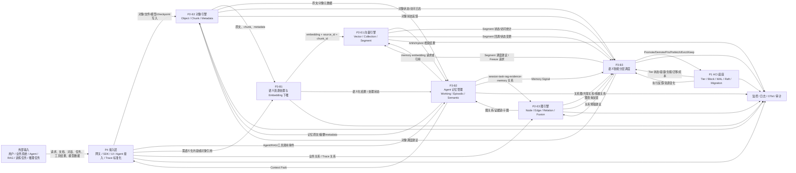

### 3.3 P3 最小闭环

12 月 1 日 MVP 的最小闭环不应被理解为“文档向量化 demo”，而应理解为“语义资源进入系统后能够完成资产化、语义化、记忆化、召回、调度和反馈”的闭环。MVP 至少需要跑通以下链路：

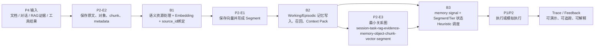

该闭环中，P2 负责对象、向量、图和 Segment 的承载与查询；P3 负责语义化、记忆化和调度决策；P1/P2 负责执行或模拟执行调度动作并返回反馈。P3 不直接实现底层引擎，也不直接执行物理迁移。

### 3.4 方案合理性说明

本方案按照“先语义化、再记忆化、再调度化”的递进关系组织 B1、B2、B3 三个模块，整体逻辑合理：

1. **B1 是语义资源入口。** 只有完成文本、记忆、知识片段和工具结果的 chunk、embedding 与 metadata 绑定，后续记忆召回和语义调度才具备统一对象基础。
2. **B2 是 Agent 语义状态管理核心。** B2 将当前对话、历史事件和长期语义知识组织为可管理、可追溯、可召回的三层记忆，并向 Agent 输出 Context Pack。
3. **B3 是资源调度决策层。** B3 不直接执行物理迁移，而是消费 B2 的记忆价值信号、P2 的对象/Segment 状态和 P1/P2 的资源状态，输出可解释的调度动作或建议。
4. **P2/P3 关系采用“接口递进、能力并行、闭环收口”。** B1/B2 可先基于样例数据和 mock 接口推进，B3 在调度对象和信号口径明确后收口，最终在 2026 年 12 月 1 日前形成可演示的最小闭环。
5. **当前阶段边界可控。** V1 Heuristic、基础记忆管理和 Sidecar 语义化链路纳入当前阶段；生产级高可用、复杂强化学习调度、最终接口协议冻结和完整性能验收不纳入当前阶段。

### 3.5 全系统数据对象与输入输出口径

为避免后续模块把“文档”误当成唯一输入，第一阶段统一采用以下数据对象口径。

| 数据大类 | 典型数据 | 生产方 | 主要管理方 | P3 使用方式 |
|---|---|---|---|---|
| 原始资产数据 | 文档、知识库、训练数据、模型文件、checkpoint、工具返回原文 | P4/业务系统/Agent/训练任务 | P2-E2/P1 | 仅其中需要语义处理的数据进入 B1/B2；训练数据、模型文件和 checkpoint 不作为 P3 记忆主线 |
| 语义资源 | 文档片段、对话片段、RAG 证据、工具结果摘要、任务事件、用户显式设定 | P4/Agent/RAG/B2 | B1/B2/P2 | 进入 B1 生成 chunk/embedding，进入 B2 形成记忆单元 |
| 记忆单元 | Working Memory、Episodic Memory、Semantic Memory | B2 | B2/P2 | 作为 Context Pack 构建对象，并向 B3 输出 memory signal |
| 图关系数据 | object-chunk-vector、session-turn-rag-evidence、task-tool-result、segment-tier | P4/B2/P2 | P2-E3 | B2 用于追溯和召回增强，B3 用于关联预取和保护判断 |
| 引擎状态数据 | ObjectMeta、Collection、Vector、SegmentStat、index_status | P2 | P2 | B2 用于召回，B3 用于调度对象建模 |
| 资源与反馈数据 | Tier 状态、容量、负载、迁移成本、调度动作、执行反馈、OTel Trace | P1/P2/P3/P4 | P1/P2/监控 | B3 用于调度决策、反馈更新和评审追踪 |

第一阶段文档中的“输入”统一指进入 P3 的语义资源或引用，不等同于所有外部原始数据；“输出”统一分为三类：写入 P2 的语义派生数据、返回 P4/Agent 的上下文数据、发送 P1/P2 的调度动作或建议。

---

## 4. B1 技术方案：Embedding 下推模块

### 4.1 B1 技术方案摘要

B1 是 P3 中负责“Embedding 下推”的基础模块

在靠近 P2 对象/向量写入链路的位置部署 B1 Sidecar，拦截或接收来自 P4/Agent/RAG/P2 的文本写入请求，完成基础 chunk 切分、CPU+SIMD embedding 计算、source_id/metadata 绑定，并将结果写入 P2 向量接口；如果 P2 接口暂未提供，则只做临时 Mock 写入验证数据结构，最终仍以 P2 正式接口为准。

B1 的核心链路为：Sidecar 接入 P4/P2 写入链路；接收文档、对话片段、RAG 证据、工具调用结果、记忆片段等输入；按照上游处理标记或本阶段约定的最小规则判断是否向量化；对需要处理的文本进行 chunk 切分；通过 CPU+SIMD embedding worker 批量计算向量；绑定 chunk_id、source_id、metadata、trace_id、embedding_model、embedding_dim 等追溯字段；最后将向量与元数据写入 P2。B1 输出的 chunk、embedding 和 metadata 主要支撑 P2 的向量保存、B2 的记忆引用与来源追溯；B3 如需语义对象信号，可从 P2/B2 结果中读取。

对 MVP 来说，B1 至少需要跑通“写入请求进入 Sidecar - 字段校验 - chunk 切分 - CPU+SIMD 批量 embedding 计算 - metadata/source_id 绑定 - P2 写入或 Mock 写入 - 状态返回”的闭环，并支持 batch=8 的性能基线验证。

### 4.2 B1 模块定位与职责边界

#### 4.2.1 模块定位

B1 位于 P4 Agent/RAG 输入和 P2 对象/向量能力之间，是 P3 语义化链路的入口模块。按照合同/规范要求，B1 第一阶段应以 **Sidecar** 方式接入写入链路，在靠近 P2 写入路径的位置完成 embedding 下推计算。它不直接负责 Agent 推理，也不负责记忆生命周期管理，而是把上层产生的文本、知识片段、对话片段和工具结果转化为可保存、可检索、可追溯的语义表示。

从上下游关系看，P4 负责提供原始输入和业务上下文，B1 Sidecar 负责完成写入拦截/接收、文本识别、chunk 切分、CPU+SIMD embedding 计算与元数据绑定，P2 负责保存原文、chunk、向量及相关 metadata，B2 基于 B1 输出的 chunk_id、source_id、embedding_ref 和 metadata 管理记忆与构建上下文，B3 后续可基于 chunk、embedding、source_type、metadata 等信息形成语义调度对象。

#### 4.2.2 B1 负责内容

| 负责内容 | 说明 | 第一阶段是否交付 |
|---|---|---|
| 输入来源梳理 | 明确文档、对话、RAG 证据、工具结果、记忆片段等来源，以及哪些来源进入 B1 | 是 |
| Sidecar 接入方式 | 明确 B1 Sidecar 如何部署在 P4/P2 写入链路旁侧，形成接口草案和样例请求 | 是 |
| CPU+SIMD embedding 计算链路 | 跑通文本预处理、batch=8 批量推理、向量归一化、维度校验和结果返回 | 是 |
| source_id 与 metadata 绑定 | 保证每个 chunk 和 embedding 能追溯到原始来源；metadata 仅保存上游提供的字段 | 是 |
| P2 写入/Mock 写入 | P2 接口可用时写入 P2；接口未就绪时只做临时 Mock 验证 | 是 |
| 状态与日志返回 | 输出 status、error_code、trace_id、latency，支持联调排障 | 是 |

#### 4.2.3 B1 不负责内容

| 不负责内容 | 原因 | 依赖/归属模块 |
|---|---|---|
| 向量数据库实现 | 由底层数据引擎提供 | P2 |
| 检索排序策略 | 由记忆召回或应用侧处理 | B2 / P4 |
| 物理存储迁移 | 由资源执行层处理 | P1/P2 |

### 4.3 B1 第一阶段目标

| 目标编号 | 阶段目标 | 验收方式 | 交付材料 |
|---|---|---|---|
| B1-G01 | 明确 B1 Sidecar 输入来源、接入位置和职责边界 | 文档说明 B1 与 P4/P2/B2/B3 的关系 | B1 技术方案、接口依赖表 |
| B1-G02 | 明确 B1 输入输出字段和最小数据结构 | 字段表覆盖 request_id、source_type、text、chunk_id、source_id、metadata、status 等核心字段 | 输入输出字段表、样例 JSON |
| B1-G03 | 跑通 CPU+SIMD Sidecar 语义化写入链路 | 样例文本可完成 Sidecar 接入、chunk 切分、CPU+SIMD embedding 计算、metadata 绑定和写入/模拟写入 | 单模块 demo 或接口样例 |
| B1-G04 | 支撑 12 月 1 日 MVP 联调 | B1 输出可被 P2 保存或被 B2 引用，并能通过 trace_id 追踪链路状态 | MVP 支撑说明、联调记录、日志样例 |

### 4.4 B1 总体技术方案

B1 总体方案按“输入来源 - Sidecar 接入方式 - CPU+SIMD embedding 计算 - 输出落地 - 异常处理”展开。

输入来源方面，B1 主要接收文档片段、Agent 多轮对话片段、RAG 证据片段、工具调用结果、任务过程记录和 B2 需要语义化的记忆内容。第一阶段不要求覆盖所有业务数据，而是优先覆盖能够支撑 MVP 演示的典型样例，例如文档段落、用户问题与回答、检索证据、工具返回摘要、任务阶段结果。

接入方式方面，第一阶段必须以 B1 Sidecar 作为主路径。Sidecar 部署在 P4/P2 写入链路旁侧，可以通过 HTTP/gRPC 标准接口接收 P4/Agent/RAG 的写入请求，也可以在 P2 对象写入前后被调用。输入中携带 source_type、source_id、text/chunk_text、metadata、trace_id 和 embedding_required。测试脚本只用于联调和压测，不替代 Sidecar 实现。

处理流程方面，B1 Sidecar 首先检查请求字段是否完整，并根据上游传入的 embedding_required 标记或本阶段约定的默认规则判断是否进入向量化流程。对于已由上游切分好的 chunk，B1 直接复用 chunk_text；对于原始长文本，B1 只按长度阈值和段落边界进行基础切分，不承诺复杂语义切分。每个 chunk 生成唯一 chunk_id，并与原始 source_id、source_type、trace_id 以及上游提供的 metadata 绑定。随后 B1 调用 Sidecar 内部的 CPU+SIMD EmbeddingWorker，以 batch=8 为基线批量生成向量，并将 embedding、chunk_id、source_id、metadata、写入状态等信息提交给 P2 向量写入接口。

输出落地方面，若 P2 向量接口已提供，B1 将结果写入 P2，并返回 embedding_ref 或写入确认信息；若 P2 接口尚未就绪，B1 仅使用 Mock 写入验证字段结构和联调流程，后续实现仍以 P2 正式接口为准。B1 同时向调用方返回 status、error_code、trace_id、latency 等状态字段，便于联调排障。

异常处理方面，B1 对 embedding 服务不可用、P2 写入失败、文本过长、metadata 缺失、字段格式不一致等情况返回明确状态和错误码。第一阶段只要求可识别、可记录、可返回，不承诺生产级自动重试队列和复杂补偿机制。

### 4.5 B1 写入链路流程图

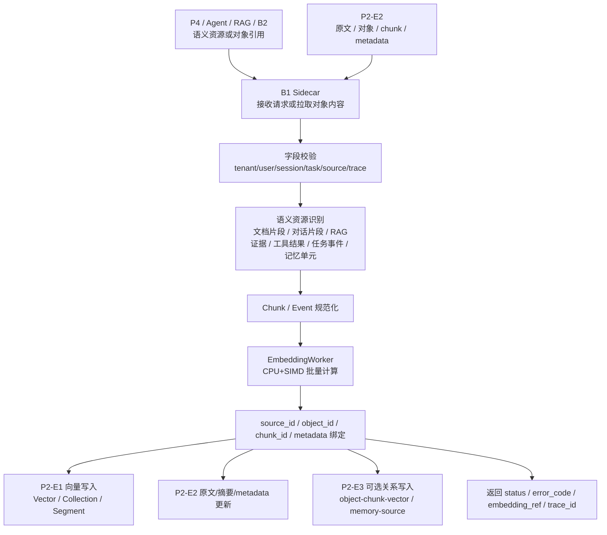

#### 图说明

B1 的输入不限定为文档，而是“需要语义化的资源或对象引用”。P4/Agent/RAG 可以直接提交文本型资源，B2 可以提交需要长期召回的 Memory Unit，P2-E2 可以根据 object_id/source_id 提供原文、chunk 和 metadata。B1 负责完成字段校验、基础切分或事件规范化、embedding 生成和来源绑定。B1 的输出主要写入 P2-E1 向量引擎，同时必要时更新 P2-E2 的原文/摘要/metadata，并可选向 P2-E3 写入 object-chunk-vector 或 memory-source 关系。B1 不负责决定记忆生命周期，也不负责底层检索排序和物理迁移。

### 4.6 B1 数据结构流转图

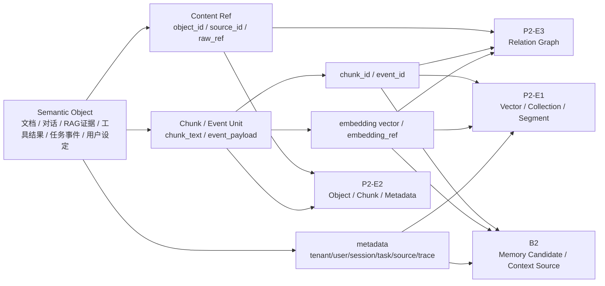

#### 图说明

原始输入首先被统一抽象为 Semantic Object。文档、对话、RAG 证据、工具结果、任务事件和用户显式设定均可进入该抽象。对于已有对象落点的数据，B1 通过 object_id、source_id 或 raw_ref 追溯原始内容；对于直接提交的文本或事件，B1 生成 Chunk / Event Unit，并补充 chunk_id 或 event_id。embedding vector 或 embedding_ref 落入 P2-E1，原文、摘要和 metadata 落入 P2-E2，必要的来源关系、证据链关系和 object-chunk-vector 关系落入 P2-E3。B2 使用 B1 输出的引用字段构建记忆，不要求 B1 直接管理 Working/Episodic/Semantic 生命周期。

### 4.7 B1 输入输出定义

#### 4.7.1 输入字段表

| 字段 | 来源 | 是否必需 | 字段说明 | 当前状态 | 待确认问题 |
|---|---|---|---|---|---|
| request_id | P4/B2/调用方 | 必需 | 单次请求标识，用于幂等、排障和状态返回 | 草案 | 是否由 P4 统一生成 |
| trace_id | P4/监控 | 必需 | 全链路追踪标识 | 草案 | Trace 规范是否全项目统一 |
| tenant_id | P4 | 必需 | 租户隔离字段 | 草案 | 是否所有 P4 请求均携带 |
| user_id | P4/Agent | 条件必需 | 用户级记忆和上下文隔离字段；系统级数据可为空 | 草案 | 匿名或系统任务如何处理 |
| agent_id | P4/Agent | 条件必需 | Agent 边界字段 | 草案 | 是否允许跨 Agent 共享记忆 |
| session_id | P4/Agent | 条件必需 | 会话型输入必需 | 草案 | 会话结束事件由谁提供 |
| task_id | P4/Agent | 条件必需 | 长任务、工具调用、RAG 链路关联字段 | 草案 | 任务状态模型由谁定义 |
| source_type | P4/B2/P2 | 必需 | document、dialogue、rag_evidence、tool_result、task_event、user_setting、memory_unit、system_config 等 | 草案 | 枚举值需冻结 |
| source_id | P4/P2/B2 | 必需 | 原始来源标识，用于追溯原文、任务、会话、对象或记忆 | 草案 | 与 object_id、memory_id 的映射关系 |
| object_id / raw_ref | P2/P4 | 条件必需 | 已落入 P2-E2 的对象引用；直接文本输入可为空 | 草案 | P2-E2 是否先保存原文 |
| memory_id | B2 | 条件必需 | B2 提交记忆单元向量化时携带 | 草案 | B1 是否直接接收 memory_id |
| content_type | P4/B2 | 建议 | text、json_event、markdown、code、table、log、binary_ref 等 | 草案 | 第一阶段支持范围 |
| text / chunk_text | P4/B2/P2 | 条件必需 | 待向量化文本；若只提供 object_id，则由 B1 拉取或由上游补充 | 草案 | 最大长度与编码格式 |
| event_payload | P4/B2 | 可选 | 工具调用、RAG 调用、任务事件等半结构化内容 | 草案 | 是否由 B1 提取文本摘要 |
| metadata | P4/P2/B2 | 必需 | 来源、时间、标签、业务上下文、权限、语言、敏感级别等 | 草案 | metadata 最小字段集合 |
| embedding_required | P4/B2 | 建议 | 是否需要向量化；未提供时按阶段默认规则处理 | 草案 | 由 P4、B2 还是 B1 判断 |
| persist_raw_required | P4/B2 | 建议 | 是否需要将原文/摘要写入 P2-E2 | 草案 | 直接文本输入是否必须先资产化 |
| graph_relation_required | P4/B2 | 可选 | 是否需要同步写入来源关系或证据链关系 | 预留 | P2-E3 当前阶段是否可用 |
| embedding_config_id | B1/P3 | 可选 | 指定 embedding 模型配置；不传则使用默认配置 | 预留 | 是否需要多模型配置 |

#### 4.7.2 输出字段表

| 字段 | 去向 | 是否必需 | 字段说明 | 当前状态 | 待确认问题 |
|---|---|---|---|---|---|
| semantic_object_id | P2/B2/监控 | 必需 | 本次语义资源处理对象 ID，可关联多个 chunk 或 event | 草案 | 是否由 B1 生成 |
| chunk_ids / event_ids | P2/B2 | 必需 | 规范化后的 chunk 或事件单元标识 | 草案 | 命名规则是否统一 |
| object_id / raw_ref | P2/B2 | 建议 | 原文、摘要或对象在 P2-E2 中的引用 | 草案 | 是否所有语义资源都需要落对象 |
| embedding_refs | P2/B2 | 必需 | 向量写入 P2-E1 后返回的引用；mock 阶段可为临时引用 | 草案 | P2 返回 vector 还是 ref |
| embedding_model | P2/B2/监控 | 必需 | 使用的 embedding 模型名称或配置标识 | 草案 | 模型由 P2/P3 哪一方确认 |
| embedding_dim | P2/B2/监控 | 必需 | 向量维度 | 草案 | 维度与 P2 collection/schema 对齐方式 |
| normalized | P2/B2/监控 | 建议 | 标记输出向量是否已归一化 | 草案 | 与 P2 距离类型统一 |
| metadata | P2/B2 | 必需 | 上游透传字段 + B1 处理状态字段 | 草案 | B1 可补充哪些字段 |
| source_id / source_type | P2/B2 | 必需 | 来源追溯字段 | 草案 | 与 P2 object_id 的关系 |
| relation_events | P2-E3/B2 | 可选 | object-chunk-vector、memory-source、rag-evidence 等关系写入事件 | 预留 | P2-E3 是否纳入 MVP |
| vector_write_status | P2/B2/监控 | 必需 | 向量写入成功、失败、pending 或 skipped | 草案 | 状态枚举需统一 |
| raw_persist_status | P2/B2/监控 | 建议 | 原文/摘要落 P2-E2 的状态 | 草案 | 是否由 B1 直接写 E2 |
| status | P4/P2/B2 | 必需 | success / failed / pending / skipped / partial | 草案 | 状态枚举需统一 |
| error_code | P4/P2/监控 | 建议 | 异常定位与降级处理字段 | 草案 | 错误码规范需统一 |
| latency | 监控 | 建议 | B1 端到端处理耗时 | 草案 | 是否包含 P2 写入耗时 |
| trace_id | 监控/P4/P2/B2 | 必需 | 全链路追踪标识 | 草案 | 是否由监控系统统一生成 |

### 4.8 B1 外部依赖与接口关系

| 依赖对象 | 依赖内容 | 当前状态 | 阻塞影响 | 待确认问题 | 期望 owner |
|---|---|---|---|---|---|
| P4 / Agent / RAG | 文档、对话片段、RAG 证据、工具结果等输入 | 未确认 | 无法确认 B1 真实接入入口和样例字段 | P4 是否提供标准输入字段和 embedding_required 标记 | P4/Agent 负责人 |
| P2 / 部署环境 | Sidecar 部署位置、端口、容器/进程形态、CPU 指令集 | 未确认 | 无法验证 CPU+SIMD Sidecar 是否符合 MVP 要求 | Sidecar 部署在 P2 同节点还是旁路节点 | P2/运维负责人 |
| P2 对象引擎 | 原文、chunk、metadata、source_id 保存能力 | 未确认 | 无法保证向量与原文可追溯 | chunk_id/source_id 是否已有规范 | P2 对象负责人 |
| P2 向量引擎 | embedding 写入接口、向量引用返回、写入状态 | 未确认 | 无法真实写入向量，只能 Mock | 向量写入 API、维度、状态返回是否可用 | P2 向量负责人 |
| embedding 模型配置 | 模型名称、向量维度、归一化方式、CPU+SIMD 后端、batch=8 配置 | 未确认 | 无法保证 B1 输出向量与 P2 schema 一致 | 第一阶段采用 BGE-small 还是 Nomic-embed 作为默认模型 | P3 总负责人/B1 负责人 |
| B2 记忆管理器 | B2 所需 chunk_id、embedding_ref、metadata 字段 | 未确认 | B1 输出可能无法直接用于记忆写入 | B2 最小依赖字段有哪些 | B2 负责人 |
| 监控系统 | trace_id、latency、status、error_code 采集 | 未确认 | 联调排障困难 | trace_id、错误码、日志格式是否统一 | 监控/运维负责人 |
| 测试环境 | 脱敏样例、Mock 接口、联调环境 | 未确认 | 单模块 demo 和 MVP 演示受影响 | 第一阶段是否提供脱敏样例和测试接口 | 项目经理/P2/P4 |

### 4.9 B1 异常与降级方案

| 异常场景 | 影响 | 第一阶段处理方式 | 是否阻塞 MVP | 备注 |
|---|---|---|---|---|
| embedding 服务不可用 | 无法生成向量，B2 召回和 P2 写入受影响 | 返回 pending/failed，记录 error_code 和 trace_id | 可能 | 第一阶段不承诺自动重试队列 |
| embedding 模型未加载成功 | B1 无法进行向量计算 | 启动时检查模型路径和配置；失败则服务不可用并输出错误日志 | 是 | 模型需提前下载或部署到运行环境 |
| embedding 维度不匹配 | P2 写入失败或后续检索不可用 | 拒绝写入，返回 EMBEDDING_DIM_MISMATCH | 是 | embedding_dim 必须与 P2 schema 对齐 |
| CPU SIMD 路径不可用 | 无法满足 MVP 的 CPU+SIMD 要求 | 启动时检测 SIMD/推理后端能力；不可用则返回 SIDECAR_SIMD_UNAVAILABLE 并禁止进入性能验收 | 是 | 开发调试可降级，验收环境不可降级 |
| Sidecar 实例不可用 | 写入链路无法完成向量化 | 上游返回 pending/failed；记录 sidecar_instance_id 和 trace_id | 可能 | 高可用不纳入第一阶段，但需要可观测 |
| P2 向量写入失败 | 向量无法真实落地 | 记录写入失败原因；若处于联调阶段，可用 Mock 验证响应结构 | 不一定 | P2 接口未就绪时不阻塞 B1 单模块验证 |
| 输入文本过长 | 可能导致切分失败、耗时过高或上下文不完整 | 按长度阈值切分；仍超出处理范围则返回 failed 或 skipped | 不一定 | 最大长度需与 P4/P2 确认 |
| metadata 缺失 | 向量无法追溯来源或业务上下文 | 缺少必需字段则拒绝写入；缺少可选字段则透传空值或不返回 | 可能 | source_id、source_type 应设为必需 |
| source_type 不在枚举范围 | 无法判断处理策略 | 返回 failed 或按 unknown 类型处理；记录待确认来源 | 不一定 | 需要统一 source_type 枚举 |
| 重复请求或重复 chunk | 可能导致重复向量写入 | 第一阶段只记录 request_id 和 source_id，复杂去重不承诺 | 不一定 | 幂等策略由 P2/P3 后续统一 |

### 4.10 B1 对 12 月 1 日 MVP 的支撑

| MVP 能力 | B1 支撑方式 | 是否必须 | 验证方式 |
|---|---|---|---|
| B1 Sidecar 接入 | 以 Sidecar 方式接入 P4/P2 写入链路，接收文档、对话、RAG 证据、工具结果、记忆片段 | 是 | 使用样例请求通过 Sidecar 完成一次写入 |
| chunk 与 embedding 生成 | 对输入文本进行基础切分，并通过 CPU+SIMD EmbeddingWorker 批量生成 embedding | 是 | 输出 chunk_id、chunk_text、embedding_ref/vector |
| embedding 配置校验 | 固定 embedding_model、embedding_dim、normalize、batch_size=8、simd_enabled 等运行配置 | 是 | 启动时打印配置，写入前校验向量维度和 SIMD 状态 |
| CPU+SIMD 性能基线 | 按 batch=8 完成 BGE-small/Nomic-embed 级别模型的 Sidecar 性能测试 | 是 | 输出 QPS、latency、CPU 使用率和测试报告 |
| metadata/source_id 绑定 | 每个 chunk 绑定 source_id、source_type、trace_id 和上游 metadata | 是 | 检查输出字段可追溯到原始输入 |
| 向量写入或模拟写入 P2 | P2 接口可用时写入 P2；不可用时仅用 Mock 验证结构 | 是 | 返回写入状态和向量引用 |
| status/trace 返回 | 返回 status、error_code、latency、trace_id | 是 | 通过日志或接口响应查看链路状态 |
| 支撑 B2 引用 | 向 B2 提供 chunk_id、embedding_ref、source_id、metadata | 是 | B2 能使用 B1 输出创建基础记忆 |

### 4.11 B1 第一阶段交付物

| 交付物 | 形式 | 是否必需 | 完成状态 |
|---|---|---|---|
| B1 技术方案 | Markdown 文档 | 必需 | 待评审确认 |
| B1 写入链路流程图 | Mermaid | 必需 | 待评审确认 |
| B1 数据结构流转图 | Mermaid | 必需 | 待评审确认 |
| B1 输入输出字段表 | 表格 | 必需 | 待评审确认 |
| B1 外部依赖表 | 表格 | 必需 | 待评审确认 |
| B1 异常与降级说明 | 表格/文字 | 建议 | 待评审确认 |
| B1 MVP 支撑说明 | 文档小节 | 必需 | 待评审确认 |

### 4.12 B1 待确认问题

| 问题 | 影响 | 期望确认对象 | 责任人 | 状态 |
|---|---|---|---|---|
| B1 Sidecar 部署在 P2 同节点、P2 旁路节点，还是 P4/P2 之间的代理节点 | 影响部署方式、性能测试和验收口径 | P3 总负责人、P4 负责人、P2 负责人 | B1 负责人跟进 | 未确认 |
| 哪些文本必须向量化，哪些只保存原文或暂不处理 | 影响 embedding_required 规则和 MVP 范围 | P4/B2/P3 总负责人 | B1 负责人跟进 | 未确认 |
| chunk 切分由上游完成还是由 B1 完成 | 影响 chunk_id 生成、重复切分和字段边界 | P4/P2/B2 | B1 负责人跟进 | 未确认 |
| source_id、chunk_id、embedding_ref 的命名和生成规则由谁统一 | 影响 P2 保存、B2 记忆引用和 B3 调度对象建模 | P2/P3 总负责人 | B1 负责人跟进 | 未确认 |
| P2 向量写入接口何时可用，返回字段包含哪些内容 | 影响 B1 是否真实写入 P2 或使用 Mock | P2 向量负责人 | B1 负责人跟进 | 未确认 |
| metadata 最小字段集合包括哪些 | 影响追溯和后续记忆管理 | P2/P4/B2 | B1 负责人跟进 | 未确认 |
| 第一阶段是否提供脱敏样例数据和测试环境 | 影响单模块 demo、联调和 MVP 演示 | 项目经理、P4/P2 | B1 负责人跟进 | 未确认 |
| MVP 默认 embedding 模型采用 BGE-small 还是 Nomic-embed | 影响 CPU+SIMD 性能基线和向量维度 | P2/P3 总负责人 | B1 负责人跟进 | 未确认 |
| CPU+SIMD 验收环境的 CPU 型号、指令集和线程数是多少 | 影响 QPS 和性能报告 | P2/运维负责人 | B1 负责人跟进 | 未确认 |
| P2 使用的距离类型是 cosine、inner product 还是 L2 | 影响是否需要 normalize_embeddings | P2 向量负责人 | B1 负责人跟进 | 未确认 |

---

## 5. B2 技术方案：Agent 记忆管理器

### 5.1 B2 技术方案摘要

B2 Agent 记忆管理器面向 Agent 多轮对话、长任务、RAG 调用和工具调用场景，负责将分散的会话内容、任务状态、证据片段、工具结果及用户显式设定组织为可管理、可追溯、可召回的三层记忆体系。模块以 Working Memory、Episodic Memory 和 Semantic Memory 为核心结构：Working Memory 保存当前会话与任务的短期状态；Episodic Memory 归档历史对话、任务轨迹和调用记录；Semantic Memory 沉淀经筛选、去重和确认后的长期偏好、规则、事实与经验。B2 对记忆实行完整生命周期管理，包括写入、使用、归档、摘要压缩、强化、衰减、失效、禁用、替代和删除，并通过状态隔离确保失效或已删除记忆不再进入召回结果。Agent 推理前，B2 按租户、用户、Agent 和任务边界检索三层记忆，结合 RAG 证据与工具结果完成过滤、去重、冲突处理、重排和 token 预算控制，生成带来源标识的 Context Pack。第一阶段以最小闭环为目标，完成基础记忆写入、Working Memory 管理、会话归档、简单历史召回、Context Pack 生成、基础遗忘机制以及向 B3 输出 memory signal，并通过测试存储或 P2 接口完成可演示原型。

### 5.2 B2 模块定位与职责边界

#### 5.2.1 模块定位

B2 位于 P4/Agent 运行流程与 B1、P2、B3 之间，是 P3 中负责“记忆组织与上下文构建”的核心模块。上游由 P4、Agent Runtime、RAG 流程和工具调用链路向 B2 提供对话、任务、证据、工具结果及用户操作事件；B2 调用 B1 获取记忆内容的 embedding 或 embedding 引用，并依赖 P2 的对象与向量能力完成持久化和检索；下游一方面向 Agent 返回 Context Pack，另一方面向 B3 输出记忆重要性、使用频次、时效性、状态和用户保护标记等价值信号。

B2 负责决定一条信息是否进入记忆、进入哪一层记忆、何时归档、何时摘要压缩、何时失效或逻辑遗忘，以及在当前请求下哪些记忆允许进入上下文。B2 不实现底层 embedding 模型、对象/向量引擎和物理数据迁移，也不负责生成 Promote、Demote、Evict 等资源调度动作。

#### 5.2.2 B2 负责内容

| 负责内容 | 说明 | 第一阶段是否交付 |
|---|---|---|
| 记忆事件接入与标准化 | 接收对话、任务、RAG、工具调用、用户设定等事件，并转换为统一记忆写入请求 | 是 |
| 三层记忆管理 | 管理 Working、Episodic、Semantic 三类记忆及其转换关系 | 是 |
| 记忆生命周期与遗忘 | 支持 TTL、时间衰减、归档、压缩、替代、禁用、逻辑删除和召回隔离 | 是，完成基础机制 |
| 记忆写入与来源追溯 | 保存 source_id、session_id、task_id、trace_id、版本和来源信息 | 是 |
| 记忆召回与过滤 | 按身份边界、状态、相关性、时间和重要性检索候选记忆 | 是，完成简单策略 |
| Context Pack 构建 | 对当前会话、历史记忆、长期知识、RAG 证据和工具结果进行去重、重排、压缩和预算控制 | 是 |
| 用户记忆操作 | 定义查看、添加、修改、禁用和删除记忆的接口与状态处理规则 | 方案交付；界面是否实现待确认 |
| Memory Signal 输出 | 向 B3 输出记忆类型、重要性、最近使用时间、使用次数、TTL、状态等字段 | 是 |
| 可观测与审计 | 记录写入、召回、归档、删除、降级和 Context Pack 构建过程 | 是，完成日志与 trace |

#### 5.2.3 B2 不负责内容

| 不负责内容 | 原因 | 依赖/归属模块 |
|---|---|---|
| 底层向量化实现 | B2 仅提交待向量化内容并使用 embedding 结果 | B1 |
| 底层对象/向量/图存储实现 | B2 通过接口使用存储与检索能力，不修改底层引擎 | P2 |
| 物理数据迁移和介质释放 | B2 只改变记忆逻辑状态并提出删除/保留需求 | P1/P2 |
| 冷热分层调度策略 | B2 输出记忆价值信号，不生成资源调度动作 | B3 |
| P4 网关、用户界面和 Agent Runtime | B2 定义接口和交互规则，不实现完整入口与前端 | P4/Agent |
| 生产级长期记忆自动抽取模型 | 第一阶段仅实现规则或可替换的摘要/抽取接口 | 后续阶段/B1或模型服务 |
| 生产级性能与高可用承诺 | 第一阶段目标为最小原型和接口收敛 | 后续阶段 |

### 5.3 B2 第一阶段目标

| 目标编号 | 阶段目标 | 验收方式 | 交付材料 |
|---|---|---|---|
| B2-G01 | 完成三层记忆模型、Memory Schema、状态机及基础遗忘规则设计 | 评审 Schema、状态转换和样例数据，检查失效/禁用/删除记忆不能被召回 | 技术方案、Schema、生命周期图 |
| B2-G02 | 跑通“对话写入 Working Memory—会话归档 Episodic Memory—简单历史召回”链路 | 使用脱敏或构造的多轮对话执行端到端演示 | 原型、接口样例、演示记录 |
| B2-G03 | 完成带来源、预算和降级标记的 Context Pack 生成 | 给定当前请求及多源候选记忆，验证过滤、去重、重排和输出结构 | Context Pack Schema、流程图、样例输出 |
| B2-G04 | 完成 B1/P2/B3 最小接口对接，向 B3 输出 memory signal | 通过真实接口或 mock 完成写入、检索及 signal 输出，日志可追踪 | 接口字段表、联调记录、memory signal 样例 |

### 5.4 B2 总体技术方案

B2 采用“事件接入—统一建模—分层保存—生命周期管理—检索召回—上下文构建—价值信号输出”的处理路径。

1. **记忆来源与事件接入**  
   P4、Agent Runtime、RAG 和工具调用链路将每轮对话、任务状态、证据使用记录、工具结果及用户显式操作封装为标准事件。B2 首先校验 tenant_id、user_id、agent_id、session_id、task_id、source_type 和 trace_id，缺少关键身份字段的请求不得进入长期记忆。

2. **统一记忆建模**  
   B2 将不同来源映射为统一 Memory Schema，并保存原始内容、摘要、来源引用、时间、权限、状态、版本和生命周期字段。需要语义检索的内容通过 B1 获取 embedding_ref，再由 P2 保存原文、元数据和向量索引。

3. **三层记忆管理**  
   当前会话中的对话、任务状态和最近工具结果先进入 Working Memory；会话结束、任务阶段完成或上下文接近预算上限时，B2 从 Working Memory 中提取有效信息并归档到 Episodic Memory；经重复出现、用户显式确认、任务成功复用或规则判定为高价值的信息，经过压缩、去重和冲突检查后进入 Semantic Memory。三层记忆的转换保留 source_id、parent_memory_id 和 version，避免失去来源。

4. **生命周期与遗忘机制**  
   B2 负责逻辑遗忘。基础机制包括：Working Memory TTL 到期自动失效；Episodic Memory 随时间和长期未使用程度衰减；重复信息合并为摘要后将原记忆标记为 compressed；被新信息纠正的旧记忆标记为 superseded；用户禁用或删除的记忆立即从检索范围中隔离。B2 只决定记忆是否可用并向 P2 发出删除或状态更新请求，底层物理删除由 P2 执行。第一阶段不实现复杂学习型遗忘策略，但预留 importance、last_used_time、use_count、correction_flag、ttl 和 status 等字段。

5. **召回与 Context Pack 构建**  
   Agent 推理前，B2 以当前请求、会话和任务为查询条件，从 Working Memory 获取当前状态，从 Episodic/Semantic Memory 获取候选历史记忆，并接收 RAG 证据和工具结果。候选内容依次经过身份与权限过滤、状态过滤、相关性排序、时间与重要性加权、重复与冲突处理、摘要压缩和 token 预算分配，最终生成带来源标识、时间、可信度和截断说明的 Context Pack。

6. **价值信号与可观测性**  
   每次记忆写入、召回、进入上下文、被纠错、被禁用或被删除时，B2 更新记忆统计字段，并按事件或批量方式向 B3 输出 memory signal。全过程记录 request_id、trace_id、memory_id、策略版本、耗时和降级状态，支撑联调与验收。

第一阶段若 P2 或 B1 接口尚未可用，可使用测试对象库、测试向量库和 mock embedding_ref，但对外字段和调用顺序保持与正式接口一致，确保后续可替换。

### 5.5 B2 三层记忆结构图

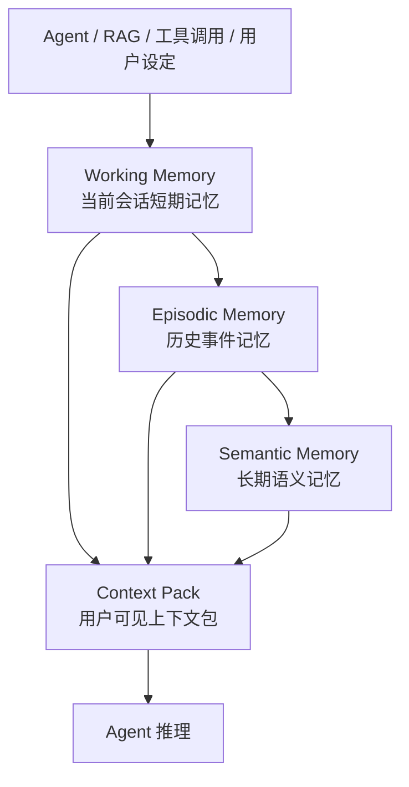

#### 图说明

输入首先经过事件标准化和身份校验，再进入 Working Memory。Working Memory 负责保持当前会话和任务连续性；会话结束、任务阶段完成或上下文接近上限时，有效内容被归档为 Episodic Memory；被用户显式确认、长期复用或规则判定为高价值的信息进一步沉淀为 Semantic Memory。三层记忆共同参与 Context Pack 构建，但只有状态有效、权限匹配且与当前任务相关的内容才允许进入上下文。生命周期控制模块对三层记忆执行 TTL、衰减、压缩、替代、禁用和删除等逻辑遗忘操作。B1 提供 embedding，P2 提供对象和向量保存与检索能力。第一阶段真实实现 Working Memory、基础 Episodic 归档、简单 Semantic Memory 写入和 Context Pack 生成；复杂自动抽取、学习型压缩和大规模长期记忆优化作为后续演进能力。

### 5.6 B2 记忆生命周期图

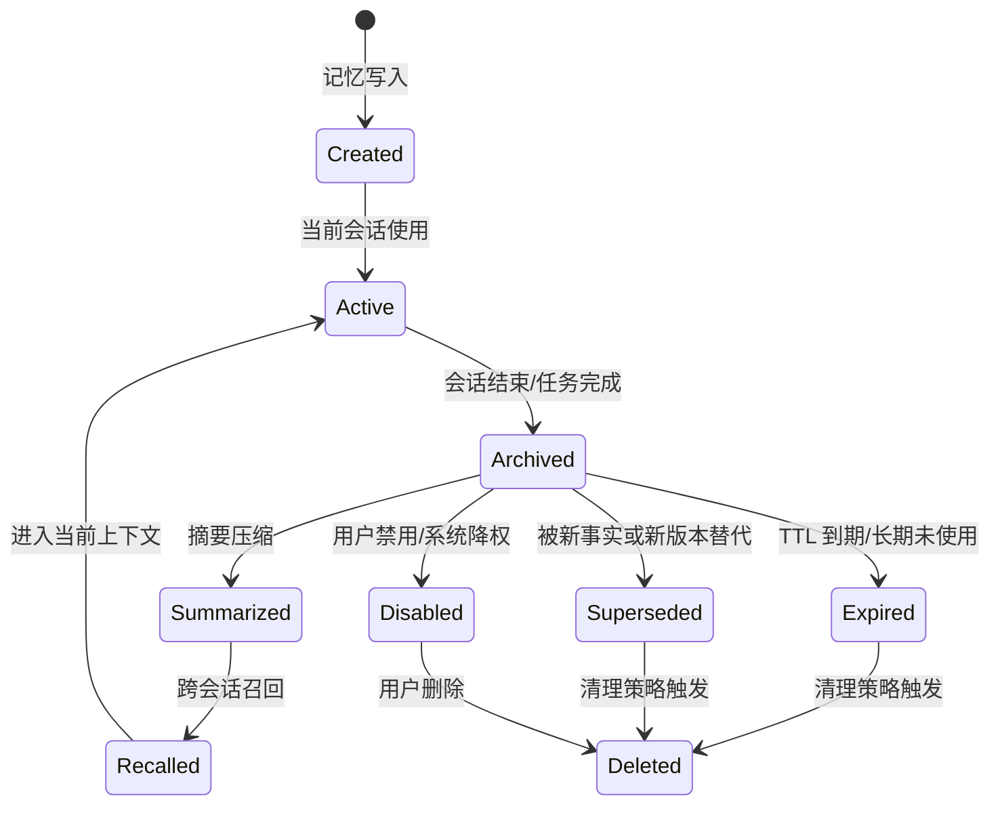

#### 图说明

记忆写入后首先处于 Created 状态，完成身份、权限、来源和字段校验后进入 Active。当前会话中的 Active 记忆可在会话结束或任务阶段完成后归档为 Archived；归档记忆可进一步摘要压缩为 Summarized，也可在后续请求中被 Recalled 并重新进入当前上下文。基础遗忘包括三条路径：一是 TTL 或保留期到期进入 Expired；二是被新事实、用户纠正或新版本替代进入 Superseded；三是用户禁用、权限撤销或合规要求导致 Disabled。以上状态均不得进入正常召回。Deleted 在 B2 中首先表示逻辑删除并立即建立召回隔离，随后由 P2 按接口完成物理删除或延迟清理。任何状态转换均需保留版本、操作人、时间、原因和 trace_id，便于审计和问题追踪。

### 5.7 B2 上下文构建流程图

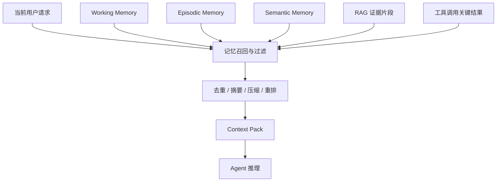

#### 图说明

上下文构建由当前请求触发。B2 同时收集当前会话、历史事件、长期语义知识、RAG 证据和工具结果形成候选集合。候选集合首先执行租户、用户、Agent、会话和权限过滤，并排除 expired、disabled、superseded 和 deleted 状态；随后按当前任务相关度、最近使用时间、重要性、可信度和来源类型进行排序。重复内容进行合并，存在冲突时优先使用用户显式设定、较新版本或更高可信度来源，并保留冲突说明。最后根据 context_budget 分配各组成部分的 token 配额，必要时对历史内容摘要压缩，生成 Context Pack。若长期记忆或向量检索异常，系统降级为仅使用 Working Memory、当前任务状态和已提供的 RAG/工具结果，保证前台推理链路可继续运行。

### 5.8 B2 记忆来源与触发机制

| 数据来源 | 典型内容 | 触发时机 | 原始资产落点 | 语义/向量落点 | 图关系落点 | 是否进入记忆 | 待确认问题 |
|---|---|---|---|---|---|---|---|
| 多轮对话 | 用户问题、Agent 回复、当前意图 | 每轮对话完成后 | P2-E2 或 B2 内部存储 | 需要跨会话召回时进入 P2-E1 | session-turn-memory | Working；会话结束后可归档 Episodic | 是否保存完整 Agent 回复及保留周期 |
| 任务执行过程 | 任务目标、步骤、阶段结果、待确认事项 | 任务创建、步骤完成、任务暂停/结束 | P2-E2 或 B2 事件表 | 关键阶段摘要可进入 P2-E1 | task-step-memory | Working/Episodic；高价值经验可进 Semantic | 任务状态事件格式由谁定义 |
| RAG 调用记录 | 查询、证据 ID、引用片段、回答依据 | RAG 调用完成后 | P2-E2 保存证据引用或摘要 | query/evidence 可按需向量化 | rag_call-evidence-answer | 当前轮进入 Working；证据链可归档 Episodic | 是否提供 evidence_id 和检索分数 |
| 工具调用结果 | 工具名称、输入、关键返回值、错误 | 工具调用完成后 | 原始大结果以 object/raw_ref 保存 | 摘要或关键返回值可向量化 | task-tool_call-tool_result | 当前任务进入 Working；关键结果可归档 Episodic | 工具结果统一 Schema 和脱敏规则 |
| 用户显式设定 | “请记住”、偏好、长期规则、删除/纠正请求 | 用户主动操作时 | P2-E2/B2 状态表 | 长期设定可进入 P2-E1 | user-memory-update_event | Semantic，默认高优先级并受保护 | 哪些内容允许长期保存 |
| 运行反馈 | 是否进入上下文、是否有帮助、是否被纠错 | 推理完成、用户反馈或纠错后 | B2 状态表/日志 | 通常不单独向量化 | memory-feedback | 更新已有记忆元数据和状态 | 反馈由 P4 还是 Agent Runtime 提供 |
| 系统/运营配置 | Agent 级知识、规则和禁用项 | 配置发布或变更时 | P2-E2/配置中心 | 规则可按需向量化 | system_config-agent | Semantic 或系统级上下文 | 配置优先级和审批流程 |
| 会话超长/预算溢出 | 被截断的旧对话、阶段摘要 | 达到 token 或轮次阈值时 | P2-E2/B2 摘要记录 | 摘要可进入 P2-E1 | session-summary | Episodic | 阈值由 P4、模型或 B2 配置 |

### 5.9 B2 Memory Schema 草案

| 字段 | 说明 | 是否必需 | 来源 | 用途 | 待确认问题 |
|---|---|---|---|---|---|
| memory_id | 记忆唯一标识 | 必需 | B2 | 管理、检索、引用、调度 | ID 生成规则是否全局统一 |
| memory_type | Working/Episodic/Semantic | 必需 | B2 | 分层管理 | 是否允许后续扩展类型 |
| tenant_id | 租户标识 | 必需 | P4 | 隔离与权限 | 标识规范 |
| user_id | 用户标识 | 条件必需 | P4 | 用户级隔离 | 系统级 Agent 如何处理 |
| agent_id | Agent 标识 | 必需 | P4/Agent | Agent 边界 | 是否支持跨 Agent 共享 |
| session_id | 会话标识 | 条件必需 | P4/Agent | 当前会话管理 | 会话结束事件 |
| task_id | 任务标识 | 条件必需 | Agent/P4 | 任务恢复和关联 | 任务状态模型 |
| source_type | dialogue/task/rag/tool/user/system/document | 必需 | 上游/B2 | 来源分类 | 枚举值冻结 |
| source_id | 原始来源标识 | 必需 | B1/P4/P2 | 来源追溯 | 不同系统 ID 映射 |
| object_id / raw_ref | 原文、摘要、大对象或工具结果在 P2-E2 中的引用 | 建议 | P2/B2 | 原文追溯、删除和审计 | 是否所有记忆必须有 object_id |
| chunk_ids | 关联的 chunk 列表 | 建议 | B1/B2 | 召回与上下文构建 | chunk 由 B1 还是上游生成 |
| embedding_refs | 关联向量引用 | 建议 | B1/P2 | 语义召回 | 向量版本和模型版本 |
| graph_refs | 关联图节点/边引用 | 可选 | B2/P2-E3 | 证据链、来源追溯和关联预取 | P2-E3 是否纳入 MVP |
| content | 原始或规范化内容 | 必需 | P4/B2 | 展示、摘要、检索 | 是否允许密文保存 |
| summary | 摘要内容 | 建议 | B2/模型服务 | 压缩和 Context Pack | 摘要模型由谁提供 |
| parent_memory_id | 父记忆或归档来源 | 可选 | B2 | 层级转换与溯源 | 一对多关系处理 |
| version | 记忆版本 | 必需 | B2 | 修改、纠错、替代 | 并发更新规则 |
| importance | 重要性，建议 0–1 | 建议 | B2/用户反馈 | 排序和 B3 信号 | 初始计算规则 |
| confidence | 可信度，建议 0–1 | 建议 | B2/来源 | 冲突处理 | 不同来源的默认值 |
| use_count | 被有效召回或使用次数 | 必需 | B2 | 热度与价值评估 | 计数口径 |
| last_used_time | 最近进入 Context Pack 的时间 | 必需 | B2 | 时效性和衰减 | 是否按召回或实际使用更新 |
| context_used_flag | 最近一次是否进入上下文 | 必需 | B2 | B3 信号和效果评估 | 反馈时机 |
| user_defined_flag | 是否为用户显式设定 | 必需 | P4/B2 | 保护高可信记忆 | 用户纠正是否同时置 true |
| correction_flag | 是否被纠错或产生冲突 | 必需 | B2/P4 | 降权、替代或禁用 | 冲突检测来源 |
| ttl | 有效时长 | 建议 | B2/策略 | 自动失效 | 各类型默认 TTL |
| expire_at | 计划失效时间 | 建议 | B2 | 定时清理 | 时间基准 |
| status | created/active/archived/summarized/expired/superseded/disabled/deleted | 必需 | B2 | 生命周期与召回隔离 | 状态枚举冻结 |
| metadata | 权限、标签、模型、语言、敏感级别等 | 必需 | P4/P2/B2 | 权限、过滤和追踪 | 必填子字段 |
| created_at / updated_at | 创建与更新时间 | 必需 | B2 | 排序和审计 | 统一时区 |
| deleted_at | 逻辑删除时间 | 删除时必需 | B2 | 删除审计 | 物理删除 SLA |
| trace_id | 链路追踪标识 | 必需 | P4/监控 | 联调和排障 | Trace 规范 |

### 5.10 B2 Context Pack 结构表

| 组成部分 | 来源 | 是否必需 | 进入条件 | 第一阶段说明 |
|---|---|---|---|---|
| 当前会话摘要 | Working Memory | 必需 | 当前会话存在 | 保留最近若干轮和阶段摘要，超预算时优先保留最新内容 |
| 当前任务状态 | Working Memory/任务流程 | 长任务场景必需 | 存在 task_id | 输出目标、当前步骤、已完成项和待确认项 |
| 相关历史记忆 | Episodic Memory + P2-E1 检索 | 建议 | 状态有效、权限匹配且与当前请求相关 | 第一阶段支持简单向量或关键词 Top-K 召回 |
| 长期语义知识 | Semantic Memory | 建议 | 与当前任务相关且未失效/禁用 | 优先用户显式设定和高可信长期规则 |
| RAG 证据片段 | P2-E2/P2-E1/RAG 记录 | 建议 | 当前回答需要外部证据 | 保留 evidence_id、source_id、object_id、chunk_id 和引用信息 |
| 工具调用结果 | Agent Runtime/P2-E2 | 建议 | 当前任务需要复用结果 | 大结果以 raw_ref 进入，Context Pack 中只放摘要或关键字段 |
| 图关系与证据链 | P2-E3 | 可选 | 存在 session-task-rag-evidence 或 object-chunk-vector 关系 | 第一阶段可用最小关系图，不强依赖完整业务知识图谱 |
| 来源与追溯引用 | P4/P2/B2 | 必需 | 所有进入上下文的信息 | 每项附 source_type、source_id、memory_id、object_id/chunk_id 和时间 |
| 优先级/可信度 | B2 | 建议 | 参与排序的内容 | 输出 importance、confidence 或 rank_score |
| token/长度预算 | Agent/P4 | 必需 | 每次构建 Context Pack | 记录总预算、已用预算、截断与摘要情况 |
| 降级标记 | B2 | 建议 | 长期召回、P2 或 B1 异常 | 标明 partial/fallback 及缺失来源 |
| trace_id | P4/监控 | 必需 | 每次上下文构建 | 用于联调、验收与问题定位 |

### 5.11 B2 向 B3 输出的记忆价值信号

| 信号 | 含义 | 用途 | 第一阶段是否输出 | 待确认问题 |
|---|---|---|---|---|
| memory_id | 记忆标识 | 作为调度对象或对象关联键 | 是 | 与 P2 object_id 的映射方式 |
| memory_type | 记忆类型 | 区分短期、历史和长期记忆 | 是 | B3 是否按类型配置不同权重 |
| importance | 记忆重要性 | 判断保护、保留和升温优先级 | 是，采用规则初始值 | 评分范围和计算公式 |
| last_used_time | 最近实际进入上下文的时间 | 判断时效性 | 是 | 召回但未进入 Context Pack 是否算使用 |
| use_count | 有效使用次数 | 判断热度 | 是 | 是否按会话去重计数 |
| user_defined_flag | 用户显式设定标记 | 防止误删、误淘汰 | 是 | 是否直接映射为 Pin 建议由 B3 决定 |
| correction_flag | 是否被纠错或存在冲突 | 用于降权、替代或禁用 | 是 | 纠错事件来源 |
| context_used_flag | 最近一次是否进入上下文 | 判断记忆实际价值 | 是 | 是否需要 Agent 反馈进一步确认 |
| ttl | 剩余有效期或保留期 | 判断过期和降温时机 | 是 | 默认 TTL 配置 |
| status | 当前生命周期状态 | 过滤过期、禁用、替代和删除对象 | 是 | 状态枚举冻结 |
| confidence | 记忆可信度 | 辅助保护、降权和冲突处理 | 建议输出 | 可信度来源 |
| updated_at | 最近更新时间 | 判断新旧版本 | 是 | 时间格式 |
| signal_version | 信号结构版本 | 支撑接口兼容 | 是 | 与 B3 的版本协商 |
| trace_id | 链路标识 | 追踪调度决策来源 | 是 | Trace 规范 |

### 5.12 B2 外部依赖与接口关系

| 依赖对象 | 依赖内容 | 当前状态 | 阻塞影响 | 待确认问题 | 期望 owner |
|---|---|---|---|---|---|
| P4/Agent Runtime | 对话、任务、身份、会话结束、用户操作事件 | 待确认 | 无法形成真实记忆写入和推理前回调 | B2 直接接入还是由 P4 统一转发；是否提供 before_inference/after_turn/session_end 事件 | P4/Agent 负责人 |
| RAG 流程 | 查询、证据、检索分数、回答引用 | 待确认 | 无法验证问题—证据—回答追溯 | RAG 调用记录是否完整开放，证据 ID 如何定义 | RAG 负责人 |
| 工具调用链路 | 工具名称、输入、结果、错误和调用 ID | 待确认 | 工具记忆无法标准化 | 是否有统一工具事件 Schema 和脱敏规则 | Agent 工具链负责人 |
| B1 | embedding_ref、chunk_id、source_id、模型版本 | 待确认 | 语义召回只能退化为关键词或 mock | B1 是否接收 memory_id；embedding 失败如何重试 | B1 负责人 |
| P2 对象引擎 | 原文、摘要、metadata、状态和版本保存 | 待确认 | 无法真实持久化 | 记忆表/对象命名空间及更新、删除接口 | P2 对象负责人 |
| P2 向量引擎 | embedding 写入、Top-K 检索、过滤条件 | 待确认 | 无法完成真实语义召回 | 是否支持 tenant/user/agent/status 过滤 | P2 向量负责人 |
| P4 用户界面 | 查看、添加、修改、禁用、删除记忆 | 待确认 | 用户可控记忆只能通过 API 演示 | MVP 是否包含最小 UI，还是只验收接口 | P4 负责人 |
| B3 | memory signal 字段、频率、传输和版本 | 待确认 | 无法形成 B2→B3 闭环 | 事件推送还是批量拉取；对象映射规则 | B3 负责人 |
| 认证/权限系统 | tenant/user/agent 权限和数据边界 | 待确认 | 存在跨租户误召回风险 | RBAC 规则和身份字段是否冻结 | P4/安全负责人 |
| 监控/Trace | request_id、trace_id、指标和日志规范 | 待确认 | 联调和验收无法完整追踪 | OTel 字段和指标口径 | 监控/运维负责人 |
| 测试数据 | 多轮、跨会话、RAG、工具、纠错和删除样例 | 待确认 | 原型只能使用自构造样例 | 是否提供脱敏数据与验收场景 | 项目经理/甲方 |
### 5.13 B2 异常与降级方案

| 异常场景 | 影响 | 第一阶段处理方式 | 是否阻塞 MVP | 备注 |
|---|---|---|---|---|
| 长期记忆召回失败 | 无法获取 Episodic/Semantic 候选 | 降级为 Working Memory、当前任务状态及已提供证据，Context Pack 标记 partial | 否 | 必须记录错误与 trace |
| P2 向量检索不可用 | 语义召回失败 | 使用关键词/metadata 过滤或测试向量库；保持接口一致 | 否 | 联调阶段再切换正式接口 |
| B1 embedding 不可用 | 新记忆暂时无法语义索引 | 先保存原文和 metadata，状态标记 pending_embedding，异步重试 | 否 | 不阻塞当前会话写入 |
| RAG 调用记录缺失 | Context Pack 缺少证据追溯 | 不伪造证据，标记 evidence_missing，并记录缺失来源 | 否 | 若验收场景要求证据追溯则需补齐 |
| 工具调用结果格式不统一 | 无法统一解析和压缩 | 通过适配层映射公共字段，未知字段保留 raw_ref | 否 | 推动工具事件 Schema 冻结 |
| 记忆删除/禁用状态同步失败 | 已删除记忆可能再次进入召回 | 采用“拒绝优先”：B2 本地状态立即隔离，后台重试同步 P2，并进行一致性检查 | 是，若存在泄露风险 | 属于安全阻断项 |
| 跨租户/跨用户身份字段缺失 | 可能发生错误召回 | 拒绝写入或召回，返回明确错误码并审计 | 是 | 不允许默认补全身份 |
| Context Pack 超出预算 | 推理成本上升或请求失败 | 按优先级截断、摘要压缩，优先保留当前任务和用户显式记忆 | 否 | 输出 budget_info |
| 新旧记忆冲突 | Agent 获得不一致上下文 | 优先用户显式纠正、较新版本和高可信来源；旧记忆标记 superseded | 否 | 保留冲突与版本链 |
| 会话结束事件缺失 | Working 无法及时归档 | 定时扫描 session 活跃时间，超时后执行补偿归档 | 否 | 超时阈值待确认 |
| Memory Signal 输出失败 | B3 无法及时获取价值信号 | 本地持久化待发送事件并重试，B3 可批量补拉 | 否 | 需要幂等键和版本号 |

### 5.14 B2 对 12 月 1 日 MVP 的支撑

| MVP 能力 | B2 支撑方式 | 是否必须 | 验证方式 |
|---|---|---|---|
| 基础记忆写入 | 提供统一记忆写入接口，接收多轮对话、RAG 或工具样例并返回 memory_id/status/trace_id | 是 | API 调用与日志检查 |
| Working Memory 当前会话管理 | 按 tenant/user/agent/session 隔离保存当前会话和任务状态 | 是 | 两组用户/会话并行测试，验证不串数据 |
| 会话归档 | 会话结束或超时后将有效内容归档为 Episodic Memory | 是 | 触发 session_end，检查状态和 parent/source 关系 |
| 简单历史记忆召回 | 基于关键词、metadata 或向量 Top-K 召回有效历史记忆 | 是 | 跨会话追问场景验证 |
| Context Pack 生成 | 聚合 Working、历史记忆、长期知识、RAG 和工具结果，并执行过滤、去重与预算控制 | 是 | 检查 Context Pack 结构、来源和预算字段 |
| 基础遗忘与召回隔离 | 支持 TTL 到期、禁用、替代和逻辑删除，相关记忆不得再次进入 Context Pack | 是 | 分别构造 expired/disabled/superseded/deleted 状态回归测试 |
| 用户显式记忆 | 支持“记住/纠正/删除”最小 API 流程 | 建议 | 接口样例演示 |
| Memory Signal 输出 | 输出 memory_id、type、importance、use_count、last_used_time、ttl、status 等 | 是 | B3 或 mock 消费方接收并校验字段 |
| 异常降级 | 长期记忆或向量检索失败时回退到 Working Memory | 是 | 故障注入后验证前台链路继续运行 |
| Trace 与日志 | 对写入、归档、召回、Context Pack 和删除操作记录 trace | 是 | 通过 trace_id 串联完整链路 |

### 5.15 B2 第一阶段交付物

| 交付物 | 形式 | 是否必需 | 完成状态 |
|---|---|---|---|
| B2 技术方案 | Markdown 文档 | 必需 | 已形成初稿，待评审 |
| 三层记忆结构图 | Mermaid | 必需 | 已形成初稿，待评审 |
| 记忆生命周期与遗忘机制图 | Mermaid | 必需 | 已形成初稿，待评审 |
| 上下文构建流程图 | Mermaid | 必需 | 已形成初稿，待评审 |
| Memory Schema 草案 | 表格/JSON Schema | 必需 | 表格初稿已完成，JSON Schema 待接口确认 |
| Context Pack 草案 | 表格/JSON 样例 | 必需 | 结构初稿已完成，样例待补 |
| Memory Signal 表 | 表格/JSON 样例 | 必需 | 字段初稿已完成，传输方式待确认 |
| B2 外部依赖表 | 表格 | 必需 | 已形成初稿，待评审 |
| B2 异常与降级说明 | 表格 | 必需 | 已形成初稿，待评审 |
| B2 MVP 支撑说明 | 文档小节 | 必需 | 已形成初稿，待评审 |
| B2 接口样例与最小原型 | API/代码/demo | 必需 | 后续原型阶段推进 |
| B2 联调与测试记录 | Markdown/测试报告 | 必需 | 后续联调阶段形成 |

### 5.16 B2 待确认问题

| 问题 | 影响 | 期望确认对象 | 责任人 | 状态 |
|---|---|---|---|---|
| B2 直接接入 Agent Runtime，还是所有事件均由 P4 转发 | 决定部署形态、时延和接口 owner | 项目经理、P4/Agent 负责人 | B2 负责人跟进 | 未确认 |
| tenant_id、user_id、agent_id、session_id、task_id 的统一规范 | 影响隔离、追溯和联调 | P4/安全/项目经理 | B2 负责人跟进 | 未确认 |
| session_end、before_inference、after_turn 等事件是否可提供 | 影响写入、归档和 Context Pack 时机 | Agent Runtime 负责人 | B2 负责人跟进 | 未确认 |
| 第一阶段记忆实际保存到 P2，还是允许测试数据库/向量库过渡 | 影响原型实现与 P2 联调 | 项目经理、P2 负责人 | B2/P2 负责人 | 未确认 |
| P2 是否支持按租户、用户、Agent、状态进行向量过滤 | 影响安全召回和性能 | P2 向量负责人 | B2/P2 负责人 | 未确认 |
| B1 输出 embedding_ref 的字段、模型版本和失败状态 | 影响记忆索引与重试 | B1 负责人 | B1/B2 负责人 | 未确认 |
| Working、Episodic、Semantic 的默认 TTL 和保留规则 | 影响遗忘、存储成本和验收 | 甲方、项目经理、合规负责人 | B2 负责人 | 未确认 |
| Semantic Memory 的进入条件由规则、用户确认还是模型抽取决定 | 影响长期记忆质量 | 项目经理、产品/Agent 负责人 | B2 负责人 | 未确认 |
| 用户删除后 P2 物理删除的完成时限和失败补偿机制 | 影响合规和状态一致性 | P2/安全负责人 | B2/P2 负责人 | 未确认 |
| Context Pack 的默认 token 预算由模型、P4 还是 B2 提供 | 影响上下文构建策略 | P4/Agent 负责人 | B2 负责人 | 未确认 |
| MVP 是否要求用户查看、修改、删除记忆的界面，还是只验收 API | 影响 P4 配合和工作量 | 项目经理、P4 负责人 | B2/P4 负责人 | 未确认 |
| B2→B3 memory signal 采用事件推送、消息队列还是批量拉取 | 影响接口、幂等和实时性 | B3 负责人、架构师 | B2/B3 负责人 | 未确认 |
| B2 的验收指标是否包含召回准确率、Context Pack 延迟、压缩比和删除生效时间 | 影响测试方案和工作量 | 项目经理、甲方 | B2 负责人 | 未确认 |
| 甲方能否提供多轮、跨会话、RAG、工具、纠错和删除的脱敏样例 | 影响场景真实性 | 项目经理、甲方 | B2 负责人跟进 | 未确认 |

---

## 6. B3 技术方案：语义智能分层调度器

### 6.1 B3 技术方案摘要

B3 语义智能分层调度器面向 Agent 长上下文推理、RAG 调用和记忆访问场景，负责在 P3 语义层中对记忆、文档片段、向量片段、对象状态和资源层级进行统一调度视图建模。B3 不直接执行底层物理迁移，而是根据 B2 输出的记忆价值信号、P2 提供的对象或 Segment 状态、访问行为与资源状态，形成可解释的调度判断，并向 P1/P2 执行层输出 Promote、Demote、Pin、Evict、Prefetch、Keep 等动作或建议。

当前总体设计阶段采用 **“核心调度逻辑自研 + 开源框架辅助工程实现 + 后续学习策略预留”** 的技术路线。第一阶段以 **V1 Heuristic 启发式策略** 为主，先形成可运行、可观测、可回退的冷启动调度能力；后续再按项目节奏逐步扩展 Contextual Bandit、Deep RL/GNN 等策略能力。开源技术方面，B3 不直接嵌入完整外部系统，而是参考 Alluxio 的缓存分层与淘汰机制，使用 LangChain/LlamaIndex 构造上层 Agent/RAG 测试场景，并优先采用成熟轻量的 API、日志、监控与异步任务框架提升开发效率。12 月 1 日 MVP 阶段，B3 需要至少跑通“状态输入—规则评分—动作输出—执行反馈或模拟反馈—日志可追踪”的最小闭环。

### 6.2 B3 模块定位与职责边界

#### 6.2.1 模块定位

B3 位于 P3 语义层的智能调度部分，是连接 **B2 记忆管理结果** 与 **P1/P2 分层执行能力** 的调度决策模块。其核心定位不是替代底层存储引擎，也不是直接负责数据搬迁，而是根据语义价值、访问热度、任务上下文和资源成本，生成分层调度动作或建议。

在 P3 内部，B1 负责语义化与 Embedding 下推，B2 负责 Agent 记忆组织和上下文构建，B3 负责对记忆、对象和 Segment 进行分层调度判断。B3 的输出结果由 P1/P2 执行层消费，执行结果再以状态或反馈形式返回 B3，用于后续策略调整和日志追踪。

#### 6.2.2 B3 负责内容

|负责内容|说明|第一阶段是否交付|
|:-:|:-:|:-:|
|调度对象视图建模|明确 Memory、Chunk、Segment、Object、Tier 等对象在调度中的角色|是|
|输入信号聚合|汇总记忆价值、访问行为、语义相关性、资源状态、执行反馈等信号|是|
|V1 Heuristic 策略|基于规则评分和阈值输出冷启动调度动作|是|
|调度动作生成|输出 Promote、Demote、Pin、Evict、Prefetch、Keep 等动作或建议|是|
|执行反馈接收|接收 P1/P2 或模拟执行层返回的状态、延迟、失败原因等反馈|是|
|调度日志与状态记录|记录调度依据、动作结果和链路 trace，支撑评审与后续策略优化|是|
|V2/V3 策略预留|为 Contextual Bandit、Deep RL/GNN 预留数据与接口位置|仅预留|

#### 6.2.3 B3 不负责内容

|不负责内容|原因|依赖/归属模块|
|:-:|:-:|:-:|
|真实物理迁移执行|B3 只生成调度动作或建议，不直接搬迁数据|P1/P2|
|P2 底层存储结构修改|B3 通过接口读取状态，不直接改造底层引擎|P2|
|向量化和 Embedding 生成|由 B1 负责|B1|
|三层记忆写入与召回|由 B2 负责|B2|
|生产级 RL/GNN 训练上线|当前阶段只做 V1 Heuristic，学习策略后续演进|后续阶段|
|完整控制台建设|B3 提供状态与指标，展示层由 P4/可观测模块负责|P4/监控|

### 6.3 B3 第一阶段目标

|目标编号|阶段目标|验收方式|交付材料|
|:-:|:-:|:-:|:-:|
|B3-G01|明确 B3 调度对象、输入信号、输出动作和执行边界|评审通过对象表、信号表、动作表|B3 技术方案、接口依赖表|
|B3-G02|形成 V1 Heuristic 调度路线|可说明评分依据、动作生成和默认回退逻辑|V1 Heuristic 策略说明|
|B3-G03|跑通最小调度闭环|可基于模拟或联调数据输出调度动作并记录反馈|最小闭环 demo / 日志样例|
|B3-G04|建立可观测与可追踪能力|可查看调度输入、评分结果、动作结果和 trace|调度日志、状态指标说明|
|B3-G05|为后续学习策略预留接口|调度日志中保留 context/action/reward 类字段|数据记录说明、后续扩展说明|

### 6.4 B3 总体技术方案

B3 第一阶段采用 **V1 Heuristic 启发式调度方案**。总体流程为：

1. 从 B2 获取记忆价值、使用次数、最近使用时间、生命周期状态等信号；

2. 从 P2 获取对象、Chunk、Vector Segment 或元数据状态；

3. 从 P1/P2 或监控系统获取层级状态、访问行为、资源容量和执行反馈；

4. 对输入信号进行统一整理，形成调度对象的候选状态；

5. 基于访问频率、语义相关性、遗忘/时效性和访问成本形成综合优先级；

6. 按阈值、资源限制和回退规则输出调度动作；

7. 将动作交给 P1/P2 执行层或模拟执行层；

8. 记录调度日志和执行反馈，形成可追踪闭环。

当前阶段不对具体算法参数、字段格式和底层迁移动作做强绑定，仅要求形成可解释、可调整、可替换的调度框架。评分规则采用配置化方式管理，后续可根据实际 trace、接口稳定性和业务验证结果调整权重、阈值和动作范围。

#### 6.4.1 技术路线选择

|路线选项|当前选择|原因|
|:-:|:-:|:-:|
|直接使用传统 LRU/LFU|不作为主路线，仅作为对比基线|无法体现语义价值和任务上下文|
|直接引入 Alluxio 作为调度系统|不采用，仅参考机制|B3 需要面向 Agent 语义调度，直接嵌入完整缓存系统边界过重|
|直接上线 Bandit/RL|不纳入第一阶段|当前阶段接口和反馈数据尚未稳定，直接上线风险较高|
|自研 V1 Heuristic 调度器|采用|可快速满足第一阶段目标，便于解释、调参和回退|
|Heuristic + 开源框架辅助|采用|利用成熟框架加快 API、日志、监控、测试场景建设|

#### 6.4.2 开源技术使用策略

|开源技术/框架|当前阶段使用方式|是否作为核心依赖|
|:-:|:-:|:-:|
|Alluxio|参考缓存分层、淘汰策略、水位线和异步淘汰思想|否|
|LangChain|构造 Agent/RAG 调用样例和测试负载|否|
|LlamaIndex|构造文档检索、向量检索和长上下文测试场景|否|
|FastAPI 或同类轻量 API 框架|快速提供调度状态查询和控制接口|可选|
|Redis 或同类缓存组件|保存短窗口访问统计、调度状态和临时计数|可选|
|Prometheus/Grafana 或同类监控组件|输出调度次数、命中率、动作结果和决策延迟|可选|
|MABWiser/Vowpal Wabbit 等 Bandit 工具|第二阶段前用于离线验证或预研|暂不纳入第一阶段交付|

### 6.5 B3 调度闭环图

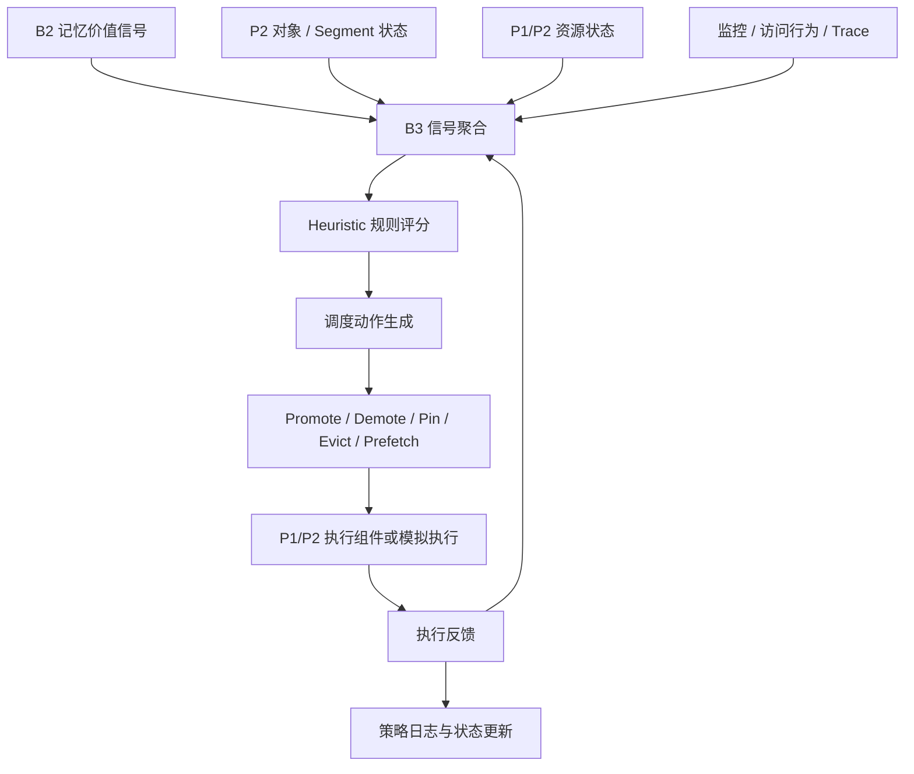

#### 图说明

B3 调度闭环由输入、决策、执行和反馈四部分组成。输入侧主要来自 B2、P2、P1/P2 和监控系统；决策侧由 B3 统一完成信号聚合和启发式评分；输出侧生成 Promote、Demote、Pin、Evict、Prefetch、Keep 等动作或建议；执行侧由 P1/P2 执行组件或模拟执行层完成。第一阶段允许先以模拟接口跑通闭环，待 P1/P2 接口稳定后再替换为真实执行接口。

### 6.6 B3 调度对象图

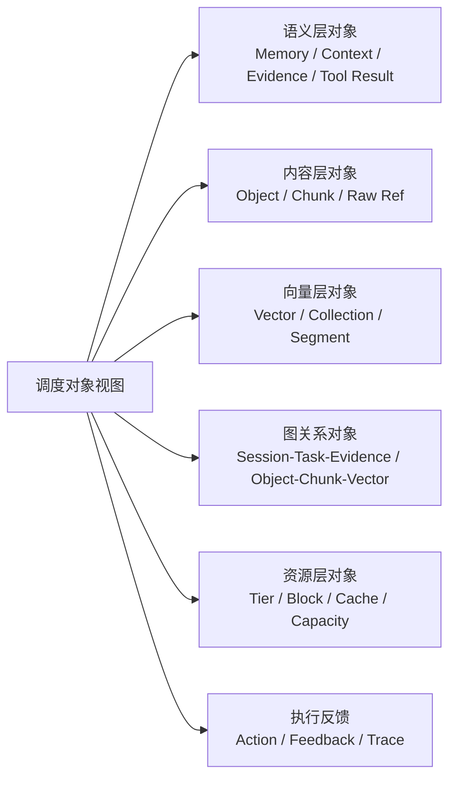

#### 当前阶段调度对象范围

| 调度对象 | 是否纳入第一阶段 | 原因 | 依赖来源 | 待确认问题 |
|---|---|---|---|---|
| Memory | 是 | B2 可输出重要性、使用次数、状态、TTL，是 B3 的主要语义价值来源 | B2 | memory signal 字段口径需确认 |
| Evidence / Tool Result | 是，作为 Memory 或 Object 的子类处理 | RAG 证据和工具结果会影响上下文价值和预取保护 | B2/P4/P2-E2 | 是否单独建对象类型 |
| Object / Chunk | 是 | 原文、证据、记忆摘要和向量之间需要可追溯 | P2-E2/B1 | object_id、chunk_id、source_id 映射关系 |
| Vector Segment | 是，允许先模拟 | 与冷热分层和向量访问性能直接相关 | P2-E1 | Segment 内省接口可用时间 |
| Graph Relation | 是，采用最小关系图 | 支撑来源追溯、关联召回、预取和保护判断 | P2-E3/B2/P4 | 第一阶段采用 Agent Trace 图还是业务图 |
| Resource Tier | 是 | 调度动作需要指向热层、温层、冷层或资源层级 | P1/P2 | tier 命名、容量、成本字段 |
| 训练数据/模型/checkpoint | 当前阶段不作为 P3 主调度对象 | 属于全系统资产流，不纳入 P3 12 月 MVP 主线 | P2-E2/P1/P4 | 后续是否扩展到训练/推理加速场景 |

### 6.7 B3 动作执行图

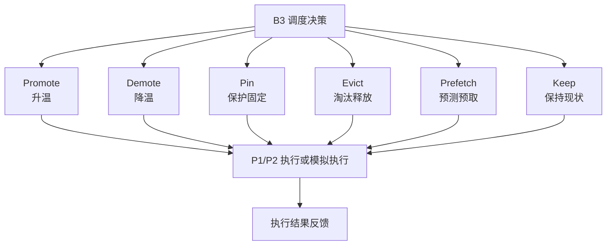

#### 图说明

B3 的输出动作分为迁移类、保护类、释放类、预取类和保持类。第一阶段重点保证 Promote、Demote、Keep 能够稳定输出；Pin 可作为高价值对象保护建议；Evict 和 Prefetch 可先以模拟或预留方式体现，不作为生产执行承诺。所有动作均由 P1/P2 执行层或模拟执行层消费，B3 根据返回结果更新日志和状态。

### 6.8 B3 输入信号表

| 信号类别 | 主要字段 | 来源 | 第一阶段是否使用 | 当前状态 | 待确认问题 |
|---|---|---|---|---|---|
| 记忆价值信号 | memory_id、memory_type、importance、confidence、use_count、last_used_time、ttl、status、user_defined_flag、correction_flag | B2 | 是 | 待确认 | B2 memory signal 字段何时稳定 |
| 语义对象信号 | semantic_object_id、source_type、source_id、object_id、chunk_id、embedding_ref、metadata | B1/P2/B2 | 是 | 待确认 | chunk、memory、object 的映射关系 |
| 对象状态信号 | object_id、bucket/key、size、content_type、current_tier、last_access_time、lifecycle_status | P2-E2 | 是 | 待确认 | 对象元数据接口字段范围 |
| Segment 状态信号 | segment_id、engine、state、row_count、size_bytes、index_type、access_count、hit_rate、tier | P2-E1/E2/E3 | 是，接口不足时可模拟 | 待确认 | Segment 内省接口字段范围 |
| 图关联信号 | relation_type、src_id、dst_id、co_access、evidence_chain、object_chunk_vector_relation | P2-E3/B2/P4 | 第一阶段使用最小关系图 | 待确认 | 图数据由 P4/B2/P2 哪方提供 |
| 访问行为信号 | access_count、last_access_time、hit/miss、request_pattern、context_used_flag | P4/P2/监控/B2 | 是 | 待确认 | 访问日志来源和统计窗口 |
| 任务上下文信号 | task_id、task_stage、request_type、latency_requirement、context_budget、business_priority | P4/Agent/B2 | 是，先使用简化字段 | 待确认 | P4 是否提供任务状态 |
| 资源状态信号 | tier、capacity、load、latency、migration_cost、available_space | P1/P2 | 是，先使用简化字段 | 待确认 | tier 层级命名和成本口径 |
| 执行反馈信号 | action_id、action_status、execute_latency、resource_change、error_code、trace_id | P1/P2/模拟执行层 | 是 | 待确认 | 调度动作执行方和反馈格式 |

### 6.9 B3 输出动作表

|动作|含义|执行方|第一阶段要求|是否纳入MVP|待确认问题|
|:-:|:-:|:-:|:-:|:-:|:-:|
|Promote|将高价值或高热对象提升到更高性能层级|P1/P2|可输出动作或建议|是|目标 tier 命名和执行接口|
|Demote|将低价值或低热对象下沉到更低成本层级|P1/P2|可输出动作或建议|是|下沉策略是否允许自动执行|
|Pin|对关键记忆或高价值对象进行保护|P1/P2|可输出保护建议|是，建议级|Pin 的有效期和权限边界|
|Evict|淘汰低价值对象以释放热层空间|P1/P2|当前阶段可模拟|可选|是否允许真实淘汰|
|Prefetch|对可能访问对象进行提前加载|P1/P2|当前阶段预留或模拟|可选|预取目标和资源预算|
|Keep|保持当前状态|B3|必须支持|是|无|

### 6.10 B3 策略层级与当前阶段边界

| 策略阶段 | 说明 | 当前阶段是否交付 | 备注 |
|---|---|---|---|
| V1 Heuristic | 基于规则评分、阈值、优先级的冷启动策略 | 是 | 当前阶段重点 |
| V2 Contextual Bandit | 基于反馈的在线策略优化 | 否 | 仅预留 |
| V3 Deep RL / GNN | 基于图结构和长期反馈的策略学习 | 否 | 不纳入验收 |

#### V1 Heuristic 当前阶段说明

|内容|当前阶段设计|
|:-:|:-:|
|使用哪些信号|优先使用访问频率、语义相关性、记忆时效性/遗忘程度、访问成本；接口不足时允许使用简化或模拟字段|
|如何形成评分或优先级|采用可配置的规则加权与阈值判断，具体权重不在总体设计阶段固化，可按联调结果调整|
|如何输出动作|根据调度对象当前层级、综合评分、资源预算和动作限制生成 Promote、Demote、Pin、Keep 等动作|
|如何记录日志|记录调度对象、输入信号摘要、动作类型、动作原因、执行状态和 trace_id|
|如何接收反馈|接收 P1/P2 或模拟执行层返回的成功、失败、延迟、错误码等结果|
|如何回退默认策略|当输入信号不足、评分异常或执行失败时，回退为 Keep 或传统 LRU/LFU 类基线策略|
|如何支撑后续学习策略|调度日志预留 context、action、reward、timestamp 等字段，为 Bandit/RL 训练或评估提供基础|

### 6.11 B3 外部依赖与接口关系

|依赖对象|依赖内容|当前状态|阻塞影响|待确认问题|期望owner|
|:-:|:-:|:-:|:-:|:-:|:-:|
|B2|记忆价值、使用频次、时效性、状态|待确认|影响语义价值判断|B2 何时输出 memory signal？|B2 负责人|
|B1/P2|chunk、embedding、metadata、source_id|待确认|影响调度对象映射|调度对象粒度是 chunk、object 还是 segment？|B1/P2 负责人|
|P2|Segment 状态、对象状态、图关系|待确认|影响真实分层判断|Segment 内省接口是否可用？|P2 负责人|
|P1/P2|Tier 状态、资源容量、迁移执行|待确认|影响动作闭环|调度动作由谁执行？反馈字段是什么？|P1/P2 负责人|
|监控系统|访问行为、命中率、trace|待确认|影响可观测与评分输入|trace 与指标口径是否统一？|监控/运维负责人|
|P4|Agent/RAG 调用样例和上层访问日志|待确认|影响场景验证|MVP 是否提供标准调用样例？|P4 负责人|

### 6.12 B3 异常与回退方案

|异常场景|影响|第一阶段处理方式|是否阻塞MVP|备注|
|:-:|:-:|:-:|:-:|:-:|
|B2 memory signal 缺失|语义价值判断不完整|使用访问行为和对象状态作为临时输入|不阻塞|需记录缺失字段|
|P2 Segment 状态不可用|无法真实判断 Segment 层级|使用模拟 Segment 状态或对象级状态替代|不阻塞|联调后替换真实接口|
|P1/P2 执行动作失败|调度动作无法闭环|记录失败状态，回退 Keep，不重复执行高风险动作|不阻塞|需明确错误码|
|规则评分结果异常|可能产生错误调度动作|禁止输出迁移动作，回退默认策略|不阻塞|需要异常告警|
|资源状态缺失|无法判断迁移成本|使用默认成本模型或保守策略|不阻塞|后续补充真实成本|
|trace 缺失|不利于排障和评审|强制记录本地调度日志|不阻塞|后续接入统一 trace|

### 6.13 B3 对 12 月 1 日 MVP 的支撑

|MVP能力|B3支撑方式|是否必须|验证方式|
|:-:|:-:|:-:|:-:|
|接收 memory signal|接收 B2 输出的记忆价值、使用状态和生命周期信息|是|使用样例 memory signal 调用 B3|
|接收对象/Segment 状态或模拟状态|接收 P2 或模拟层提供的对象、segment、tier 状态|是|使用样例状态生成调度结果|
|输出 Heuristic 调度动作|通过 V1 Heuristic 输出 Promote、Demote、Keep 等动作|是|查看调度动作表和日志|
|记录执行反馈|接收真实或模拟执行反馈并更新状态|是|查看反馈日志和状态变化|
|支持默认回退|当信号缺失或动作失败时回退为 Keep 或基线策略|是|构造异常输入验证回退|
|支持可观测展示|输出调度次数、动作分布、失败次数、trace 信息等|是|通过日志或基础面板展示|

### 6.14 B3 第一阶段交付物

|交付物|形式|是否必需|完成状态|
|:-:|:-:|:-:|:-:|
|B3 技术方案|Markdown 文档|必需|已形成初稿，待评审|
|调度闭环图|Mermaid|必需|已形成初稿，待评审|
|调度对象图|Mermaid|必需|已形成初稿，待评审|
|动作执行图|Mermaid|必需|已形成初稿，待评审|
|输入信号表|表格|必需|已形成初稿，待评审|
|输出动作表|表格|必需|已形成初稿，待评审|
|V1 Heuristic 策略说明|文字/表格|必需|已形成初稿，待评审|
|B3 外部依赖表|表格|必需|已形成初稿，待评审|
|B3 异常与回退说明|表格|建议|已形成初稿，待评审|
|B3 待确认问题|表格|必需|已形成初稿，待评审|

### 6.15 B3 待确认问题

|问题|影响|期望确认对象|责任人|状态|
|:-:|:-:|:-:|:-:|:-:|
|B2 输出的 memory signal 字段是否固定|影响 B3 语义价值判断|B2 负责人|B3/B2|未确认|
|P2 Segment 内省接口是否在第一阶段可用|影响 B3 是否能基于真实 Segment 调度|P2 负责人|B3/P2|未确认|
|调度动作最终由 P1 还是 P2 执行|影响动作接口和反馈字段|P1/P2 负责人|项目经理协调|未确认|
|Promote/Demote/Pin/Evict/Prefetch 的权限边界如何定义|影响动作是否能真实执行|P1/P2/P4 负责人|B3 负责人跟进|未确认|
|MVP 阶段是否允许使用模拟执行层|影响 12 月 1 日演示范围|项目经理/架构负责人|B3 负责人|未确认|
|B3 可观测指标是否接入统一监控|影响评审展示和后续联调|监控/运维负责人|B3/监控|未确认|
|后续 Bandit/RL 数据日志是否需要统一格式|影响第二阶段策略升级|P3 总负责人|B3 负责人|未确认|

---

## 7. P2/P3 接口与依赖统一说明

> 本章由 P3 总负责人维护，B1/B2/B3 三位负责人共同确认。

### 7.1 P2/P3 接口总表

| 接口编号 | 接口方向 | 数据内容 | 使用模块 | 第一阶段目标 | 期望 owner | 状态 |
|---|---|---|---|---|---|---|
| IF-P4-P2-01 | P4 → P2-E2 | 原始对象、文档、文件、模型/checkpoint、metadata | P2/P4，P3 可引用 | 确认原始资产统一落点和 object_id/source_id 生成规则 | P4/P2 | 未确认 |
| IF-P4-B1-01 | P4 → B1 | 需语义化的文本、对象引用、RAG 证据、工具结果摘要、embedding_required | B1 | 明确 B1 真实输入来源和样例 | P4/B1 | 未确认 |
| IF-P4-B2-01 | P4/Agent → B2 | 对话、任务事件、RAG 调用记录、工具调用结果、用户显式设定 | B2 | 明确记忆事件来源和生命周期触发点 | P4/Agent/B2 | 未确认 |
| IF-B1-P2-01 | B1 → P2-E1 | embedding、chunk_id、source_id、object_id、metadata、embedding_model | B1/P2 | 明确向量写入方式和返回 embedding_ref | P2 向量负责人 | 未确认 |
| IF-B1-P2-02 | B1 → P2-E2 | chunk、摘要、处理状态、metadata 更新 | B1/P2 | 明确原文、chunk、向量之间的追溯关系 | P2 对象负责人 | 未确认 |
| IF-B2-P2-01 | B2 → P2-E2/E1 | 记忆原文/摘要、memory metadata、memory embedding 请求或引用 | B2/P2 | 支撑 Episodic/Semantic 持久化和跨会话召回 | B2/P2 | 未确认 |
| IF-B2-P2-02 | B2 → P2-E3 | session-turn-task-rag-evidence-memory 关系写入 | B2/P2 | 构建最小 Agent Trace / 记忆来源图 | B2/P2 图负责人 | 未确认 |
| IF-P2-B2-01 | P2-E1/E2/E3 → B2 | 向量检索结果、对象原文/metadata、图关系/子图 | B2 | 支撑 Context Pack 构建 | P2/B2 | 未确认 |
| IF-B2-B3-01 | B2 → B3 | memory signal、context_used_flag、importance、TTL、状态 | B3 | 支撑语义价值判断 | B2/B3 | 未确认 |
| IF-P2-B3-01 | P2 → B3 | ObjectMeta、SegmentStat、访问统计、图关系、索引状态 | B3 | 支撑调度对象建模 | P2/B3 | 未确认 |
| IF-B3-P1P2-01 | B3 → P1/P2 | Promote、Demote、Pin、Unpin、Prefetch、Evict、Keep 等动作或建议 | B3/P1/P2 | 明确动作是建议式还是执行式 | P1/P2/B3 | 未确认 |
| IF-P1P2-B3-01 | P1/P2 → B3 | 执行反馈、资源变化、迁移耗时、失败原因、trace_id | B3 | 支撑闭环反馈和回退 | P1/P2/B3 | 未确认 |
| IF-MON-ALL-01 | P4/P3/P2/P1 → 监控 | request_id、trace_id、latency、status、error_code、指标 | 全模块 | 支撑评审追踪和问题定位 | 监控/运维 | 未确认 |

### 7.2 P2/P3 递进关系图

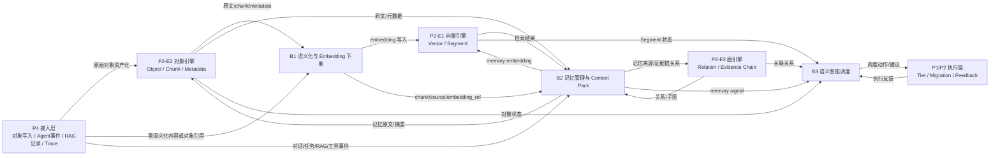

该关系图强调：P2 不是只向 B3 提供状态，也同时为 B1/B2 提供对象、向量和图能力；P3 不是只向 P2 写入 embedding，也会把记忆原文、记忆向量和来源关系写入 P2，并从 P2 读取检索和关系结果。

### 7.3 当前需项目经理协调的接口 owner

| 接口/能力 | 期望 owner | 当前状态 | 备注 |
|---|---|---|---|
| P4 写入/Agent/RAG 输入 | P4/Agent 负责人 | 未确认 | 影响 B1/B2 |
| P2 向量写入接口 | P2 向量负责人 | 未确认 | 影响 B1 |
| P2 对象元数据接口 | P2 对象负责人 | 未确认 | 影响 B1/B3 |
| P2 Segment 内省接口 | P2 向量/存储负责人 | 未确认 | 影响 B3 |
| P1/P2 Tier 回调接口 | P1/P2 负责人 | 未确认 | 影响 B3 |
| 监控 Trace 规范 | 监控/运维负责人 | 未确认 | 影响三模块联调 |

---

## 8. 第一阶段计划与里程碑

### 8.1 阶段计划

| 阶段 | 时间窗口 | 主要工作 | 交付物 |
|---|---|---|---|
| 需求与边界确认 | 6–7 月 | 明确 P3 定位、B1/B2/B3 边界、P2/P3 依赖 | 阶段方案初稿、接口依赖表 |
| 模块方案形成 | 8 月 | 三个模块分别形成技术方案 | B1/B2/B3 技术方案 |
| 单模块原型打通 | 9 月 | 各模块形成最小可运行链路 | 单模块 demo 或接口样例 |
| P2/P3 联调 | 10 月 | 对象/向量/记忆链路、调度反馈链路联调 | 联调记录、问题清单 |
| MVP 集成准备 | 11 月 | 整合演示数据、日志、接口样例 | MVP 演示材料 |
| 最小原型系统 | 2026-12-01 | 形成可演示的 P2/P3 最小闭环 | MVP 演示版本 |

### 8.2 12 月 1 日 MVP 最小验收

| 模块/链路 | MVP 最小要求 |
|---|---|
| P4 输入 | 能提供文档/知识片段、Agent 对话、RAG 证据、工具结果中的至少两类脱敏样例，并携带 request_id、trace_id、tenant/user/session/task 等最小身份字段 |
| P2-E2 对象链路 | 能保存或模拟保存原始对象、chunk、记忆原文/摘要和 metadata，并返回 object_id/source_id/raw_ref |
| B1 | 能接收语义资源或对象引用，输出 chunk_id、embedding_ref/vector、metadata、source_id，并写入或模拟写入 P2-E1 |
| P2-E1 向量链路 | 能保存或模拟保存 B1/B2 写入的向量，并支持最小 Top-K 检索返回 SearchHit |
| B2 | 能写入 Working Memory，归档基础 Episodic Memory，调用 P2-E1/E2 完成简单召回，并生成带来源字段的 Context Pack |
| P2-E3 最小关系图 | 能保存或模拟保存 session-task-rag-evidence-memory-object-chunk-vector-segment 的最小关系，支持来源追溯或关系查询样例 |
| B3 | 能接收 memory signal、对象/Segment 状态、Tier/资源状态或模拟状态，输出 Heuristic 调度动作及 reason |
| P1/P2 执行反馈 | 能真实或模拟返回 action_status、execute_latency、resource_change、error_code、trace_id |
| 监控/日志 | 能通过 trace_id 串联“输入—对象保存—Embedding—向量写入—记忆召回—调度动作—反馈”的最小链路 |

## 9. 风险与应对

| 风险 | 影响模块 | 影响 | 应对措施 |
|---|---|---|---|
| P2 向量接口未及时提供 | B1/B2 | 无法真实写入向量 | 先用测试向量库或 mock 接口 |
| P2 Segment 状态不可用 | B3 | 调度对象缺少状态输入 | 先使用对象状态或模拟 Segment 状态 |
| Agent/RAG 数据样例不足 | B2 | 记忆流程难验证 | 先构造脱敏样例和标准场景 |
| P1/P2 调度执行边界不清 | B3 | 动作输出无法闭环 | 第一阶段明确执行方和反馈字段 |
| 三模块字段不统一 | B1/B2/B3 | 联调困难 | 建立统一字段表和 source_id 规范 |
| 12 月 MVP 范围扩大 | P3 整体 | 影响按期交付 | 严格限定 MVP 为最小闭环 |

---

## 10. 第一阶段评审材料清单

| 材料 | 责任人 | 是否必需 | 说明 |
|---|---|---|---|
| P3 第一阶段阶段方案 | P3 总负责人 | 必需 | 本文档 |
| B1 技术方案 | B1 负责人 | 必需 | 对应第 4 章 |
| B2 技术方案 | B2 负责人 | 必需 | 对应第 5 章 |
| B3 技术方案 | B3 负责人 | 必需 | 对应第 6 章 |
| P2/P3 接口依赖表 | P3 总负责人 + 三模块负责人 | 必需 | 用于 PM 分派 owner |
| 甘特图 | P3 总负责人 | 必需 | 与 P2/P3 融合甘特图一致 |
| 风险与待确认问题清单 | P3 总负责人 | 必需 | 用于阶段评审 |
| 评审结论表 | 项目经理/评审负责人 | 必需 | 会后记录 |

---

## 11. 阶段评审检查清单

| 检查项 | 是否通过 | 备注 |
|---|---|---|
| P3 总体定位是否清楚 | 待评审 |  |
| B1/B2/B3 职责是否清楚 | 待评审 |  |
| 三个模块是否都有独立技术方案 | 待评审 |  |
| 每个模块是否都有流程图和输入输出表 | 待评审 |  |
| P2/P3 接口依赖是否明确 | 待评审 |  |
| 12 月 1 日 MVP 路径是否明确 | 待评审 |  |
| 当前阶段范围是否控制合理 | 待评审 |  |
| 风险是否有应对措施 | 待评审 |  |
| 待确认问题是否可分派责任人 | 待评审 |  |
| 是否允许进入下一阶段 | 待评审 |  |

---

## 12. 附录：各模块边界约束

### 12.1 B1 边界约束

- 不写生产级向量数据库设计；
- 不写复杂检索排序算法；
- 不写与 B2/B3 重叠的记忆管理或调度策略；
- 不承诺最终压测结果；
- 不跳过 P2 向量接口依赖。

### 12.2 B2 边界约束

- 不写底层向量化实现；
- 不写底层存储实现；
- 不写调度策略；
- 不把所有历史内容无差别进入上下文；
- 不忽略用户查看、修改、删除记忆的边界。

### 12.3 B3 边界约束

- 不写生产级 RL/GNN 策略；
- 不承诺真实物理迁移执行；
- 不修改 P2 底层结构；
- 不绕过 B2 记忆价值信号；
- 不绕过 P1/P2 执行反馈。

---

## 13. 总结

P3 第一阶段阶段方案的核心，不是直接完成完整系统，而是明确 B1、B2、B3 三个模块的技术方案、接口依赖、数据流和 MVP 路径。

修订后的统一口径是：外部数据先由 P4 标准化进入系统，原始资产由 P2-E2/P1 承载；与 Agent/RAG 相关的语义资源进入 B1/B2，形成 chunk、embedding、memory、Context Pack 和 memory signal；P2-E1/E2/E3 分别承载向量、对象和关系图，向 B2/B3 提供检索、内省和关系查询；B3 结合 B2 的记忆价值、P2 的对象/Segment/图状态和 P1/P2 的资源状态，输出 Promote、Demote、Pin、Prefetch、Evict、Keep 等调度动作或建议；P1/P2 执行或模拟执行后返回反馈，形成可演示、可追踪、可解释的数据闭环。

B1 负责语义资源处理和 Embedding 下推；B2 负责 Agent 记忆管理和用户可见上下文构建；B3 负责基于语义价值、访问行为、对象/Segment 状态和资源状态输出分层调度动作。三者通过 P2 对象、向量、图和 Segment 能力形成递进关系，并在 2026 年 12 月 1 日前收口为最小原型系统。